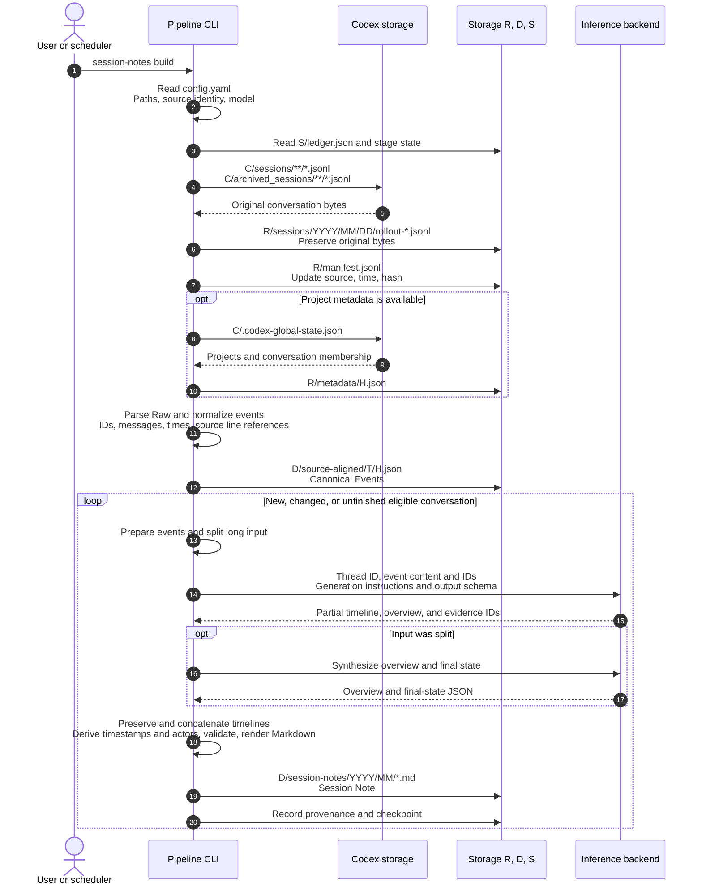

# Tkn GenAI Chat Note Pipeline

Japanese: [README_ja.md](README_ja.md)

Preserve local AI conversations as source evidence and turn each conversation into
a reusable Session Note. Notes retain requests, corrections, failed attempts,
unresolved questions, a source-backed timeline, and the last known state.
They support later reconsideration from different viewpoints.

A **session** means one continuous sequence of conversation, listed chronologically
in one Markdown note.

Version 0.11.0 ends at Session Notes. Classification and Working Context belong to
[tkn_genai_context_curation_pipeline](https://github.com/tuckn/tkn_genai_context_curation_pipeline);
Decision distillation belongs to
[tkn_genai_insight_pipeline](https://github.com/tuckn/tkn_genai_insight_pipeline).
Each CLI installs independently and exchanges versioned files.

## Usage: get the first result

### Requirements and installation

Python 3.11+, uv, readable local Codex JSONL logs, and a configured inference
provider for generation. Codex CLI is the default; Claude Code, GitHub Copilot
CLI, and local Ollama are inference alternatives. **Only Codex chat acquisition
is implemented.** Other inference providers do not add chat-source support.

~~~console
cd "C:\path\to\tkn_genai_chat_note_pipeline"
uv tool install .
tkn-genai-chat-note --help
tkn-genai-chat-note config init
~~~

Edit the displayed `~/.tkn/genai_chat_note_pipeline/config.yaml`. Select storage
roots and an available model. For Codex inference, check `codex --version` and
`codex login status` in the terminal; the desktop app does not replace the CLI.
See the packaged [configuration example](src/tkn_genai_chat_note/resources/config.example.yaml).

### First capture and generation

~~~console
tkn-genai-chat-note config show
tkn-genai-chat-note clone --dry-run
tkn-genai-chat-note clone
~~~

`clone` initializes missing owned storage, captures all locally available
history, normalizes supported events, and generates eligible Session Notes.
It writes by default and may use substantial inference time/tokens.
`--dry-run` reads local inputs and validates the plan; it makes no inference or
network calls and creates no directories, locks, caches, or reports.

### Daily updates and results

~~~console
tkn-genai-chat-note pull
tkn-genai-chat-note status
tkn-genai-chat-note provenance validate
~~~

`pull` captures changed or newly discovered logs, updates eligible notes, and
resumes unfinished work. Repeating a successful unchanged run makes no model
calls. The default idle interval is 30 minutes; Raw capture still precedes
deferral of active conversations. `--limit 20` bounds note generation attempts.

Open the note and report paths shown in the result. `status` reads the last-run
record, not live source state. Completion now depends only on eligible Session
Notes; no Scope, Decision, or Working Context build is required.

## Commands

Global options, including `--config` and inference options, precede the command.

| Command | Behavior |
| --- | --- |
| `config init` | Create packaged user configuration; preserve edits; `--force` backs up before replacement |
| `config show` | Read resolved values, five configuration layers, and summary profile hashes |
| `clone` | Initialize and capture/build available history; resumable |
| `pull` | Update an initialized store and resume notes |
| `raw ingest` | Capture source bytes without inference |
| `session-notes build` | Refresh notes; `--thread-id` selects one conversation |
| `session-notes validate <artifact>` | Read-only note validation |
| `status` | Read the previous run's coverage and report path |
| `provenance validate` | Read-only hash, identity, and relationship checks |
| `storage migrate` | Copy a source store into fresh roots using `--from-config`; inspect with `--dry-run` |

Build commands support `--dry-run`, `--force`, `--allow-edited`, and
`--full-output`. `--force` re-evaluates unchanged input but does not unlock
reviewed files. `--allow-edited` explicitly permits replacing manually edited,
unreviewed notes. Raw ingest supports `--dry-run` and `--full-output`.

Progress uses stderr; stdout is JSON. `-q` suppresses progress, `-v` adds
diagnostics. Exit codes: `0` successful command/plan, `1` failure, `2` incomplete
clone/pull (for example deferred or protected work). A leaf build's report
describes overall note coverage even when one thread was selected.

## Configuration

Precedence: built-in → user-global → current directory `.tkn/config.yaml` →
explicit `--config` → CLI options. Each supplied layer is validated before
merging. Relative paths resolve against the file declaring them. Schema 6.0.0
uses snake_case keys and quoted SemVer; unknown keys and newer unsupported
versions fail visibly.

~~~console
tkn-genai-chat-note --config "C:\path\to\config.yaml" clone
tkn-genai-chat-note --idle-minutes 0 --runtime-minutes 60 pull --limit 20
~~~

### Storage directories

By default, data is stored under `~/.tkn/genai_chat_note_pipeline/<kind>/<provider>/<source_id>`.
To change the storage directories, set `raw_root`, `data_root`, and `state_root` under each `chat.providers.<provider>.sources.<source_id>` entry in `config.yaml`.
`cache_root` is shared and cannot be configured separately for each `chat.providers.<provider>.sources.<source_id>` entry.

```yaml
schema_version: "6.0.0"
cache_root: ~/.cache/genai_chat_note_pipeline
chat:
  providers:
    codex:
      sources:
        my-windows-pc:
          enabled: true
          source_root: ~/.codex
          include_archived: true
          raw_root: C:/path/to/my-chat-store/raw
          data_root: C:/path/to/my-chat-store/data
          state_root: C:/path/to/my-chat-store/state
        my-wsl-ubuntu:
          enabled: false
          source_root: '//wsl$/Ubuntu/home/<user>/.codex'
          include_archived: true
```

Keep all actual roots separate from one another, source roots, and configuration.
A common parent such as `my-chat-store/` can group `raw/`, `data/`, and `state/`
for backup and relocation. Treat state as durable restart/checkpoint data and
retain it with data; provenance under data contains the published evidence.
Cache is disposable and is not copied by migration. Missing app metadata does
not prevent conversation capture.

Inference transport configuration and authentication details are retained in
[inference providers](#inference-configuration). Generation through an
external CLI may send selected inputs to its service; Ollama is restricted to
a loopback endpoint. Model availability and authentication are provider-owned.

### Session Note language

Set `generation.session_note_profile` in your existing `config.yaml` to `default-jp` (Japanese, the default) or `default-en` (English). The following is a configuration fragment; retain your other settings.

```yaml
generation:
  session_note_profile: default-en
```

For a single run, use `tkn-genai-chat-note --session-note-profile default-en pull`. The option precedes the command. `config show` reports the selected profile, its resources and hashes, and the configuration source.

Both built-in profiles preserve the same schema, headings, timeline, citations, and state rules. Only narrative language and explanatory notices change; times remain in Asia/Tokyo. Custom profile names, directories, and prompts are not supported. Bundles are packaged under `profiles/default-jp/` and `profiles/default-en/`.

Changing language makes an existing note eligible for regeneration on the next build/pull. Each conversation retains one note and its identity; this does not create parallel language editions. Reviewed or edited notes retain their existing protection, and dry-run never generates or writes. Interrupted work from a different profile is not reused.

### Chat sources and generation AI

`chat.providers` configures conversation acquisition; `generation.providers`
configures the AI used to generate notes. `--provider` changes only
`generation.active_provider`, independently of chat acquisition.

| Chat provider | Default source_root | enabled | Support |
| --- | --- | --- | --- |
| `codex` | `~/.codex` | `true` | Local log acquisition implemented |
| `claude-code` | `~/.claude` | `false` | Configuration only; acquisition, normalization, and note integration are pending |
| `github-copilot` | `~/.copilot` | `false` | Configuration only; acquisition, normalization, and note integration are pending |

Each provider has a `sources` map. Its keys are the stable `source_id` values;
do not repeat `source_id` inside entries. Each entry has `enabled`, `source_root`,
and optional final `raw_root`, `data_root`, and `state_root`. `include_archived`
is Codex-specific. `source_root` is the parent `.codex` directory, not `sessions/`;
it supplies sessions, archives, and app metadata. It does not change Codex's own
storage configuration, authentication, or the generation provider.

Choose an ID for a persistent input directory: for example `laptop-windows` or
`laptop-wsl-ubuntu`. Lowercase ASCII **kebab-case** is recommended; an ID is a
configuration key, directory component, and provenance identifier, not a Python
variable. The exact rules are:

- ASCII letters (`A-Z`, `a-z`), digits, `.`, `_`, and `-`; start with a letter or digit.
- No spaces, Japanese/full-width characters, leading/trailing whitespace, or trailing dot.
- Windows device names such as `CON`, `nul.txt`, and `COM1` are rejected.
- IDs must be unique ignoring case within a provider. Exact spelling is retained;
  IDs are never trimmed or automatically lowercased. Quote numeric-only YAML keys.

Identity is `(provider, source_id)`, so different providers may share an ID.
Keep it stable after ingestion; changing the key does not rename or migrate an
existing store. Display-oriented folder names in `source_root` and output paths
can still contain spaces and Unicode. Register each input directory once.

Enabled Codex sources run sequentially in map order. `--limit` counts generation
attempts across the whole invocation (including failed attempts and dry-run plans),
and `runtime_minutes` provides one shared generation deadline. All selected stores
are checked before writes. Each source retains its own catalog, provenance,
checkpoint, and run report; a source processing failure is included in the overall
failure result while other sources can continue. `--full-output` includes per-source
thread details; ordinary output includes per-source totals and report paths.

~~~console
tkn-genai-chat-note clone --dry-run
tkn-genai-chat-note --source my-windows-pc pull
tkn-genai-chat-note --source my-windows-pc session-notes build --thread-id <thread-id>
tkn-genai-chat-note status
tkn-genai-chat-note provenance validate
~~~

`--source` precedes the command. It selects one enabled source for processing,
status, provenance validation, or storage migration; omitted selection means all
enabled sources for processing/status/provenance. `--thread-id` and storage migration
require one selected source when several are enabled. Unknown or disabled selections
fail visibly. `config show` always displays all configured sources and resolved roots.

Source maps merge by ID across config layers; later fields override only the same
source. An explicit map replaces the implicit built-in source, so adding your own
IDs never silently enables an extra `windows` source. `sources: {}` clears that
provider's map; `enabled: false` disables one inherited source. Duplicate YAML keys
and case-only source IDs are rejected.

Disabled sources are not scanned and their input directories need not exist.
An enabled unimplemented adapter stops processing before writes; disabling every
supported source also stops execution. `config show` remains available. Claude
Code/Copilot acquisition adapters are still unimplemented.

Windows and WSL input directories need separate IDs. Windows can use the WSL UNC
path shown above when the distribution is accessible. When running this CLI inside
WSL, configure Linux paths and its generation executable; `~` follows the OS running
this CLI. The WSL example is a path configuration example, not a claim of completed
WSL integration testing. Account-based filtering is not implemented.

<a id="inference-configuration"></a>

### Inference providers

The currently supported chat source is locally stored Codex conversation logs.
You can change the generative AI model used for inference through
`generation.active_provider` and the selected provider's `model` setting.
Set the selected provider's model and transport; model
availability and authentication belong to the chosen service.

| Provider ID | Required transport setting | Execution |
| --- | --- | --- |
| `codex` | `executable: codex` | Standalone `codex exec` |
| `claude-code` | `executable: claude` | Non-interactive Claude Code |
| `github-copilot` | `executable: copilot` | Non-interactive Copilot CLI |
| `ollama` | `base_url: http://127.0.0.1:11434` | Local chat endpoint, loopback addresses only |

For example, replace the generation block to use an already available local model:

```yaml
generation:
  active_provider: ollama
  providers:
    ollama:
      model: <installed-local-model>
      reasoning_effort: high
      base_url: http://127.0.0.1:11434
```

CLI providers send the selected generation input through their configured
service. Raw captures and provenance snapshots retain source content locally;
choose storage appropriate for private conversation data. Generation profiles,
output validation, and retry limits are application-owned. Changing a model,
provider, reasoning setting, or generation profile invalidates affected stages.

### Migrating older configuration

Normal execution uses schema `"6.0.0"`. For schema 5, preserve the old config,
move each provider's settings under `sources.<its-existing-source_id>`, remove the
nested `source_id`, rename `home` to `source_root`, and change `schema_version` to
`"6.0.0"`. Keep the same IDs and final paths: **storage 5 requires no data migration**
for this configuration-only change. Update/reinstall the CLI before using the file.

Old config 2–4 is accepted only as standalone `--from-config` input to copy migration.
Preserve that old file, create schema 6 with fresh roots, and follow the storage
migration below. Every supplied user-global/project layer must use schema 6 for
normal execution; `--config` does not bypass invalid lower layers.

## Data and responsibility boundaries

~~~mermaid
flowchart LR
    L["Local Codex logs"] --> R["Raw copies and manifest"]
    R --> E["Canonical Events"]
    E --> T["Session Notes"]
    M["Observed Project membership"] --> C["Thread catalog"]
    T --> C
    C --> U["Context curation CLI<br/>(separate repository)"]
    T --> I["Insight CLI<br/>(separate repository)"]
    R --> P["Versioned evidence"]
    E --> P
    T --> P
~~~

Default storage is ordered by role, acquisition application, source environment,
then kind of data. Explicit roots start directly with the kind of data. `P` below is the acquisition provider, `I` the source_id, `T` the
threadKey, and `H` a content hash. Changing `generation.active_provider` does
not change these paths.

| Storage path | Contents |
| --- | --- |
| `<raw_root>/sessions/...` | Latest Codex source copies preserving relative paths and bytes |
| `<raw_root>/archived_sessions/...` | Latest copies preserving Codex's archived layout |
| `<raw_root>/manifest.jsonl` | Raw source references, hashes, and acquisition metadata |
| `<raw_root>/metadata/H.json` | Observed application Project metadata |
| --- | --- |
| `<data_root>/source-aligned/T/H.json` | Canonical Events retaining source references |
| `<data_root>/session-notes/YYYY/MM/...md` | Current Session Notes by conversation start year/month |
| `<data_root>/catalog/threads.json` | This source’s catalog, observations, states, and note references |
| `<data_root>/provenance/...` | This source’s immutable snapshots, entities, activities, and published index |
| --- | --- |
| `<state_root>/pipeline.json` | Per-source initialization and storage version |
| `<state_root>/threads/T/...` | Per-conversation checkpoints |
| `<state_root>/ledger.json`, `reports/`, `last-run.json`, `normalization/` | Per-source run and normalization state |
| --- | --- |
| `<cache_root>/P/I/...` | Reusable generation work for one source |

For provider `codex` and source_id `my-windows-pc`, Raw goes to
`~/.tkn/genai_chat_note_pipeline/raw/codex/my-windows-pc/sessions/...`; notes go to
`~/.tkn/genai_chat_note_pipeline/data/codex/my-windows-pc/session-notes/YYYY/MM/...md`.
Other providers use separate folders even when they share a source_id.
Inspect resolved paths in `config show` under `storage.sourceRoots`.

Each root has a source-bound ownership marker and lock. Reusing it for another
source identity is rejected. `status` and `provenance validate` cover the configured
source. Identical threadKeys in different environments have independent note IDs,
checkpoints, catalogs and provenance. `data:/` resolves under this source’s data_root.
For Raw, `raw:/codex/<source_id>/` is a logical source prefix; append only the
remaining path to this source’s raw_root. `store.json` retains source identity
and legacy reference aliases alongside the data.

<a id="processing-flow"></a>

### session-notes build: generate Session Notes from Raw

Capture and normalize conversation logs, then generate Markdown Session Notes for
eligible conversations. Use `--thread-id` to select one conversation. This command
does not generate Decisions or Working Context. The model receives event content
and IDs, generation instructions, and the output schema.

The following shows `tkn-genai-chat-note session-notes build`. The legend applies
to the diagram immediately below it.

| Diagram notation | Configuration key | Default location |
| --- | --- | --- |
| `C` | `chat.providers.codex.sources.<source_id>.source_root` | `~/.codex` |
| `R` | `chat.providers.codex.sources.<source_id>.raw_root` | `~/.tkn/genai_chat_note_pipeline/raw/codex/windows` |
| `D` | `chat.providers.codex.sources.<source_id>.data_root` | `~/.tkn/genai_chat_note_pipeline/data/codex/windows` |
| `S` | `chat.providers.codex.sources.<source_id>.state_root` | `~/.tkn/genai_chat_note_pipeline/state/codex/windows` |

`T` is a conversation's `threadKey` and `H` is a content hash.
They are placeholders in the diagram.



The saved Canonical Events and the summarizer's input originate from the same
parse. The current implementation passes in-memory events to the summarizer;
it does not re-read the saved canonical JSON for that step. Summarization is
per conversation, independent of work-scope grouping.

### Migrating older storage

Version 0.14.0 uses config `"6.0.0"` and storage `5`. The copy migration reads a
standalone old configuration (`2.0.x–2.2.x`, integer `2`, `3.0.x`, `4.0.x–4.1.x`)
or a completed storage-5/config-5-or-6 store for relocation. Its roots and source ID
must describe the existing store without relying on other configuration layers.
Prepare a new config-6 file with the same provider and source_id and fresh,
disjoint final roots. Choose a fresh cache base if the old namespace is unowned. Stop writers to the source store during the copy.

~~~console
tkn-genai-chat-note --config "C:\path\to\new.yaml" config show
tkn-genai-chat-note --config "C:\path\to\new.yaml" storage migrate --from-config "C:\path\to\old.yaml" --dry-run
tkn-genai-chat-note --config "C:\path\to\new.yaml" storage migrate --from-config "C:\path\to\old.yaml"
tkn-genai-chat-note --config "C:\path\to\new.yaml" provenance validate
tkn-genai-chat-note --config "C:\path\to\new.yaml" pull --dry-run
~~~

`--dry-run` lists source/destination files, sizes, and hashes without creating
files, directories, locks, or model calls. Apply copies Raw, notes, canonical
data, selected source evidence, and restart state. It verifies copied bytes and
provenance before marking completion. Source files and configuration are never
modified or deleted. Conflicting destination files stop the operation. Ordinary
write errors roll back copied changes; interrupted copies resume with the same
source and destination configurations. A changed source requires fresh destinations.

Each store has its own catalog/provenance; migration from shared storage selects
the configured source and required evidence snapshots. Note bytes, IDs, review
status, immutable entities, activities and blobs are preserved. Mutable index,
catalog and checkpoint locators change. `store.json` records old reference
aliases so historical evidence remains resolvable within the copied store.
Cache is not migrated. A completed migration can be repeated without writes.

New Session Notes use schema 6; historical Thread Note schemas 3–5 remain readable.
Migration itself never invokes inference. A later `pull` may regenerate eligible
old-format unreviewed notes; reviewed/edited protections remain active. A pure
storage-5 relocation does not invalidate generation solely because paths changed.
Raw-only stores publish provenance after their first generation; run provenance
validation after that. Old Project-only stores without pipeline metadata or Raw
manifest require a separate migration plan. Downstream curation/insight v0.2.0
accept Session Note 6 and multiple named stores; update input paths while retaining
input names after relocating a store.

Thread identity survives Project reassignment. Membership observations are
retained upstream; semantic scopes and approved relationships belong downstream.
Session Notes are derived records, not a replacement for original evidence.
Source and inference providers remain separate concepts.

Local `sessions` and, by default, `archived_sessions` are scanned. Projectless,
unmatched, and ambiguous conversations remain eligible. Internal/approval
conversations and sources without a clean user message are retained and
normalized but excluded from notes. Cloud-only ChatGPT/Work history is not
fetched. Unsupported records and divergent versions remain visible in reports.

See [data contract](reference/data-contract.md),
[Session Note format](docs/session-note-format.md), and
[processing sequence](#processing-flow) for IDs, hashes, schemas,
citations, storage details, and input preparation.

## Reinstall after updates

After source or resource changes:

~~~console
cd "C:\path\to\tkn_genai_chat_note_pipeline"
uv tool install . --reinstall
~~~

## Development and verification

~~~console
uv sync --locked
uv run pytest
uv run ruff check .
uv run mypy src
uv build
~~~
