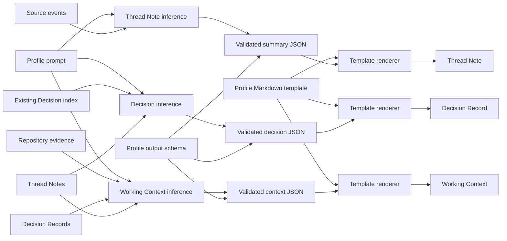

# Tkn Codex Context Pipeline

An independent, local-first pipeline that generates Markdown summaries,
decisions, and current Project context from Codex chat logs. It reads Codex app
Project registrations and chat assignments, preserves the chat logs unchanged
as source captures, and creates a Thread Note for each chat. It then distills
reusable decisions into Decision Records and summarizes the current state of
each Project in a Working Context. The input root is configurable; by default,
the pipeline reads Project information and logs under `~/.codex`, including the
logs below its `sessions` directory.
It never writes markers, configuration, or context into a Project folder.

Japanese documentation: [README_ja.md](README_ja.md)

## Terminology

This project uses different terms for the user-facing conversation, its
technical identity, and the artifacts derived from it. A Codex chat and a
thread describe the same source at different layers; the other terms are not
interchangeable.

| Term | Project definition |
| --- | --- |
| Codex chat | One user-facing conversation shown by the Codex app. Use `chat` in user documentation. |
| thread | The persistent technical identity of a Codex chat. It has a `threadId` and contains turns. Use `thread` in code, state, reports, and attribution. |
| turn | One Codex processing cycle within a thread. It normally starts from user input and ends with completion or interruption, and may contain messages and tool items. |
| user message | One message submitted by the user. This is the canonical data term for a user's submitted text or multimodal content. |
| user instruction | A request or direction contained in a user message. One user message may contain multiple instructions. |
| assistant message | A message generated by Codex with the assistant role. |
| final answer | The final assistant message that completes a turn, distinct from an intermediate update. |
| item | A lower-level element in a turn, such as a message, tool call, tool output, or reasoning item. |
| prompt | Input or instructions that guide model generation. Do not use it as a fixed synonym for `user message`. |
| session | A runtime or lifecycle period, or a Codex session tree. Do not use it as a synonym for a chat or thread. |
| rollout file | An internal JSONL log persisted by Codex for a thread. It is source evidence, not a public compatibility format or a synonym for the conversation. |
| Thread Note | This application's durable, source-near factual Markdown artifact generated from one source thread. |
| Decision Record | A durable judgment synthesized from one or more Thread Notes. |
| Working Context | A concise, source-backed orientation dashboard describing what is currently true for one Project. |

In prose, use **Codex chat (source thread)** on first mention when both layers
matter. Use `chat` for product-facing explanations and `thread` or `threadId`
for technical identity. Raw Codex input remains under `~/.codex/sessions`;
that storage path does not change the source object's canonical name.

## Requirements

- Python 3.11 or newer
- [uv](https://docs.astral.sh/uv/)
- Local Codex app Project state and chat logs under `~/.codex/sessions`
- One supported inference backend for Thread Note, Decision Record, or Working Context generation:
  - `codex` on `PATH` when `generation.active_provider: codex` is selected
    - For Windows, install it with `powershell -ExecutionPolicy Bypass -c "irm https://chatgpt.com/codex/install.ps1 | iex"`
  - `claude` on `PATH` or an explicit `executable` when `generation.active_provider: claude-code` is selected
  - `copilot` on `PATH` or an explicit `executable` when `generation.active_provider: github-copilot` is selected
  - A local Ollama service when `generation.active_provider: ollama` is selected

## Installation

Install the repository with the following command. Replace `C:\path\to\tkn_codex_context_pipeline` with the actual path to this repository.

```console
cd "C:\path\to\tkn_codex_context_pipeline"
uv tool install .
tkn-codex-context --help
```

The final command confirms that `tkn-codex-context` can be run after installation. This installation uses the code as it existed when the command was run and does not automatically track later repository changes.

Reinstall after every repository update, such as after `git pull`, to make the updated code and dependencies available to the installed command:

```console
uv tool install "C:\path\to\tkn_codex_context_pipeline" --reinstall
tkn-codex-context --help
```

Use `--reinstall` after a repository update to reinstall all packages in the tool environment and refresh cached package data. `--force` is intended to recreate an existing tool environment and replace conflicting entry points; it is not the normal repository-update option.

### Editable installation for development

For development, an editable installation can be used instead:

```console
uv tool install -e "C:\path\to\tkn_codex_context_pipeline" --reinstall
```

The `-e` (`--editable`) option makes the installed command reference the repository source code directly, so source-code-only edits take effect without reinstallation. Run the same editable installation command with `--reinstall` after changing dependencies in `pyproject.toml` or `uv.lock`, changing package metadata or entry points, moving or renaming the repository folder, or when the editable installation may still reference an old location.

## Configuration

Create the user configuration, inspect the resolved values, then preview and
initialize pipeline storage:

```console
tkn-codex-context config init
tkn-codex-context config show
tkn-codex-context init --dry-run
tkn-codex-context init
```

`config init` copies the application-owned example to
`~/.tkn/codex_context_pipeline/config.yaml` and prints its absolute path. A
second run reports `unchanged`. It never overwrites an edited config
implicitly; `config init --force` first creates a timestamped backup and then
replaces it. The packaged example remains available after a normal wheel or
`uv tool` installation.

`config show` emits the effective configuration as JSON, including the
effective config schema version, each available layer's source and effective
schema versions, any in-memory migration, and the winning source for every
setting.

### Inference providers

The source provider remains Codex: Project metadata and chat evidence are read
only from the Codex app and `~/.codex/sessions`.
`generation.active_provider` selects only the inference backend that converts
that evidence into Thread Notes, Decision Records, and Working Context.

| Provider ID | Transport | Structured-output contract |
| --- | --- | --- |
| `codex` | `codex exec` | Native JSON Schema output |
| `claude-code` | `claude -p` | `--json-schema` and `structured_output` |
| `github-copilot` | piped input to `copilot -s` | JSON-only prompt plus application validation |
| `ollama` | local `POST /api/chat` | JSON Schema in `format` plus application validation |

Claude Code and GitHub Copilot run non-interactively with file, shell, URL, and
MCP-style tools disabled. Ollama endpoints are restricted to loopback hosts
(`localhost`, `127.0.0.1`, or `::1`). All providers use the same
application-owned prompt, schema, renderer, validation, retry, and atomic-write
pipeline.

Generation settings use an `active_provider + providers` structure. The active
provider is one stable provider ID, while `providers` retains each backend's
own model and transport settings. YAML setting names use `snake_case`; provider
IDs such as `claude-code` and `github-copilot` remain `kebab-case` values.
Executable names may be replaced with absolute paths when they are not on
`PATH`. On Windows, the Codex App executable under `WindowsApps` is rejected
because it is not the standalone CLI required for automation; install the
standalone Codex CLI and configure that executable instead.

```yaml
schema_version: "2.1.0"
raw_root: ~/.tkn/codex_context_pipeline/raw
generation:
  active_provider: codex
  providers:
    codex:
      model: gpt-5.6-sol
      reasoning_effort: high
      executable: codex
```

To use another provider, add its provider block and select the same ID as
`active_provider`. Each configured CLI provider requires `model` and
`executable`; Ollama requires `model` and `base_url` instead.
`reasoning_effort` defaults to `high` when omitted.

```yaml
# Claude Code
generation:
  active_provider: claude-code
  providers:
    claude-code:
      model: sonnet
      reasoning_effort: high
      executable: claude
```

```yaml
# GitHub Copilot CLI
generation:
  active_provider: github-copilot
  providers:
    github-copilot:
      model: <model-supported-by-copilot>
      reasoning_effort: high
      executable: copilot
```

```yaml
# Ollama
generation:
  active_provider: ollama
  providers:
    ollama:
      model: qwen3.5:9b
      reasoning_effort: high
      base_url: http://127.0.0.1:11434
```

Every application-managed config file requires a quoted three-part SemVer
`schema_version`; the current effective version is `"2.1.0"`. The version is
metadata for that individual source and does not participate in normal
configuration precedence. Readers accept older compatible versions in the
same major, and a newer patch in the supported major/minor. A newer minor or
major, an older major without a migration path, a missing version, or an
invalid version format stops with an actionable error. `config show` reports
the source and effective versions and whether an in-memory migration occurred.

The integer `schema_version: 2` emitted by v0.3.0 is recognized as a legacy
representation and normalized to `"2.1.0"` in memory without rewriting the
file. Replace that first line with `schema_version: "2.1.0"` to persist the
current format.

Configuration schema major v2 replaces the former flat `provider`, `model`,
`reasoning_effort`, `*_executable`, and `ollama_base_url` keys. Schema v1 is
rejected with a migration message so that a partially migrated configuration
cannot silently select the wrong backend. Move those values into the matching
provider block and set `schema_version: "2.1.0"`.

The same values can be overridden as global CLI options placed before the
command:

```console
tkn-codex-context --provider ollama --model qwen3.5:9b thread-notes pull
```

Use `config show` to inspect the resolved values, config schema compatibility,
and winning configuration layers. A dry-run resolves the provider and selects
source evidence but does not call any inference provider.

Choosing Codex, Claude Code, or GitHub Copilot sends the selected, redacted
generation input through the account and service used by that CLI.
Authentication, subscription entitlements, usage limits, and possible charges
are managed by the corresponding CLI or service rather than this application.
Ollama sends the input only to the configured loopback service and has no
per-request cloud API charge from this application, although local compute and
electricity are still used.

Generated artifacts, state, and reports record both the stable provider ID and
its display name. Provider ID, model, and reasoning effort are included in
generation fingerprints, so changing providers makes previously generated
artifacts eligible for regeneration.

`init` reads the existing configuration, creates the Project registry, and
creates empty `thread-notes/` and `decisions/` directories for each Project in
the Codex app sidebar. It also writes a `.tkn-codex-context-root.json`
ownership marker to each configured data, state, cache, and raw root. It does not
generate Thread Notes, Decision Records, or Working Contexts. The command
records the current time as `installed_at`. A normal pull automatically
processes only chats created or updated at or after that time. Older chats
require an explicit `pull --backfill` or `rebuild`.

To rebuild existing pipeline storage, inspect the destructive plan and then
force initialization. Model, path, and runtime settings are preserved;
`installed_at` is refreshed. `--force` can replace only a missing root, an empty
directory, or a directory with a valid ownership marker for this application
and root kind. A non-empty unmarked directory, a foreign marker, or a malformed
marker is rejected before any storage is staged. A successful force dry-run
includes every root's ownership status; a refusal identifies every unsafe root
and its reason.

```console
tkn-codex-context init --force --dry-run
tkn-codex-context init --force
```

Storage created by an earlier version does not have ownership markers. Inspect
the configured paths and explicitly adopt those existing directories before a
forced rebuild:

```console
tkn-codex-context init --adopt-existing --dry-run
tkn-codex-context init --adopt-existing
tkn-codex-context init --force --dry-run
tkn-codex-context init --force
```

The adoption dry-run reports the ownership status and reason for every root.
Adoption is a separate operator assertion: applying it writes only the
ownership markers and does not rebuild storage, rewrite the config, or refresh
`installed_at`. It refuses foreign or malformed markers rather than replacing
them.

List the registered Projects when you need to map a Project name or current
root back to its internal ID:

```powershell
tkn-codex-context projects list
tkn-codex-context projects list --json
```

The default output is a human-readable table containing status, name, internal
Project ID, and current root. `--json` also includes the registered root
metadata for scripts and more detailed inspection.

The application separates its own files by purpose:

```text
~/.tkn/codex_context_pipeline/
├── config.yaml
├── raw/
│   ├── .tkn-codex-context-root.json
│   └── <sourceId>/
│       ├── manifest.jsonl
│       └── sha256/<prefix>/<sha256>.jsonl
├── data/
│   ├── .tkn-codex-context-root.json
│   ├── project-registry.jsonl
│   └── projects/
│       └── <projectId>/
│           ├── working-context.md
│           ├── thread-notes/
│           └── decisions/
└── state/
    ├── .tkn-codex-context-root.json
    ├── projects/
    │   └── <projectId>/
    │       ├── chat-refresh-state.json
    │       ├── decision-build-state.json
    │       └── working-context-build-state.json
    └── reports/

~/.cache/codex_context_pipeline/
├── .tkn-codex-context-root.json
└── resumable work cache
```

`raw/` holds immutable, content-addressed copies of source JSONL and an
append-only manifest. `data/` holds durable Project registry, Thread Note,
Decision Record, and Working Context data. `state/` holds
refresh checkpoints and reproducible history such as run
reports. Cache is kept separately under `~/.cache` by default;
`XDG_CACHE_HOME` is honored when it is set. Model input and output needed only
during execution use Python's platform temporary directory, normally `%TMP%`
on Windows and `/tmp` on Linux.

Configuration is merged in this order:

1. built-in defaults
2. `~/.tkn/codex_context_pipeline/config.yaml`
3. `./.tkn/config.yaml`
4. `--config`
5. CLI options

The source example is the package resource
`src/tkn_codex_context/resources/config.example.yaml`. Do not commit real configuration.
Relative paths in a YAML layer are resolved relative to that YAML file.
Thread Note, Decision Record, and Working Context generation profiles are application-owned and
have no user configuration key.
Legacy `summary_prompt: null` is ignored; remove any non-null
`summary_prompt` entry before running the current CLI.

## Normal operation

### Capture raw chats in the Bronze landing zone

Every `thread-notes pull` and `thread-notes rebuild` run first performs the
same Bronze ingest. In a write run, each newly observed byte sequence is copied
to `raw_root/<sourceId>/sha256/<prefix>/<sha256>.jsonl`; the source under
`codex_home/sessions` is never moved, rewritten, or deleted. Thread processing
then reads the owned capture. The append-only manifest records `sourceRef`,
capture hash, byte count, capture time, thread ID, and last event time.

Capture and processing are separate states. A successful capture means the raw
bytes are available; it does not mean a Thread Note was generated. Per-Project
refresh state and run reports record `sourceCaptureRef` and
`sourceCaptureSha256`, which identify the exact capture processed. There is no
global watermark: the latest capture is selected independently for each
`sourceRef`, and a source removed later remains available as `bronze-only`.

Run Bronze ingest without generating notes when needed:

```powershell
tkn-codex-context raw ingest --dry-run
tkn-codex-context raw ingest
```

The dry-run validates and reports planned copies without creating raw blobs,
manifests, ownership markers, or reports. A non-empty unowned `raw_root`, an
invalid ownership marker, overlapping source/raw roots, or a corrupt registered
capture fails closed.

### Assign stable artifact IDs

New Thread Notes, Decision Records, and Working Context artifacts receive a
canonical lowercase UUIDv4 in Frontmatter as `id`. Regeneration preserves that
value even when a filename changes. Existing artifacts can be migrated
explicitly:

```powershell
tkn-codex-context artifacts migrate-ids --all --dry-run
tkn-codex-context artifacts migrate-ids --all
tkn-codex-context artifacts migrate-ids --project-id <projectIdOrNameOrRoot> --dry-run
```

This is a metadata-only migration: it adds or validates `id`, preserves the
Markdown body, BOM, newline style, existing dates and IDs, and leaves every
legacy `schemaVersion` unchanged. A write run validates the result and restores
all original bytes if any artifact fails; duplicate or non-UUIDv4 IDs are
rejected. The dry-run does not mint IDs or write a run report.

This repository owns the Markdown identity only. It does not create an RDF
projection or emit `https://id.tuckn.net/{noteId}` IRIs; a downstream RDF
component maps the Markdown `id` value to that IRI.

### Fetch Project metadata

After initialization, fetch added or changed Project metadata from the Codex
app. This is a one-way update from the Codex app into the local registry.
Dry-run does not change the registry or Project directories:

```powershell
tkn-codex-context projects fetch --dry-run
```

Then apply:

```powershell
tkn-codex-context projects fetch
```

### Reading Project fetch results

`projectFetch.projects` in `projects fetch` and `thread-notes pull` contains
the following fields for each Project currently present in the Codex app:

| Field | Meaning |
| --- | --- |
| `sourceProjectId` | Internal Project ID read from the Codex app |
| `projectId` | Project ID used by the registry and storage folder; it is always identical to `sourceProjectId` in the current design |
| `name` | Current Project name shown by the Codex app |
| `status` | Whether this fetch associated the Codex app Project with a registry record |
| `method` | How the registry record was selected |
| `roots` | Currently active Codex app roots; the first is Primary and the remainder are Secondary |

`projectFetch.projects[*].status` currently has one possible value:

- `bound`: the Codex app internal ID was associated with a registry
  `projectId`. This is used both when reusing an existing record and when
  creating a new record.

A Project missing from the Codex app does not appear in
`projectFetch.projects`. Use `projects list` to inspect all saved Projects.
Its `status` values mean:

- `active`: a Project with the same internal ID existed in the Codex app at
  the most recent fetch.
- `inactive`: the Project is no longer present in the Codex app. Its registry
  record, Thread Notes, and state are retained. The same ID becomes `active`
  again if it returns.
- `unknown`: a nonstandard registry record has no status. Records created by
  normal `init` or `projects fetch` do not use this value.

`method` has these possible values:

- `project-id`: an existing registry record with the same internal Project ID
  was found, and its name and root metadata were refreshed.
- `new`: no record had the same internal Project ID, so a new registry record
  was created. With `--dry-run`, this means the record is planned but has not
  been written.

In `projects list --json`, `roots[*].status` is `active` for a current root and
`historical` for a previous root retained as an attribution alias.

### Generate Thread Notes

`thread-notes pull` pulls Codex chats eligible for normal processing and
creates or updates Thread Notes. It automatically fetches Project metadata
before scanning. Its default JSON output is compact: `projectFetchSummary` and
`reportSummary` contain booleans and counts, and `reportPath` points to the
saved full run report. Use `--full-output` only when the complete per-Project
and per-thread detail is needed on standard output.
Generated notes use `type: threadNote`. They are stored under `thread-notes/`
and managed with the `thread-notes` command.

Inspect the selection with dry-run first. Dry-run does not call the generative
AI and does not change the registry, Thread Notes, refresh state, cache, or
run reports.

```powershell
tkn-codex-context thread-notes pull --dry-run
```

The main compact output fields mean:

| Field | Meaning |
| --- | --- |
| `ok` | Whether the run completed without failed threads or pending Project bindings |
| `reportPath` | Saved run report; `null` in dry-run because no report is written |
| `projectFetchSummary.projectCount` | Number of Projects returned by the Codex app |
| `projectFetchSummary.boundCount` | Number of Projects with a usable local root binding |
| `projectFetchSummary.newCount` | Number of newly discovered Projects |
| `projectFetchSummary.pendingCount` | Number of Projects still requiring a root binding |
| `reportSummary.mode` | `daily` for a normal pull, `backfill` for explicit historical processing, or `rebuild` |
| `reportSummary.selectedCount` | Number of Thread Notes planned after applying `--limit` |
| `reportSummary.processedCount` | Number of Thread Notes successfully created or updated |
| `reportSummary.failedCount` | Number of failed threads |
| `reportSummary.deferredCount` | Number of threads postponed by the runtime limit |
| `reportSummary.warningCount` | Number of run warnings |
| `reportSummary.excludedCount` | Number of identifiable chats listed in the detailed `excluded` array |
| `reportSummary.rawIngest.*` | Bronze discovery, capture/planned, unchanged, available, and Bronze-only counts |
| `reportSummary.scan.*` | Numeric scan counters such as files, eligible, unchanged, and ignored files |

The default output intentionally omits large `projects`, `selected`, `excluded`,
`processed`, and error-detail arrays. For a non-dry-run command, inspect the
file at `reportPath` for those details. Dry-run does not write a report, so use
`--full-output` when the exact selected or excluded Projects, threads, and
sources must be reviewed:

```powershell
tkn-codex-context thread-notes pull --dry-run --full-output
```

The full report's `excluded` array identifies chats rejected because of their
classification, a persistent source/content condition, or a Project
attribution result. Every entry has
`threadId`, the sessions-root-relative `sourceRef`, `reason`, and
`candidateProjectIds`. The reason codes are:

| Reason | Meaning |
| --- | --- |
| `without-event-time` | The last valid JSONL record has no usable source event timestamp |
| `approval-or-internal` | The chat is an approval review or a known internal Codex chat |
| `without-user-message` | No usable user message exists in the chat |
| `projectless` | Codex app state explicitly marks the thread as projectless |
| `assigned-to-other-project` | The thread is explicitly assigned outside the selected Project set |
| `ambiguous-project` | cwd evidence matches more than one candidate Project |
| `unmatched-project` | Neither explicit assignment nor cwd evidence identifies a Project |
| `without-project-user-message` | A Project matched, but no user message belongs to that Project |

Date-window, idle, explicit thread-filter, and unchanged-note decisions are not
added to `excluded`; they remain scan counters. Consequently,
`reportSummary.excludedCount` and `reportSummary.scan.ignoredFiles` need not be
equal.

If dry-run reports `reportSummary.selectedCount: 0`, no Thread Note is planned
for creation or update. `reportPath: null` and
`reportSummary.processedCount: 0` are normal dry-run behavior.

`reportSummary.scan.ignoredFiles` is the total number of excluded files; the
later, specialized counters are not a complete breakdown. Files rejected early
by the date window or idle requirement increment only `ignoredFiles`. A source
without a valid event timestamp also increments
`excludedWithoutEventTime`. It is therefore not an error when `ignoredFiles`
is larger than the sum of the specialized counters.

After review, generate the notes:

```powershell
tkn-codex-context thread-notes pull
```

Normal pulls process chats that have been idle for at least 30 minutes. The
top-level `timestamp` of the last valid JSONL record is the source event time
used for both the `installed_at` window and idle check. Filesystem modification
time is not used as a substitute, so copying, restoring, or synchronizing a
session log does not move it between normal and backfill windows. JSONL is
decoded once per scan or revalidation, producing metadata, events, and that
source event time together. Full dry-run output includes `lastEventAt` for each
selected thread.

#### Existing Thread Note update behavior

An existing Thread Note is reported as `scan.unchanged` and skipped when its
source fingerprint, artifact schema, model, reasoning effort, summary prompt,
output schema, Markdown template, generator prompt envelope, and renderer
version all match the current conditions. The generative AI is not called, and
neither the Thread Note nor state is modified.

A changed source, an older schema, or different generation conditions such as
the model automatically make the note eligible for creation or update. A
schema newer than the current implementation stops with an error rather than
being overwritten.

Use `--force` to regenerate notes even when all conditions match:

```powershell
tkn-codex-context thread-notes pull --force --dry-run
tkn-codex-context thread-notes pull --force
```

Normal `pull --force` covers chats at or after `installed_at`. To force the
entire history, run the historical and normal windows separately:

```powershell
tkn-codex-context thread-notes pull --backfill --all --force --dry-run
tkn-codex-context thread-notes pull --backfill --all --force
tkn-codex-context thread-notes pull --force
```

#### Backfill historical chats

`pull --backfill` processes chats whose last source event is before
`installed_at`. It uses the same
fingerprint, schema, and model checks as a normal pull, so unchanged current
notes are skipped. Dry-run does not call the generative AI or write files.

```powershell
tkn-codex-context thread-notes pull --backfill --project-id <projectIdOrNameOrRoot> --dry-run
tkn-codex-context thread-notes pull --backfill --all --dry-run
tkn-codex-context thread-notes pull --backfill --all
```

`--backfill` requires either `--project-id` or `--all` to prevent accidental
full-history processing. `--project-id` and `--all` are valid only with
`--backfill`. `--project-id` accepts an internal Project ID, exact current
Project Name, or CURRENT ROOT. Resolution order is exact ID, exact current
Name, then CURRENT ROOT. Root comparison normalizes Windows path case, `/`
versus `\`, and trailing separators. If a Name or CURRENT ROOT matches more
than one active Project, the command stops and lists the matching Project IDs.

#### Rebuild one Project

`rebuild` re-evaluates every chat attributed to one Project, regardless of
`installed_at` or the idle threshold, and reconstructs its Thread Note
directory and refresh state as a consistent set. Existing notes and state
remain in place if generation or staged validation fails.

Every numeric schema version older than the current schema is regenerated.
Notes already using the current schema with matching source and generation
conditions are reused. A newer schema stops as unsupported. `--force`
regenerates every eligible note, including current unchanged notes.

```powershell
tkn-codex-context thread-notes rebuild --project-id <projectIdOrNameOrRoot> --dry-run
tkn-codex-context thread-notes rebuild --project-id <projectIdOrNameOrRoot>
tkn-codex-context thread-notes rebuild --project-id <projectIdOrNameOrRoot> --force
```

#### Validate one Thread Note

`validate` checks one Thread Note against the current schema, required
frontmatter, source thread/ref and fingerprint, required headings, and status
consistency between frontmatter and the body. It does not modify the file or
call the generative AI.

```powershell
tkn-codex-context validate <thread-note.md>
```

### Generate Decision Records

`decisions build` uses the stored supported Thread Note v3-v4 files for one Project as its
primary input. The normal path does not reread the original Codex chat. Only
Thread Notes with an `Explicit Decision` section are candidates. Multiple
notes are sent in bounded synthesis batches, and the output unit is a central
decision rather than a Thread Note. When several notes establish, refine, or
verify the same decision, one record lists all supporting `sourceThreadNoteRefs`.
The model also receives an index of existing Decision Records so the same
decision can reference an existing ID instead of creating a duplicate.

Start with an explicit dry-run when you want to review the selection. Dry-run
does not call the generative AI or change the registry, Thread Notes, Decision
Records, state, cache, or run reports.

```powershell
tkn-codex-context decisions build --project-id <projectIdOrNameOrRoot> --dry-run
tkn-codex-context decisions build --project-id <projectIdOrNameOrRoot> --dry-run --full-output
```

`reportSummary.selectedCount` is the number of selected Thread Notes,
`synthesisBatchCount` is the number of model batches, `createdCount` is the
number of new records, `updatedCount` is the number of resynthesized unreviewed
records, and `referencedExistingCount` is
the number of links to existing records. Because dry-run skips generative AI,
the final create, update, and existing-reference counts are known only during
normal execution. Use `--full-output` to inspect the individual selected Thread
Notes and planned synthesis batches.

Only the newest 200 existing Decision Records are included in the inference
index. When the index reaches that limit, the report increments `warningCount`
and exposes `existingDecisionIndexLimit` and
`existingDecisionIndexOmittedCount`. This is a quality warning rather than a
run failure; it makes the point at which older records begin leaving the model
context explicit.

Without `--dry-run`, the command calls generative AI, generates decisions, and
writes Decision Records, state, and a run report:

```powershell
tkn-codex-context decisions build --project-id <projectIdOrNameOrRoot>
```

Version 0.2.0 changed this command from default dry-run to normal write
execution. The former `--write` option remains temporarily accepted for script
compatibility, but emits a deprecation warning and should be removed.

New records are stored under
`data/projects/<projectId>/decisions/DR-NNNN-<slug>.md`. A newly generated
Decision Record v5 always contains `Decision` and renders every other section
only when it has source-backed content. Empty sections and `None.` placeholders
are omitted. A decision is `Accepted` only when the source establishes explicit
user acceptance or an operational practice that is already in effect;
otherwise it is `Proposed`. Decision status and implementation/verification
status remain separate fields. Incomplete or blocked verification is retained
under `Verification` as `Limitations`.

#### How to read a Decision Record

A Decision Record is not a meeting transcript. It preserves one judgment that
should guide later work. Read `Decision` first, then inspect only the optional
sections that are present and relevant.

| Section | What it tells you |
| --- | --- |
| `Decision` | The central judgment that should guide later work |
| `Why` | Why the decision was needed and the explicit reasons for choosing it |
| `Consequences` | Benefits together with accepted costs and risks |
| `Alternatives` | Options considered but not selected |
| `Scope` | Applicability boundaries, reusable principles, and Project-specific details |
| `Verification` | Supporting checks, limitations, and the validation date |
| `Related Evidence` | Supporting Thread Notes, files, specifications, or other evidence |
| `Follow-up` | Concrete work that remains after the decision |
| `Supersession` | Earlier decisions replaced by this one, or a later decision that replaces it |

The frontmatter primarily supports search, state management, and reproducible
generation. For ordinary reading, `description`, `status`,
`implementationStatus`, and `reviewStatus` are usually enough. `status` says
whether the decision itself is `Proposed`, `Accepted`, or in another lifecycle
state. `implementationStatus` separately shows whether it is not started,
partial, implemented, or verified. `reviewStatus` says whether a person has
reviewed the content. `automatedValidation` only reports structural validation
of required fields and formatting; `passed` does not mean that a person verified
the stated facts or the live environment. `sourceThreadNoteRefs` identifies the
supporting Thread Notes, while `promotionStatus` and `promotedTo` track
promotion beyond the Project Decision Record into reusable principles, global
context, or other wider context. Model, prompt, schema, hash, and
generation-time fields can normally be skipped on a first read because they
record generation provenance. Targets for working context, repository
documentation, global context, and Skills are also kept in `*Targets`
frontmatter fields instead of the body.

Existing Decision Record v1-v4 files remain readable and are not automatically
rewritten. A Codex-generated v2-v4 record with `reviewStatus: unreviewed` can
be resynthesized as v5 while preserving its decision ID, artifact `id` when
already present, and original date during normal
`decisions build` execution. A `--dry-run` does not change it.

Decision generation does not modify its input Thread Notes. The Decision
Record keeps the forward dependency in `sourceThreadNoteRefs`, while
`decision-build-state.json` owns per-source processing state and the reverse
`decisionIds` index. Run reports expose the current mapping as `decisionRefs`.
A no-action result is also state-only, leaving the same Thread Note available
for later working-context distillation.

An unchanged Thread Note with the same decision profile is skipped. Use
`--force` to re-evaluate it; combine `--force --dry-run` to preview that
selection without model calls or writes. A matching
decision links to the existing ID. An unreviewed Codex-generated record may be
resynthesized in place when combined sources materially correct or improve it,
while preserving its ID and original date. Reviewed records do not have their
central judgment rewritten automatically; only new `sourceThreadNoteRefs` and
`Related Evidence` are appended as provenance.

```powershell
tkn-codex-context decisions build --project-id <projectIdOrNameOrRoot> --force
```

Validate a generated Decision Record v5 or an existing v2-v4 record without
changing it:

```powershell
tkn-codex-context decisions validate <decision-record.md>
```

### Build Working Context

`working-context build` combines the current Project's validated Thread Note
v3-v4 files, Decision Records, selected root documentation, and a read-only Git
snapshot into one concise `working-context.md`. It records current truth rather
than chronology: stale statements are replaced, accepted decisions guide the
dashboard, and proposed decisions are not promoted into current truth.

Use an explicit dry-run to review the sources and change plan. It does not call
Codex or change the registry, artifacts, state, cache, or run reports:

```powershell
tkn-codex-context working-context build --project-id <projectIdOrNameOrRoot> --dry-run
tkn-codex-context working-context build --project-id <projectIdOrNameOrRoot> --dry-run --full-output
```

Without `--dry-run`, the command calls generative AI and writes the generated
artifact, state, and a run report:

```powershell
tkn-codex-context working-context build --project-id <projectIdOrNameOrRoot>
```

Version 0.2.0 changed this command from default dry-run to normal write
execution. The former `--write` option remains temporarily accepted for script
compatibility, but emits a deprecation warning and should be removed.

The generated artifact is stored at
`data/projects/<projectId>/working-context.md`. Working Context v4 always
contains `Project Overview` and `Current Truth`; other sections are rendered
only when source-backed content exists. `Semantic Context` may contain a small
Project-specific `Semantic Glossary`, `Taxonomy`, and explicit relationships.
Every generated fact, term, classification, and relationship cites an exact
`project:/` or `repo:/` logical source reference.

Input and generation fingerprints make an unchanged build a no-op. `--force`
re-evaluates unchanged inputs; `--force --dry-run` previews that selection. The
pipeline also stores the generated artifact hash. If `working-context.md` was edited
after generation, a later changed build stops instead of overwriting it. Use
`--allow-edited` only after reviewing the edited file and intentionally choosing
generated replacement content. Combine it with `--dry-run` first to verify that
the edited-file protection is the only blocker being released:

```powershell
tkn-codex-context working-context build --project-id <projectIdOrNameOrRoot> --dry-run --allow-edited
tkn-codex-context working-context build --project-id <projectIdOrNameOrRoot> --allow-edited
```

Validate a generated Working Context v4 without changing it:

```powershell
tkn-codex-context working-context validate <working-context.md>
```

### Dry-run contract

Every pipeline command that normally changes application-owned data, state,
cache, or reports provides `--dry-run`. Without that option, `init`, `projects fetch`, `thread-notes
pull/rebuild`, `raw ingest`, `artifacts migrate-ids`, `decisions build`, and
`working-context build` perform the
operation named by the command. `config init` is the explicit, idempotent
configuration-creation boundary: it reports `unchanged` for identical content
and protects differing content unless `--force` creates a backup first.

Dry-run resolves the same configuration, reads and validates the local Codex
app state, chat logs, existing pipeline state, Project files, and local Git
snapshot needed for an accurate plan. It does not call generative AI, perform
network access or downloads, change an external system, or create, update, or
delete application-owned data, config, state, cache, or reports. It leaves no
temporary files behind. The result reports the selected and skipped work and,
where the output can be known without generation, planned create/update counts
and paths. Inputs are re-read and protection conditions are rechecked during
normal execution, so a dry-run is a preview rather than a guarantee that later
execution will be identical.

Commands emit structured JSON results except for the human-readable default of
`projects list`; use `projects list --json` when machine-readable output is
needed. Thread Note, Decision Record, and Working Context commands emit a compact summary by default and save the
complete non-dry-run report at `reportPath`; add `--full-output` to emit the
complete report JSON.

Progress logs go to standard error by default, while the final JSON result stays
on standard output. Interactive runs therefore show messages such as
`[INFO] Starting thread 1/7: ...` and
`[SUCCESS] Completed thread 1/7: ...`, while scripts can safely pipe or capture
standard output. Logging uses only Python's standard-library `logging` module
and adds no logging dependency.

In an ANSI-capable interactive terminal, `[SUCCESS]` lines are green and
`[ERROR]` / `[CRITICAL]` lines are red. Redirected output, `NO_COLOR`, and
`TERM=dumb` remain uncolored. On Windows, the CLI enables virtual-terminal
processing when the console supports it.

- `-q` / `--quiet`: suppress progress logs and show errors only.
- `-v` / `--verbose`: include `[DEBUG]` diagnostics and raw progress events.

```powershell
tkn-codex-context thread-notes rebuild --project-id <projectIdOrNameOrRoot>
tkn-codex-context -q thread-notes rebuild --project-id <projectIdOrNameOrRoot> --dry-run
tkn-codex-context -v thread-notes pull
```

## Scope

The current implementation generates Thread Notes, Decision Records, and
Project Working Contexts. Cross-Project and global context remain out of scope.

Codex app Projects may contain one primary root and multiple secondary roots.
All configured roots are active and equal for chat attribution; secondary
roots are not treated as historical roots, and roots may belong to different
Git repositories.

## Project and thread attribution

Stored paths, reports, and `projectId` values use the internal Project ID from
the Codex app's `local-projects` state. When `--project-id` receives a Name or
CURRENT ROOT, that value is used only to resolve the CLI input; the resolved
internal ID is still used for storage. Project names and roots are mutable
metadata and are not used as identity. Two sidebar Projects remain distinct
even when they use the same root; the same internal ID remains one Project when
its name or roots change.

Thread attribution uses an explicit Codex app assignment first, then a unique
cwd match against all active roots, then saved historical aliases. Resolved cwd
variants are cached and root variants are calculated once per Project during a
scan.
Projectless or ambiguous threads are excluded and reported.

## Internal-format boundary

The adapter depends on Codex app's private `.codex-global-state.json` and local
JSONL thread-log formats under `~/.codex/sessions`. These are not public
compatibility contracts. The
reader validates required structure and fails closed when a format is missing,
damaged, or incompatible; it does not guess Project identity. Source JSONL
files are always read-only.

Generation uses the configured inference provider with a structured-output
contract and application validation. Codex uses an ephemeral process with a
read-only sandbox; Claude Code and GitHub Copilot run without file, shell, URL,
or MCP-style tools; Ollama is restricted to a loopback endpoint. Source and
generator fingerprints make unchanged threads a no-op. Notes and refresh state
are written atomically only after validation; normal and rebuild work is cached
and resumable after an interrupted run.

## Development

### Application-owned generation profiles

Thread Note, Decision Record, and Working Context generation resources are application-owned developer assets. Users
cannot select or override a prompt, schema, template, or profile. The current
profile is loaded as one bundle; additional developer-maintained patterns can
be added later as sibling profile directories:

```text
src/tkn_codex_context/profiles/
├── summary/
│   └── default/
│       ├── prompt.md
│       ├── output.schema.json
│       └── template.md
├── decision/
│   └── default/
│       ├── prompt.md
│       ├── output.schema.json
│       └── template.md
└── working_context/
    └── default/
        ├── prompt.md
        ├── output.schema.json
        └── template.md
```

| Resource | Role |
| --- | --- |
| `prompt.md` | Versioned editorial policy, field meanings, development-label definitions, and source/merge/repair mode instructions |
| `output.schema.json` | Strict generated-JSON fields, types, enums, and limits used by inference-provider structured output and Python validation |
| `template.md` | Versioned deterministic Markdown heading order and section placement |

The resources form one pipeline:



The output schema governs the model's intermediate JSON, not the completed
Markdown file. Final frontmatter, required headings, event-ID integrity, and
`schemaVersion` remain application contracts enforced by Python. The bundle
loader verifies the strict schema and exact template placeholders, but semantic
field changes must still be coordinated by the developer:

| Change | Usually update |
| --- | --- |
| Editorial policy without changing fields | Prompt and its `version` |
| Limits or enum values on existing fields | Schema, prompt when it documents them, and tests |
| Add, remove, or rename a generated field | Schema, prompt, Python validation/rendering, and tests; template if layout changes |
| Reorder or rename Markdown sections | Template and its `version`; Python validation/tests when required headings or placeholders change |
| Change final frontmatter or an incompatible Thread Note format | Python renderer/validation, tests, and normally `THREAD_NOTE_SCHEMA_VERSION` |

The schema is identified by SHA-256; prompt and template also have explicit
versions. All three hashes participate in the generation fingerprint and their
provenance remains visible in `config show` and generated note metadata.

Sync the development dependencies, then run the tests, static checks, and
build:

```powershell
uv sync
uv run pytest
uv run ruff check .
uv run mypy
uv build
```
