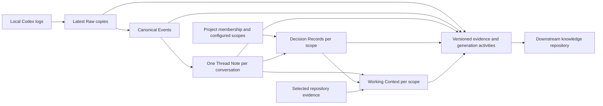
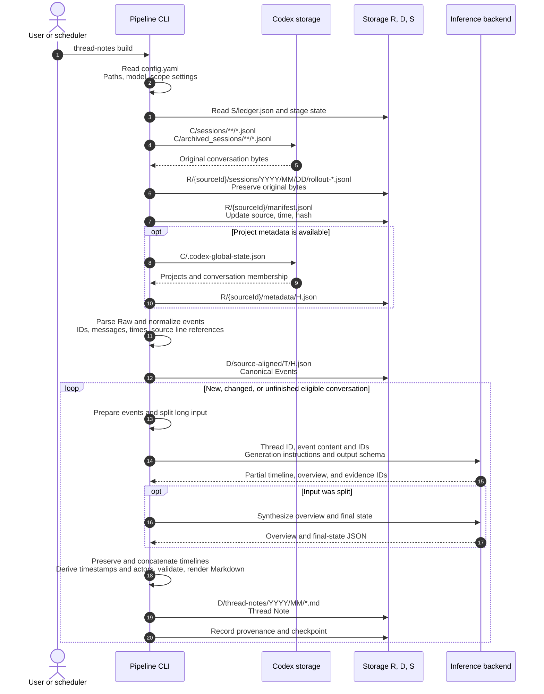
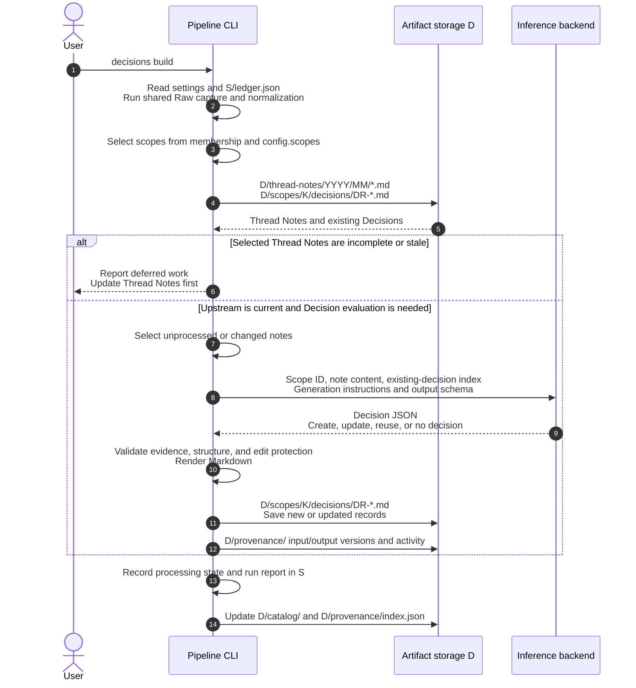
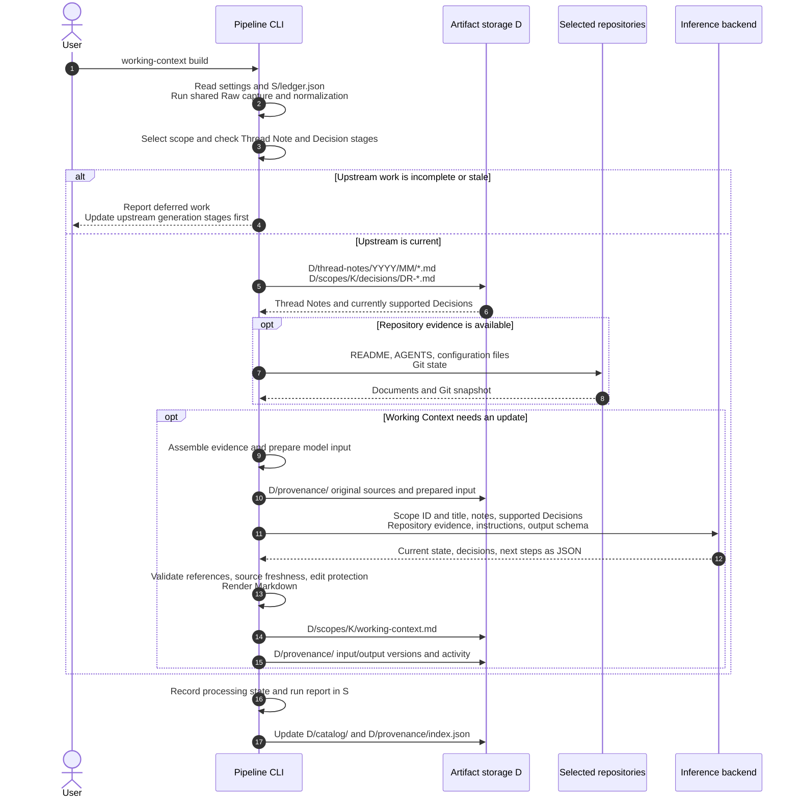
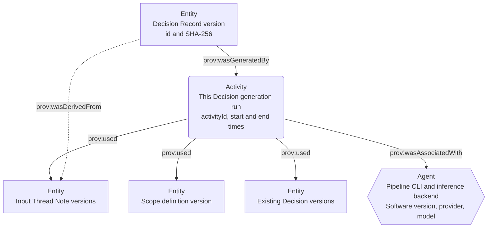

# Tkn Codex Context Pipeline

Japanese: [README_ja.md](README_ja.md)

A local data pipeline that first preserves Codex conversations as Raw data,
then creates Markdown notes summarizing that data (called Thread Notes).
Thread Notes feed Decision Records. Thread Notes, Decision Records, and repository
evidence then feed Working Context, which describes the current state and next steps.
Thread Notes retain a timeline and last known state as well as an overview.
After configuring `config.yaml`, run `clone` for the available history,
then run `pull` periodically.

## Purpose and current scope

Source evidence is organized by conversation. A conversation has one
Thread Note even when it moves between Codex Projects or contributes to several
pieces of work. Project membership is observed metadata. Decisions and Working
Context are generated for scopes: a Codex Project, an explicitly configured
collection of related work, or the unassigned conversation collection.



The `clone` command runs every stage from Raw capture to Working Context generation.
Use `pull` for subsequent updates and individual build commands to run a selected
generation stage. Generated files remain in application storage specified in
`config.yaml`; the pipeline does not write into source repositories or Codex storage.
The `--config` argument selects a configuration file. There are no CLI arguments
for setting storage paths directly.

See [Processing sequence and provenance](#processing-flow) for the actors,
file paths, model inputs, and generated artifacts at each stage.

| Source | Coverage |
| --- | --- |
| `codex_home/sessions/**/*.jsonl` | Available local Codex conversation logs |
| `codex_home/archived_sessions/**/*.jsonl` | Included by default |
| `.codex-global-state.json` | Optional Project membership evidence; missing or unsupported metadata does not exclude conversations |
| Projectless, unmatched, ambiguous conversations | Captured and summarized without inventing a Project assignment |
| Cloud ChatGPT chats / cloud Work | No cloud history connector; only supported JSONL actually present locally can be ingested |
| A cloud-to-local handoff | The locally available log portion; remote ancestry and full cloud history are not guaranteed |
| Internal/approval tasks, logs without a clean user message | Captured and normalized, excluded from Thread Notes |

These are local internal-format readers, not a guarantee that every conversation
visible in the app has a corresponding supported local log. Unparseable logs and
conflicting versions are retained and reported. Unknown record types remain in
Raw and are reported as coverage warnings.

## Requirements and installation

Use Python 3.11+, uv, and accessible local logs. Generation also requires a
configured inference backend. Codex CLI is the default; Claude Code, GitHub
Copilot CLI, and local Ollama are supported. App metadata is optional.

```console
cd "C:\path\to\tkn_codex_context_pipeline"
uv tool install .
tkn-codex-context --help
```

This installs a snapshot of this checkout. After updating the repository, reinstall
with the following command to apply the changes:

```console
uv tool install . --reinstall
```

To use Codex for inference, make sure `codex` runs in your command prompt or
terminal and `codex --version` displays `codex-cli <version>`.
Authentication is also required. Check the version and login status with:

```console
codex --version
codex login status
```

If you are not logged in, authenticate with `codex login`.
The graphical Codex App does not replace the standalone CLI. Even with the App
installed, verify that the commands above work in your terminal.
See the [official Codex CLI command reference](https://learn.chatgpt.com/docs/developer-commands?surface=cli).

## Configure, clone, then pull

### config: create and inspect configuration

Create the configuration file with the following command:

```console
tkn-codex-context config init
```

Edit the displayed `~/.tkn/codex_context_pipeline/config.yaml`. Choose the input
root, storage locations, and generation provider/model. After editing, check
the settings that will actually apply:

```console
tkn-codex-context config show
```

### clone: process historical conversations

`clone` initializes missing storage without resetting existing data, captures
all available history, generates eligible Thread Notes, then builds Decisions
and Working Context for every affected scope. A large conversation history can
consume many AI tokens and take substantial time. Start with a dry-run to inspect
the selected conversations and planned work:

```console
tkn-codex-context clone --dry-run
```

`--dry-run` makes no AI calls and creates no directories or reports. It does not
estimate actual token usage or cost, or predict model output. Stages awaiting new
Thread Notes are reported as `awaiting-upstream`. Once you have checked the
configuration and selected work, capture and generate the artifacts with:

```console
tkn-codex-context clone
```

After an interruption or deferral, repeating the command resumes from saved data
and processing records.

### pull: incorporate new and changed conversations

After the initial `clone`, run the following command periodically:

```console
tkn-codex-context pull
```

`pull` checks previously saved logs and processing records, then captures new
or updated conversations. It updates the affected Thread Notes, Decisions, and
Working Context and resumes unfinished work. Conversations held before this CLI
was installed are also included if their supported logs are added to the input
source later. Unchanged successful stages make no model calls.
The default 30-minute idle interval delays summarizing active conversations;
Raw capture still happens first. Use `--limit` to bound the number of notes
attempted in a run; remaining work resumes on the next `pull`.

Inspect the last result and the scopes selected for generation with:

```console
tkn-codex-context status
tkn-codex-context scopes list
```

`status` shows the last run's recorded state and timestamp, not a live source
scan. A run is complete only when all eligible conversations and active scopes
are current. Failures, deferred work, and protected stale notes prevent that
claim. Scopes with incomplete inputs do not synthesize a supposedly current
context. Independent scopes can still finish.

## Configuration

The packaged [example](src/tkn_codex_context/resources/config.example.yaml)
contains usable defaults:

```yaml
schema_version: "2.2.0"
codex_home: ~/.codex
raw_root: ~/.tkn/codex_context_pipeline/raw
data_root: ~/.tkn/codex_context_pipeline/data
state_root: ~/.tkn/codex_context_pipeline/state
cache_root: ~/.cache/codex_context_pipeline
source_id: windows
include_archived: true
generation:
  active_provider: codex
  providers:
    codex:
      model: gpt-5.6-sol
      reasoning_effort: high
      executable: codex
idle_minutes: 30
runtime_minutes: 230
model_timeout_seconds: 1800
scopes: {}
```

Configuration precedence is built-in defaults → user configuration → current
directory `.tkn/config.yaml` → explicit `--config` → command-line options.
Relative paths resolve against the file declaring them. `config show` reports
the winning sources, schema migrations, and generation profile hashes. Existing
configuration is preserved by `config init`; `config init --force` first backs
it up. Older compatible configuration versions are read in memory. Legacy
`installed_at`, if present, has no selection effect in this workflow.

Put global options before the command:

```console
tkn-codex-context --config "C:\path\to\config.yaml" clone
tkn-codex-context --idle-minutes 0 --runtime-minutes 60 pull --limit 20
```

Use separate non-overlapping roots owned by this application, outside source
logs and configuration. An existing unrelated directory is rejected. A store
is bound to one `source_id`; use a separate store for a different source.
`include_archived: false` stops scanning the archive directory; previously
captured evidence remains available.

### Inference providers

The currently supported chat source is locally stored Codex conversation logs.
You can change the generative AI model used for inference through
`generation.active_provider` and the selected provider's `model` setting.
Set the selected provider's model and transport; model
availability and authentication belong to the chosen service.

| Provider ID | Required transport setting | Execution |
| --- | --- | --- |
| `codex` | `executable: codex` | Standalone `codex exec` |
| `claude-code` | `executable: claude` | Non-interactive Claude Code |
| `github-copilot` | `executable: copilot` | Non-interactive Copilot CLI |
| `ollama` | `base_url: http://127.0.0.1:11434` | Local chat endpoint, loopback addresses only |

For example, replace the generation block to use an already available local model:

```yaml
generation:
  active_provider: ollama
  providers:
    ollama:
      model: <installed-local-model>
      reasoning_effort: high
      base_url: http://127.0.0.1:11434
```

CLI providers send the selected generation input through their configured
service. Raw captures and provenance snapshots retain source content locally;
choose storage appropriate for private conversation data. Generation profiles,
output validation, and retry limits are application-owned. Changing a model,
provider, reasoning setting, or generation profile invalidates affected stages.

### Automatic and custom scopes

A scope defines which conversations to consider together when building
Decisions and Working Context. You do not need to create one for every Project.

| Scope | Who defines it? | Selected conversations |
| --- | --- | --- |
| `project:<source-project-id>` | The CLI creates it automatically from observed local Project membership | Conversations assigned to that local Project |
| `unassigned` | The CLI creates it automatically when needed | Conversations without a resolved local Project assignment |
| `work:<configuration-key>` | You choose the grouping in `config.yaml`; the CLI materializes it | The union of the configured Project and thread selectors |

Start with `scopes: {}`. Automatic scopes operate with that setting, and scopes
without eligible conversations are not materialized. Add a custom work scope
when you want to review the decisions and next steps of several Projects or
selected conversations together. The CLI does not infer thematic groups with AI.

Your task is to choose the scope's name and membership. You do not write its
summary, Decisions, or Working Context by hand. `data_root/catalog/scopes.json`
is a generated catalog, not the configuration file to edit.

### Work spanning Projects

Use `scopes list` and the thread catalog to find exact source IDs. Add explicit
selectors to configuration; the selected set is the union of the Project and
thread selectors:

```yaml
scopes:
  context-pipeline:
    title: Context pipeline work
    project_ids: [project-a, project-b]
    thread_ids: [a-projectless-thread-id]
    repository_roots: ["C:/path/to/repository-a", "C:/path/to/repository-b"]
```

This creates `work:context-pipeline` in addition to the automatic scopes.
`title` is the display name. `project_ids` uses original Project IDs without the
`project:` prefix, and `thread_ids` uses original conversation IDs.
`repository_roots` optionally adds repository evidence for Working Context; it
does not select conversations. The configuration key is the scope's identity:
changing the key creates a different scope, while changing its title does not.

After editing the configuration, run `pull` to update affected scopes. Custom
scopes can overlap; they reference shared Thread Notes instead of copying them.
Unknown selectors fail before inference. Membership changes preserve the
conversation's note identity. `unassigned` remains a collection of independent
activities without assuming they share one goal.

Working Context uses shared Thread Notes, applicable Decision Records, and
available selected repository documents/Git state. Project scopes use their
observed roots; custom work scopes use `repository_roots`. Repository evidence
is bounded. Unreadable or secret-like repository files are omitted; absence of
repository evidence is not proof of implementation. Decisions without valid
current source support are retained as stale and excluded from current context
inputs. A scope with no decisions can still have a valid Working Context.

## Commands and operation

| Command | Purpose |
| --- | --- |
| `config init`, `config show` | Create or inspect configuration |
| `clone` | Initialize and process all available history through every stage |
| `pull` | Capture changes and resume all affected or unfinished stages |
| `status` | Inspect last recorded run, without scanning sources |
| `scopes list` | Inspect last published scopes and their exact IDs |
| `raw ingest` | Capture bytes only, without normalization or inference; can initialize storage |
| `thread-notes build [--thread-id ID]` | Re-evaluate notes, all or one conversation |
| `decisions build [--scope ID]` | Re-evaluate Decisions, all or one scope |
| `working-context build [--scope ID]` | Re-evaluate Working Context with current upstream stages |
| `thread-notes validate FILE` | Validate a Thread Note |
| `decisions validate FILE` | Validate a Decision Record |
| `working-context validate FILE` | Validate a Working Context |
| `provenance validate` | Check indexed artifacts, retained evidence hashes, and activity relations |

All pipeline mutation commands write by default and accept `--dry-run`.
Generation commands also accept `--force` and `--allow-edited`. `--force`
re-evaluates unchanged inputs at the selected stage; it does not override edit
protection. `--allow-edited` explicitly permits replacing edited unreviewed
outputs. Reviewed notes/context are protected from regeneration. Reviewed
Decisions can be referenced but are not rewritten. Preserved reviewed artifacts
may require manual reconciliation when their sources change.

```console
tkn-codex-context thread-notes build --thread-id "thread-id" --force
tkn-codex-context decisions build --scope "work:context-pipeline" --force
tkn-codex-context working-context build --scope "work:context-pipeline" --force
```

Individual builds still capture and normalize local evidence before selecting
their stage. They do not rebuild upstream stages or declare the entire pipeline
complete. Run `pull` to bring all stages up to date.

Progress and diagnostics go to stderr; stdout is UTF-8 JSON. Full reports are
saved in `state_root/reports/`; add `--full-output` for per-thread/per-scope
stdout details. Global `--quiet` suppresses progress and `--verbose` enables
additional diagnostics.

| Exit code | Meaning |
| --- | --- |
| `0` | Requested stages succeeded, or a dry-run plan validated |
| `1` | Configuration, source, storage, validation, or generation failure |
| `2` | Incomplete/blocked pipeline, or invalid command syntax |

A failed run retains successful notes, committed decision batches, and captured
Raw. Retry with `pull`; it does not repeat successful unchanged model work.
OS locks reject overlapping writers and are released when the process exits.
The runtime budget stops new work; an in-flight inference may use a bounded
grace interval. A process interrupted before publication leaves a running,
incomplete last-run record.

For scheduled operation, configure an external scheduler to execute `pull` with
an explicit config path, a consistent working directory, and captured exit code
and stderr. This CLI does not install a scheduler or resident process. Use
`raw ingest` at a shorter interval if acquisition must continue independently
of inference; follow it with `pull` to update the derived artifacts.

<a id="processing-flow"></a>

## Storage layout

The pipeline captures original chats as Raw, normalizes their events, and generates
Thread Notes. Raw preserves the source log layout; Thread Notes are organized by
the year and month in which each conversation started.

The following shows the default locations. `~` is the user home directory and
`<sourceId>` identifies the source (default: `windows`). Each root is configurable.

```text
~/.tkn/codex_context_pipeline/
├─ raw/                                  # raw_root
│  └─ <sourceId>/
│     ├─ sessions/                       # Original layout below sessions/
│     │  └─ 2026/09/10/
│     │     └─ rollout-....jsonl
│     ├─ archived_sessions/              # Original relative paths and filenames
│     │  └─ ...
│     ├─ manifest.jsonl                  # Latest capture record per source file
│     └─ metadata/<hash>.json             # App membership metadata
├─ data/                                 # data_root
│  ├─ source-aligned/<threadKey>/
│  │  └─ <hash>.json                     # Normalized conversation events
│  ├─ thread-notes/
│  │  ├─ 2025/
│  │  │  └─ 12/
│  │  │     └─ <start-time>-<slug>.md
│  │  └─ 2026/
│  │     ├─ 08/
│  │     │  └─ <start-time>-<slug>.md
│  │     └─ 09/
│  │        └─ 20260910T081831+0900-storage-layout.md
│  ├─ scopes/<scopeKey>/
│  │  ├─ decisions/DR-*.md               # Scope Decision Records
│  │  └─ working-context.md              # Current scope context
│  ├─ catalog/                           # Conversations, membership, artifacts
│  └─ provenance/                        # Generation evidence and history
└─ state/                                # state_root: processing state and reports

~/.cache/codex_context_pipeline/          # cache_root: resumable work data
```

### Raw: latest chats in their original folder structure

Under `raw_root/<sourceId>/`, the pipeline preserves the relative folder structure
and filenames from Codex's `sessions/` and `archived_sessions/`. The dated folders
in the tree are an example of the source layout. Changed logs replace the latest
copy at the same path; missing originals do not cause saved copies to be deleted.
Backup generations belong to external tools such as FreeFileSync or Task Scheduler.

### Thread Notes: organized by conversation start year and month

Normalized conversation events produce one Thread Note per conversation at
`data_root/thread-notes/YYYY/MM/<start-time>-<slug>.md`. Both the folder and filename
use the conversation start time converted to the system timezone. In Japan, this
looks like `20260910T081831+0900`; there are no daily note folders. Conversations
spanning months stay in their starting month, and stable IDs remain in Frontmatter.

Decision Records and Working Context are generated per scope using Thread Notes
as input. Generation evidence snapshots in `data_root/provenance/` are maintained
separately from the latest Raw copies.

## Processing sequence and provenance

The CLI selects inputs, the inference backend returns structured JSON, and the
CLI validates and renders that JSON into Markdown. `clone` and `pull` run the
following three generation stages in order. Individual build commands first
capture and normalize Raw, then run only their selected generation stage.
Prepare storage initially with `clone`, or `raw ingest` for capture alone.

The diagrams show normal execution when generation is needed. Unchanged successful
work is skipped. `--dry-run` makes no AI calls or file writes. Raw capture and
normalization do not use a model.

### thread-notes build: generate Thread Notes from Raw

Capture and normalize conversation logs, then generate Markdown Thread Notes for
eligible conversations. Use `--thread-id` to select one conversation. This command
does not generate Decisions or Working Context. The model receives event content
and IDs, generation instructions, and the output schema.

The following shows `tkn-codex-context thread-notes build`. The legend applies
to the diagram immediately below it.

| Diagram notation | Configuration key | Default location |
| --- | --- | --- |
| `C` | `codex_home` | `~/.codex` |
| `R` | `raw_root` | `~/.tkn/codex_context_pipeline/raw` |
| `D` | `data_root` | `~/.tkn/codex_context_pipeline/data` |
| `S` | `state_root` | `~/.tkn/codex_context_pipeline/state` |

`T` is a conversation's `threadKey` and `H` is a content hash.
They are placeholders in the diagram.



The saved Canonical Events and the summarizer's input originate from the same
parse. The current implementation passes in-memory events to the summarizer;
it does not re-read the saved canonical JSON for that step. Summarization is
per conversation, independent of work-scope grouping.

### decisions build: generate Decisions from Thread Notes

The CLI uses scopes to select shared Thread Notes and existing Decisions, then
passes unprocessed or changed notes to the model. A scope is selection data.
The model receives the scope ID and selected evidence, not the full scope
configuration JSON. Work is deferred if the scope's Thread Notes are not current.
This command does not generate Thread Notes or Working Context.

The following shows `tkn-codex-context decisions build`. Use `--scope` to select a scope.

| Diagram notation | Configuration key / meaning | Default location |
| --- | --- | --- |
| `D` | `data_root`: notes, Decisions, provenance | `~/.tkn/codex_context_pipeline/data` |
| `S` | `state_root`: processing records | `~/.tkn/codex_context_pipeline/state` |
| `T` / `K` | Conversation `threadKey` / scope storage key | Placeholders in paths |



A result with no new Decisions can still succeed. Model references to existing
Decisions are also retained in the processing records.

### working-context build: generate current state and next steps

Working Context combines a scope's Thread Notes, supported Decisions, and selected
repository documents/Git state. The model receives the scope ID and title,
selected evidence, generation instructions, and the output schema. Original
sources and size-bounded model inputs are retained as separate snapshots.

The following shows `tkn-codex-context working-context build`. Use `--scope` to select
a scope. Thread Notes and the Decision stage must be current; this command does
not regenerate them. Zero Decision Records are valid if the Decision stage
completed successfully.

| Diagram notation | Configuration key / meaning | Default location |
| --- | --- | --- |
| `D` | `data_root`: notes, Decisions, Working Context, provenance | `~/.tkn/codex_context_pipeline/data` |
| `S` | `state_root`: processing records | `~/.tkn/codex_context_pipeline/state` |
| `T` / `K` | Conversation `threadKey` / scope storage key | Placeholders in paths |
| Selected repositories | Observed Project roots or scope `repository_roots` | Scope-dependent |



### A PROV-O view of a Decision's provenance

In [PROV-O](https://www.w3.org/TR/prov-o/#description-starting-point), an
Entity represents data such as a particular file version, an Activity is an
execution, and an Agent is a responsible actor. The arrows below trace an
output back to its generating activity and evidence.



This is a mapping of the current JSON records to PROV-O concepts; RDF output
belongs downstream. The recorded `used` set describes stage-level dependencies,
including the scope used for selection. It is not limited to text directly
sent to the model, and is not a complete log of every model request.

In the following table, `D` is `data_root`, `S` is `state_root`, and `H` is a content hash.

| Record location | What it explains |
| --- | --- |
| `D/provenance/entities/*.json` | Logical identity, version, hash, and snapshot reference |
| `D/provenance/blobs/{prefix}/H` | Exact bytes of the retained version |
| `D/provenance/activities/{activityId}.json` | Which execution used which versions and produced which outputs |
| `D/provenance/index.json` | Published artifact versions, status, and activity references |
| `S/ledger.json` | Completed stages and resumable work |
| `S/reports/{runId}.json` | Successes, failures, and deferred work in one invocation |
| `S/last-run.json` | Last invocation's recorded state |

## What a Thread Note records

The artifact is called a **Thread Note** (Japanese: **スレッド記録**).
“Chat summary” is an informal process name, not a requirement to compress the
whole record. The `thread-notes` command, `type: threadNote`, storage paths, and
`profiles/summary/default` resource path remain stable.

- **Summary**: a short overview of the conversation's purpose and outcome.
- **Timeline**: dated, attributed entries with evidence IDs. Preserve questions,
  ideas, unaccepted options, failures, retries, corrections, actions, checks, and
  decisions. Group routine reads by purpose.
- **Last Known State**: the final observed state, latest user direction,
  unresolved requests, unverified checks, and continuation point.
- **Evidence / Source Notes**: useful exact checks and input/verification limitations,
  shown only when populated.

The application derives timestamps and actors from cited start/end events. The
renderer groups by date and displays seconds in `Asia/Tokyo`. Raw and canonical
events retain original timestamp precision and line references. Source order wins
for identical timestamps or clocks moving backwards; missing, invalid, or timezone-naive
timestamps display as unknown. Logged time is not a measurement of working duration.

Timeline entries use a time heading followed by fixed fields: `Actor`, `Type`, `Text`,
`EventRange`, and `Sources`. Actors are `User`, `AI`, and `Tool`; both assistant messages
and tool invocations use `AI`, while tool results use `Tool`. `Type` is the development
classification. `EventRange` gives the start/end IDs that determine time and actor (the
same ID twice for one event); `Sources` lists all supporting events. Never infer endpoints
from citation order. Separators are ASCII: ` - ` for time ranges, ` -> ` for event ranges,
and `: ` for fields. Missing time/day use `Unknown` / `Unknown date`.

```markdown
### 2026-05-17

- **11:27:35 - 11:27:47**
  - Actor: AI
  - Type: Action
  - Text: Investigated public access and listing behavior.
  - EventRange: L000010 -> L000020
  - Sources: L000010, L000012, L000020
```

Prose continuation lines stay indented below `Text`. Summary and Evidence use `Text`
with a child `Sources` field. Last Known State has fixed fields in this order: `Work State`,
`Detail`, `Latest User Direction`, `Unresolved`, `Unverified`, `Continuation Point`, `Sources`.
Its Sources support the state record as a whole; per-field citations are not inferred.
Unresolved/unverified items are nested `Text` records. Empty arrays display as `[]` and
empty prose as `null` (the JSON still uses empty strings). These mean no recorded value,
not that all checks passed or no user direction exists. Source Notes use `Text` records
without invented types or citations. Empty Evidence/Source Notes sections remain omitted;
omission means no recorded items, not an independent finding of no problems.
Downstream readers continue to accept the older layouts.
This Markdown is not RDF/PROV-O serialization: future conversion should use structured
source events and explicit IDs rather than infer roles from display text. The timeline
JSON schema is unchanged.

Chapter headings/order, optional-section conditions, and Last Known State field labels/order
live in `src/tkn_codex_context/profiles/summary/default/template.md`.
`{{?evidence}}` / `{{/evidence}}` and `{{?source_notes}}` / `{{/source_notes}}` include
their heading and body only when the corresponding body has content. Conditional markers
occupy their own lines and cannot nest; unclosed, unknown, or duplicate blocks fail validation.
Python formats repeated body items and indentation, derives times/actors/references, and
validates the data. Inserted prose containing syntax such as `{{evidence}}` stays literal.
The output JSON and existing Markdown reader contracts remain unchanged; no dependency is added.

Long conversations are processed in parts. **Partial timeline entries are concatenated
without another model reduction**; only the overview and final state are synthesized.
There is no six-development-per-task limit or 9,000-character whole-record limit.
Each entry allows up to 900 characters. Validation checks user-message coverage,
references, and ranges crossing actors, days, or turns. These are structural and
reference checks, not proof of semantic correctness. Event text is no longer cut at
8,000 characters. After credential-shaped text is redacted, all remaining text is supplied
in order. Normal events stay whole; events larger than the default 120,000-character
serialized event-array budget are split into consecutive pieces carrying the original ID,
timestamp, part index/count, and text offsets. The budget excludes prompt/schema overhead
and is not a token limit. Repair calls receive the same source pieces. All partial timeline
entries survive merging. This preserves input coverage, not every detail in the generated
prose. Source Notes still disclose gaps already present in the source, such as tool-output
truncation; lossless input partitioning is not a source gap.

Thread Notes contain source-backed facts. New ideas, recurring-work analysis,
automation suggestions, and diaries are downstream uses. Observable tool operations
and results are included; unlogged internal reasoning is not reconstructed.
Decisions and Working Context accept old and new Thread Notes, including records up
to 180,000 characters per note; larger inputs fail explicitly instead of being silently cut.

For a real generation comparison, use the development helper below. It saves the
baseline, a source-log snapshot, generated output, and validation report in a new
output directory. It uses the configured generation provider without updating live
notes or pipeline checkpoints.

```console
uv run python scripts/review_thread_note.py --source-log <rollout.jsonl> --baseline-note <thread-note.md> --output-dir <new-review-directory>
```

`--reuse-dir <previous-review-directory>` reuses cached inference responses only for
identical prompts, profiles, and provider settings. Current validation still runs;
repairs and uncached calls use the configured provider.

## Downstream data contract

| Root / path | Contents |
| --- | --- |
| `raw_root/<sourceId>/sessions/<original-relative-path>.jsonl` | Latest original-byte copies (also `archived_sessions/`) |
| `raw_root/<sourceId>/manifest.jsonl` | Latest capture/discovery record per source |
| `raw_root/<sourceId>/metadata/<hash>.json` | Captured app membership metadata |
| `data_root/source-aligned/<threadKey>/<hash>.json` | Immutable canonical events, raw line locators and parser diagnostics |
| `data_root/thread-notes/YYYY/MM/*.md` | One stable-ID Thread Note per conversation |
| `data_root/scopes/<scopeKey>/decisions/DR-*.md` | Scope Decision Records |
| `data_root/scopes/<scopeKey>/working-context.md` | Current scope context |
| `data_root/catalog/threads.json`, `scopes.json` | Observed membership/history, references and processing status |
| `data_root/provenance/` | Immutable entity versions, input/output snapshots, generation activities and consumer index |
| `state_root/` | Storage identity, processing checkpoints, stage state, reports and last-run status |
| `cache_root/` | Resumable generation work and pending outputs |

The data contract separates logical UUIDs from content versions (`sha256:`),
records generating provider/model/profile hashes, and links outputs to exact
input versions. Working Context uses `scopeId` and `scopeStatus` (schema 5).
Thread Notes use schema 5 and Decisions use schema 5. Thread Note schemas 3 and 4 remain readable. Existing artifact IDs and
creation dates are preserved on regeneration; ambiguous duplicate notes are
rejected.

[Data contract](reference/data-contract.md) describes references, schemas,
completion semantics, and how to consume provenance. RDF serialization, global
IRI policy, OWL vocabulary, semantic entity resolution, and PROV-O mapping
belong to the downstream repository. This repository exports the evidence
needed for that work and does not implement an ontology or graph store.

## Development

```console
uv sync
uv run pytest
uv run ruff check src tests
uv run mypy
uv build
```

Tests use synthetic logs, fake inference providers, and framework-managed
temporary directories. They do not require a live account or personal corpus.
Generation prompts, schemas, and templates live under
`src/tkn_codex_context/profiles/` and ship with the package. Review their
versions/hashes when changing the generation contract.

[Project handoff](reference/project-handoff.md) explains the implementation
boundaries and how to resume development.
