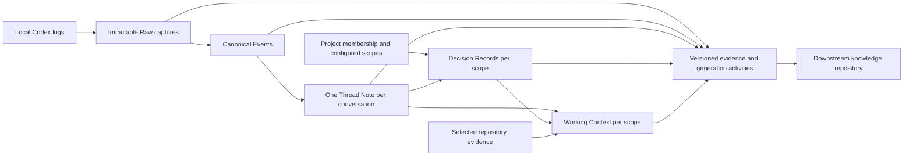
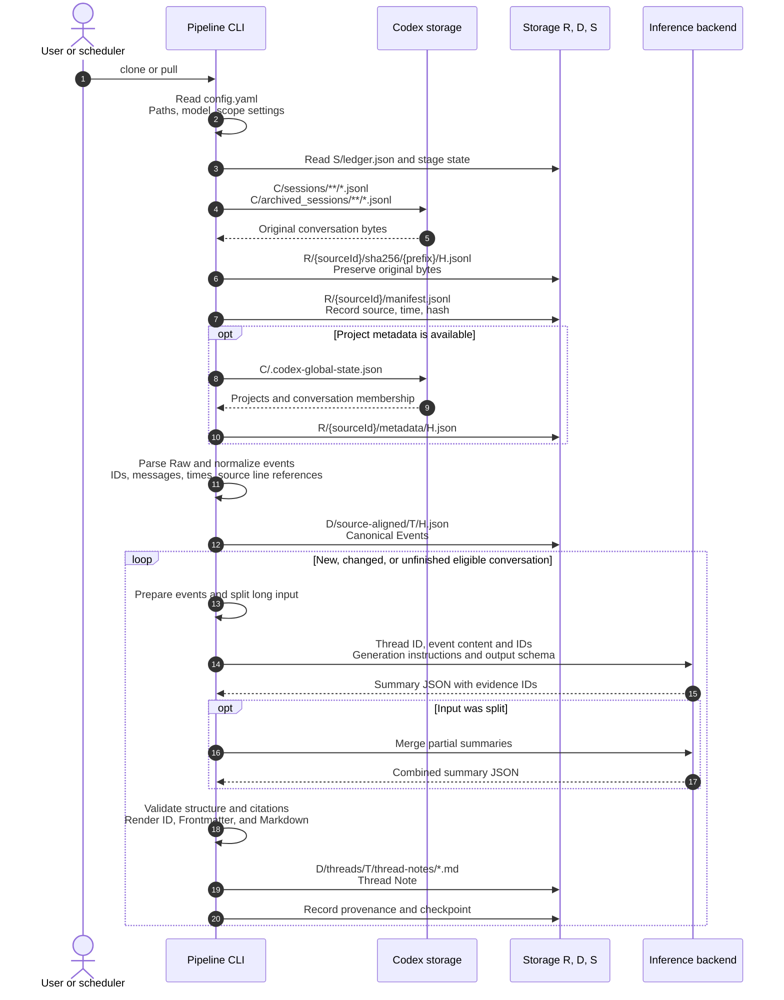
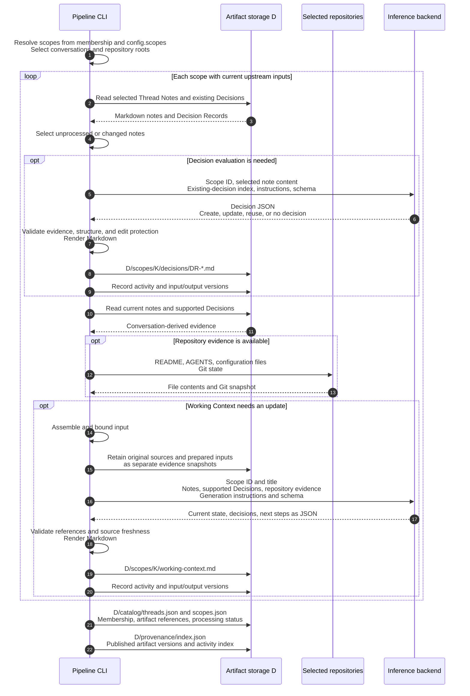
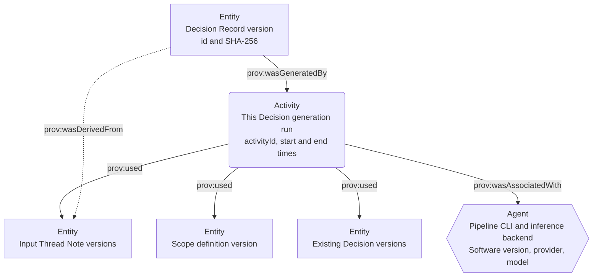

# Tkn Codex Context Pipeline

A local data pipeline that preserves Codex conversations and turns them into
Thread Notes, Decision Records, and current Working Context. Configure it once,
run `clone` for the available history, then run `pull` periodically.

Japanese: [README_ja.md](README_ja.md)

## Purpose and current scope

Version 0.5 organizes source evidence by conversation. A conversation has one
Thread Note even when it moves between Codex Projects or contributes to several
pieces of work. Project membership is observed metadata. Decisions and Working
Context are generated for scopes: a Codex Project, an explicitly configured
collection of related work, or the unassigned conversation collection.



The normal command runs every stage. Individual builds are maintenance tools.
No Project registration or per-Project backfill is required before capture or
summarization. Generated files remain in the configured application storage;
the pipeline does not write into source repositories or Codex storage.

See [Processing sequence and provenance](#processing-flow) for the actors,
file paths, model inputs, and generated artifacts at each stage.

| Source | Coverage |
| --- | --- |
| `codex_home/sessions/**/*.jsonl` | Available local Codex conversation logs |
| `codex_home/archived_sessions/**/*.jsonl` | Included by default |
| `.codex-global-state.json` | Optional Project membership evidence; missing or unsupported metadata does not exclude conversations |
| Projectless, unmatched, ambiguous conversations | Captured and summarized without inventing a Project assignment |
| Cloud ChatGPT chats / cloud Work | No cloud history connector; only supported JSONL actually present locally can be ingested |
| A cloud-to-local handoff | The locally available log portion; remote ancestry and full cloud history are not guaranteed |
| Internal/approval tasks, logs without a clean user message | Captured and normalized, excluded from Thread Notes |

These are local internal-format readers, not a guarantee that every conversation
visible in the app has a corresponding supported local log. Unparseable logs and
conflicting versions are retained and reported. Unknown record types remain in
Raw and are reported as coverage warnings.

## Requirements and installation

Use Python 3.11+, uv, and accessible local logs. Generation also requires a
configured inference backend. Codex CLI is the default; Claude Code, GitHub
Copilot CLI, and local Ollama are supported. App metadata is optional.

```console
cd "C:\path\to\tkn_codex_context_pipeline"
uv tool install .
tkn-codex-context --help
```

This installs a snapshot of this checkout. After updating the repository:

```console
uv tool install . --reinstall
```

The standalone `codex` CLI must be available and authenticated when using the
Codex provider. The Codex desktop executable under `WindowsApps` is not a
substitute for the standalone CLI.

## Configure, clone, then pull

```console
tkn-codex-context config init
```

Edit the displayed `~/.tkn/codex_context_pipeline/config.yaml`. Choose the input
root, storage locations, and generation provider/model. Inspect the effective
configuration and optionally preview the first run:

```console
tkn-codex-context config show
tkn-codex-context clone --dry-run
tkn-codex-context clone
```

`clone` initializes missing storage without resetting existing data, captures
all available history, generates eligible Thread Notes, then builds Decisions
and Working Context for every affected scope. Repeating `clone` is resumable.
The initial run can make many model calls. `--dry-run` performs no inference,
creates no directories or reports, and does not predict model output; downstream
stages awaiting new notes are reported as `awaiting-upstream`.

For routine updates:

```console
tkn-codex-context pull
tkn-codex-context status
tkn-codex-context scopes list
```

`pull` requires initialized storage. It scans for new or changed captures and
retries unfinished stages, including old conversations added later. There is no
installation-date cutoff. Unchanged successful stages make no model calls.
The default 30-minute idle interval delays summarizing active conversations;
Raw capture still happens first. Use `--limit` to bound the number of notes
attempted in a run; remaining work resumes on the next `pull`.

`status` shows the last run's recorded state and timestamp, not a live source
scan. A run is complete only when all eligible conversations and active scopes
are current. Failures, deferred work, and protected stale notes prevent that
claim. Scopes with incomplete inputs do not synthesize a supposedly current
context. Independent scopes can still finish.

## Configuration

The packaged [example](src/tkn_codex_context/resources/config.example.yaml)
contains usable defaults:

```yaml
schema_version: "2.2.0"
codex_home: ~/.codex
raw_root: ~/.tkn/codex_context_pipeline/raw
data_root: ~/.tkn/codex_context_pipeline/data
state_root: ~/.tkn/codex_context_pipeline/state
cache_root: ~/.cache/codex_context_pipeline
source_id: windows
include_archived: true
generation:
  active_provider: codex
  providers:
    codex:
      model: gpt-5.6-sol
      reasoning_effort: high
      executable: codex
idle_minutes: 30
runtime_minutes: 230
model_timeout_seconds: 1800
scopes: {}
```

Configuration precedence is built-in defaults → user configuration → current
directory `.tkn/config.yaml` → explicit `--config` → command-line options.
Relative paths resolve against the file declaring them. `config show` reports
the winning sources, schema migrations, and generation profile hashes. Existing
configuration is preserved by `config init`; `config init --force` first backs
it up. Older compatible configuration versions are read in memory. Legacy
`installed_at`, if present, has no selection effect in this workflow.

Put global options before the command:

```console
tkn-codex-context --config "C:\path\to\config.yaml" clone
tkn-codex-context --idle-minutes 0 --runtime-minutes 60 pull --limit 20
```

Use separate non-overlapping roots owned by this application, outside source
logs and configuration. An existing unrelated directory is rejected. A store
is bound to one `source_id`; use a separate store for a different source.
`include_archived: false` stops scanning the archive directory; previously
captured evidence remains available.

### Inference providers

The source provider remains Codex. `generation.active_provider` changes only
the inference backend. Set the selected provider's model and transport; model
availability and authentication belong to the chosen service.

| Provider ID | Required transport setting | Execution |
| --- | --- | --- |
| `codex` | `executable: codex` | Standalone `codex exec` |
| `claude-code` | `executable: claude` | Non-interactive Claude Code |
| `github-copilot` | `executable: copilot` | Non-interactive Copilot CLI |
| `ollama` | `base_url: http://127.0.0.1:11434` | Local chat endpoint, loopback addresses only |

For example, replace the generation block to use an already available local model:

```yaml
generation:
  active_provider: ollama
  providers:
    ollama:
      model: <installed-local-model>
      reasoning_effort: high
      base_url: http://127.0.0.1:11434
```

CLI providers send the selected generation input through their configured
service. Raw captures and provenance snapshots retain source content locally;
choose storage appropriate for private conversation data. Generation profiles,
output validation, and retry limits are application-owned. Changing a model,
provider, reasoning setting, or generation profile invalidates affected stages.

### Automatic and custom scopes

A scope defines which conversations to consider together when building
Decisions and Working Context. You do not need to create one for every Project.

| Scope | Who defines it? | Selected conversations |
| --- | --- | --- |
| `project:<source-project-id>` | The CLI creates it automatically from observed local Project membership | Conversations assigned to that local Project |
| `unassigned` | The CLI creates it automatically when needed | Conversations without a resolved local Project assignment |
| `work:<configuration-key>` | You choose the grouping in `config.yaml`; the CLI materializes it | The union of the configured Project and thread selectors |

Start with `scopes: {}`. Automatic scopes operate with that setting, and scopes
without eligible conversations are not materialized. Add a custom work scope
when you want to review the decisions and next steps of several Projects or
selected conversations together. The CLI does not infer thematic groups with AI.

Your task is to choose the scope's name and membership. You do not write its
summary, Decisions, or Working Context by hand. `data_root/catalog/scopes.json`
is a generated catalog, not the configuration file to edit.

### Work spanning Projects

Use `scopes list` and the thread catalog to find exact source IDs. Add explicit
selectors to configuration; the selected set is the union of the Project and
thread selectors:

```yaml
scopes:
  context-pipeline:
    title: Context pipeline work
    project_ids: [project-a, project-b]
    thread_ids: [a-projectless-thread-id]
    repository_roots: ["C:/path/to/repository-a", "C:/path/to/repository-b"]
```

This creates `work:context-pipeline` in addition to the automatic scopes.
`title` is the display name. `project_ids` uses original Project IDs without the
`project:` prefix, and `thread_ids` uses original conversation IDs.
`repository_roots` optionally adds repository evidence for Working Context; it
does not select conversations. The configuration key is the scope's identity:
changing the key creates a different scope, while changing its title does not.

After editing the configuration, run `pull` to update affected scopes. Custom
scopes can overlap; they reference shared Thread Notes instead of copying them.
Unknown selectors fail before inference. Membership changes preserve the
conversation's note identity. `unassigned` remains a collection of independent
activities without assuming they share one goal.

Working Context uses shared Thread Notes, applicable Decision Records, and
available selected repository documents/Git state. Project scopes use their
observed roots; custom work scopes use `repository_roots`. Repository evidence
is bounded. Unreadable or secret-like repository files are omitted; absence of
repository evidence is not proof of implementation. Decisions without valid
current source support are retained as stale and excluded from current context
inputs. A scope with no decisions can still have a valid Working Context.

## Commands and operation

| Command | Purpose |
| --- | --- |
| `config init`, `config show` | Create or inspect configuration |
| `clone` | Initialize and process all available history through every stage |
| `pull` | Capture changes and resume all affected or unfinished stages |
| `status` | Inspect last recorded run, without scanning sources |
| `scopes list` | Inspect last published scopes and their exact IDs |
| `raw ingest` | Capture bytes only, without normalization or inference; can initialize storage |
| `thread-notes build [--thread-id ID]` | Re-evaluate notes, all or one conversation |
| `decisions build [--scope ID]` | Re-evaluate Decisions, all or one scope |
| `working-context build [--scope ID]` | Re-evaluate Working Context with current upstream stages |
| `thread-notes validate FILE` | Validate a Thread Note |
| `decisions validate FILE` | Validate a Decision Record |
| `working-context validate FILE` | Validate a Working Context |
| `provenance validate` | Check indexed artifacts, retained evidence hashes, and activity relations |

All pipeline mutation commands write by default and accept `--dry-run`.
Generation commands also accept `--force` and `--allow-edited`. `--force`
re-evaluates unchanged inputs at the selected stage; it does not override edit
protection. `--allow-edited` explicitly permits replacing edited unreviewed
outputs. Reviewed notes/context are protected from regeneration. Reviewed
Decisions can be referenced but are not rewritten. Preserved reviewed artifacts
may require manual reconciliation when their sources change.

```console
tkn-codex-context thread-notes build --thread-id "thread-id" --force
tkn-codex-context decisions build --scope "work:context-pipeline" --force
tkn-codex-context working-context build --scope "work:context-pipeline" --force
```

Individual builds still capture and normalize local evidence before selecting
their stage. They do not rebuild upstream stages or declare the entire pipeline
complete. Run `pull` to bring all stages up to date.

Progress and diagnostics go to stderr; stdout is UTF-8 JSON. Full reports are
saved in `state_root/reports/`; add `--full-output` for per-thread/per-scope
stdout details. Global `--quiet` suppresses progress and `--verbose` enables
additional diagnostics.

| Exit code | Meaning |
| --- | --- |
| `0` | Requested stages succeeded, or a dry-run plan validated |
| `1` | Configuration, source, storage, validation, or generation failure |
| `2` | Incomplete/blocked pipeline, or invalid command syntax |

A failed run retains successful notes, committed decision batches, and captured
Raw. Retry with `pull`; it does not repeat successful unchanged model work.
OS locks reject overlapping writers and are released when the process exits.
The runtime budget stops new work; an in-flight inference may use a bounded
grace interval. A process interrupted before publication leaves a running,
incomplete last-run record.

For scheduled operation, configure an external scheduler to execute `pull` with
an explicit config path, a consistent working directory, and captured exit code
and stderr. This CLI does not install a scheduler or resident process. Use
`raw ingest` at a shorter interval if acquisition must continue independently
of inference; follow it with `pull` to update the derived artifacts.

<a id="processing-flow"></a>

## Processing sequence and provenance

The CLI selects inputs, the inference backend returns structured JSON, and the
CLI validates and renders that JSON into Markdown. The sequence diagrams show
the normal write workflow; unchanged successful stages are skipped during
`pull`. Source capture and deterministic normalization do not use a model.

| Diagram abbreviation | Configuration key | Default location |
| --- | --- | --- |
| `C` | `codex_home` | `~/.codex` |
| `R` | `raw_root` | `~/.tkn/codex_context_pipeline/raw` |
| `D` | `data_root` | `~/.tkn/codex_context_pipeline/data` |
| `S` | `state_root` | `~/.tkn/codex_context_pipeline/state` |

`T` is a conversation's `threadKey`, `K` is a scope's storage key, and `H` is a
content hash. They are placeholders in the diagrams.

### From Codex logs to Thread Notes



The saved Canonical Events and the summarizer's input originate from the same
parse. The current implementation passes in-memory events to the summarizer;
it does not re-read the saved canonical JSON for that step. Summarization is
per conversation, independent of work-scope grouping.

### From scopes and notes to Decisions and Working Context

A scope is selection data, not an actor. The CLI uses it to choose which
shared notes and existing Decisions to consider together.



| Generation stage | Main model input | Scope's role |
| --- | --- | --- |
| Thread Note | Conversation events and evidence IDs | Summarization remains per conversation |
| Decision | Selected Thread Note content, existing-decision index, scope ID | Select the notes and existing Decisions |
| Working Context | Notes, supported Decisions, repository evidence, scope ID and title | Define the work whose current state is synthesized |

The full scope configuration JSON is not sent directly to the model. The CLI
passes the selected evidence and scope identity; Working Context also receives
the title. All three stages use packaged generation instructions and an output
schema. Incomplete upstream inputs defer downstream synthesis. A Decision
result with no new records can still be successful.

### A PROV-O view of a Decision's provenance

In [PROV-O](https://www.w3.org/TR/prov-o/#description-starting-point), an
Entity represents data such as a particular file version, an Activity is an
execution, and an Agent is a responsible actor. The arrows below trace an
output back to its generating activity and evidence.



This is a mapping of the current JSON records to PROV-O concepts; RDF output
belongs downstream. The recorded `used` set describes stage-level dependencies,
including the scope used for selection. It is not limited to text directly
sent to the model, and is not a complete log of every model request.

| Record location | What it explains |
| --- | --- |
| `D/provenance/entities/*.json` | Logical identity, version, hash, and snapshot reference |
| `D/provenance/blobs/{prefix}/H` | Exact bytes of the retained version |
| `D/provenance/activities/{activityId}.json` | Which execution used which versions and produced which outputs |
| `D/provenance/index.json` | Published artifact versions, status, and activity references |
| `S/ledger.json` | Completed stages and resumable work |
| `S/reports/{runId}.json` | Successes, failures, and deferred work in one invocation |
| `S/last-run.json` | Last invocation's recorded state |

## Storage and downstream contract

| Root / path | Contents |
| --- | --- |
| `raw_root/<sourceId>/sha256/<prefix>/<hash>.jsonl` | Immutable original-byte captures |
| `raw_root/<sourceId>/manifest.jsonl` | Append-only capture/discovery records |
| `raw_root/<sourceId>/metadata/<hash>.json` | Captured app membership metadata |
| `data_root/source-aligned/<threadKey>/<hash>.json` | Immutable canonical events, raw line locators and parser diagnostics |
| `data_root/threads/<threadKey>/thread-notes/*.md` | One stable-ID Thread Note per conversation |
| `data_root/scopes/<scopeKey>/decisions/DR-*.md` | Scope Decision Records |
| `data_root/scopes/<scopeKey>/working-context.md` | Current scope context |
| `data_root/catalog/threads.json`, `scopes.json` | Observed membership/history, references and processing status |
| `data_root/provenance/` | Immutable entity versions, input/output snapshots, generation activities and consumer index |
| `state_root/` | Storage identity, processing checkpoints, stage state, reports and last-run status |
| `cache_root/` | Resumable generation work and pending outputs |

The data contract separates logical UUIDs from content versions (`sha256:`),
records generating provider/model/profile hashes, and links outputs to exact
input versions. Working Context uses `scopeId` and `scopeStatus` (schema 5).
Thread Notes use schema 4 and Decisions use schema 5. Existing artifact IDs and
creation dates are preserved on regeneration; ambiguous duplicate notes are
rejected.

[Data contract](reference/data-contract.md) describes references, schemas,
completion semantics, and how to consume provenance. RDF serialization, global
IRI policy, OWL vocabulary, semantic entity resolution, and PROV-O mapping
belong to the downstream repository. This repository exports the evidence
needed for that work and does not implement an ontology or graph store.

Version 0.5 uses storage version 2. Older Project-based output layouts are not
migrated or reset automatically. Configure fresh data/state/cache locations
(and preferably fresh Raw storage), retain the old store, and run `clone`.
The old per-Project backfill/reset command workflow is no longer exposed.

## Development

```console
uv sync
uv run pytest
uv run ruff check src tests
uv run mypy
uv build
```

Tests use synthetic logs, fake inference providers, and framework-managed
temporary directories. They do not require a live account or personal corpus.
Generation prompts, schemas, and templates live under
`src/tkn_codex_context/profiles/` and ship with the package. Review their
versions/hashes when changing the generation contract.

[Project handoff](reference/project-handoff.md) explains the implementation
boundaries and how to resume development.
