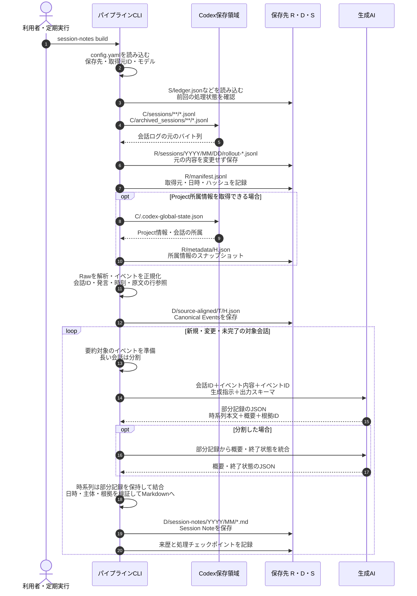

# Tkn Codex Chat Note Pipeline

English: [README.md](README.md)

Codexとの会話を源泉データとして保存し、会話ごとに再利用可能なSession Noteを生成する
ローカルCLIです。依頼、訂正、失敗した試行、未解決の問い、根拠付きの時系列、
最後に確認できた状態を残し、後から異なる観点で考え直せるようにします。

**session** は時系列で連続した一連の会話を意味し、そのまとまりを一つのMarkdownノートに記録します。

処理はSession Noteで完了します。分類とWorking Contextは
[tkn_genai_context_curation_pipeline](https://github.com/tuckn/tkn_genai_context_curation_pipeline)、
Decision抽出は
[tkn_genai_insight_pipeline](https://github.com/tuckn/tkn_genai_insight_pipeline)の責務です。
各CLIは単独でインストールでき、バージョンを持つファイルで連携します。

## 使い方 — 最初の結果まで

### 必要なものとインストール

Python 3.11以上、uv、読み取り可能なローカルCodex JSONLログを用意します。
生成には設定済みの推論プロバイダーが必要です。既定はCodex CLIで、
Claude Code、GitHub Copilot CLI、ローカルOllamaも推論に利用できます。
**チャット取得はCodex専用です。**
推論プロバイダーは独立して選択でき、他アプリのチャット取得は本リポジトリの対象外です。

~~~console
cd "C:\path\to\tkn_codex_chat_note_pipeline"
uv tool install .
tkn-codex-chat-note --help
tkn-codex-chat-note config init
~~~

表示された`~/.tkn/codex_chat_note_pipeline/config.yaml`を編集し、保存先と
利用可能なモデルを指定します。Codexを使う場合は、端末で`codex --version`と
`codex login status`を確認します。デスクトップアプリだけではCLIの代わりになりません。
[同梱設定例](src/tkn_codex_chat_note/resources/config.example.yaml)も参照してください。

### 最初の保存・生成

~~~console
tkn-codex-chat-note config show
tkn-codex-chat-note clone --dry-run
tkn-codex-chat-note clone
~~~

`clone`は未作成の管理領域を初期化し、取得できる全履歴を保存・正規化して、
対象のSession Noteを生成します。通常実行は書き込みを行い、履歴量に応じて
推論時間・トークンを消費します。

`--dry-run`はローカル入力を読み、実行条件と予定を検証します。
推論・ネットワークアクセスは行わず、ディレクトリ、ロック、cache、reportも作りません。

### 日常の更新と結果確認

~~~console
tkn-codex-chat-note pull
tkn-codex-chat-note status
tkn-codex-chat-note provenance validate
~~~

`pull`は追加・変更されたログを取得し、対象ノートの更新と未完了処理の再開を行います。
成功済みで入力条件が変わらなければ、モデルを再呼び出ししません。
既定の待機時間は30分です。活動中の会話の要約を延期しても、その前にRawを保存します。
`--limit 20`で1回の生成試行数を制限できます。

結果に表示されたノートとreportのパスを開いて確認します。
`status`は前回実行時の記録であり、現在の入力を再走査しません。
完了判定は対象Session Noteだけで行い、Scope・Decision・Working Contextの生成を待ちません。

### Windows Task Schedulerでの週次更新

初回の`clone`後、普段CLIにログインしている同じWindowsユーザーで、週1回の`pull`を登録します。
プログラムにはインストール済み`tkn-codex-chat-note.exe`の絶対パス、引数には
`--config "C:\path\to\config.yaml" pull`を指定します。設定オプションは`pull`の前に置きます。
開始フォルダに`.tkn/config.yaml`があると設定階層に加わるため、通常実行で使う設定と一致させてください。
WSLの取得元を有効にした場合、そのユーザーから設定したUNCパスを読める必要があります。

未生成のノートは次の`pull`で再開します。`--limit`を付けた検証や、活動中の会話・実行時間上限による
延期が残る実行は終了コード`2`になります。終了コード`1`はreportの失敗理由を確認します。
`runtime_minutes`は新しい生成を開始する期限で、実行中の生成には最大9分の猶予があります。
Raw取得・正規化はこの生成期限によって中断されません。Task Scheduler側の停止時間には余裕を持たせます。

## コマンド一覧

`--config`や推論設定などの共通オプションは、コマンドの前に置きます。

| コマンド | 動作 |
| --- | --- |
| `config init` | 同梱設定を作成。編集済み設定は保護し、`--force`時はバックアップ後に置換 |
| `config show` | 有効な設定、5段階の設定元、要約プロファイルのhashを表示 |
| `clone` | 初期化と全履歴の保存・生成。再実行で再開可能 |
| `pull` | 初期化済みの保存先へ差分を反映し、ノート生成を再開 |
| `raw ingest` | 推論せずに元のバイト列を保存 |
| `session-notes build` | ノートを更新。`--thread-id`で会話を選択 |
| `session-notes validate <artifact>` | ノートの読み取り専用検証 |
| `status` | 前回の対象範囲・状態・reportパスを表示 |
| `provenance validate` | hash、ID、来歴の関係を読み取り専用で検証 |
| `storage migrate` | `--from-config`で指定した取得元を新しいrootへコピー。`--dry-run`で内容を確認 |

生成コマンドでは`--dry-run`、`--force`、`--allow-edited`、`--full-output`を使えます。
`--force`は入力が同じでも再評価しますが、review済みファイルの保護は解除しません。
`--allow-edited`は手編集した未reviewノートの置換を明示的に許可します。
Raw取得は`--dry-run`と`--full-output`に対応します。

進捗は標準エラー、結果は標準出力のJSONです。`-q`は進捗を抑制し、`-v`は診断を追加します。
終了コードは、成功・計画検証が`0`、失敗が`1`、clone/pullの未完了が`2`です。
単独ノートのbuildでも、reportにはノート全体の処理状況が含まれます。

## 設定の詳細

優先順位は、組み込み既定値 → ユーザー設定 → 現在のフォルダの`.tkn/config.yaml` →
明示した`--config` → CLIオプションです。各設定ファイルを統合前に検証します。
相対パスはその値を宣言した設定ファイルの場所から解決します。
設定スキーマ7.0.0はsnake_caseのキーと引用したSemVerを使い、
未知のキーや未対応の新しいバージョンはエラーにします。

~~~console
tkn-codex-chat-note --config "C:\path\to\config.yaml" clone
tkn-codex-chat-note --idle-minutes 0 --runtime-minutes 60 pull --limit 20
~~~

### 保存先フォルダ

未指定の場合、各種データは `~/.tkn/codex_chat_note_pipeline/<kind>/codex/<source_id>`に保存されます。
保存先フォルダを変更する場合、`config.yaml`の各`sources.<source_id>`で`raw_root`・`data_root`・`state_root`を設定します。
なお、`cache_root`は共通で使用され、取得元ごとには設定できません。

```yaml
schema_version: "7.0.0"
cache_root: ~/.cache/codex_chat_note_pipeline
sources:
  my-windows-pc:
    enabled: true
    source_root: ~/.codex
    include_archived: true
    raw_root: C:/path/to/my-chat-store/raw
    data_root: C:/path/to/my-chat-store/data
    state_root: C:/path/to/my-chat-store/state
  my-wsl-ubuntu:
    enabled: false
    source_root: '//wsl$/Ubuntu/home/<user>/.codex'
    include_archived: true
```

実際の各rootは互いに分離し、取得元source_rootや設定ファイルとも重ならない場所にします。
共通の親の下に`raw/`・`data/`・`state/`を並べると、まとめてバックアップ・移動できます。
stateは再開・checkpointのための永続データとして保持し、dataとセットで管理します。
公開する証跡はdata内のprovenanceに保持します。cacheは再作成できるため移行ではコピーしません。
アプリのProject情報がなくても会話を保存できます。

推論の接続設定・認証は[推論プロバイダー](#inference-configuration)を参照してください。
外部CLIによる生成では、選択した入力がそのサービスへ送られる場合があります。
Ollamaの接続先はループバックに限定します。利用可能なモデルと認証はプロバイダー側の管理です。


### Session Noteの言語

既存の`config.yaml`の`generation.session_note_profile`で、`default-jp`（日本語・既定）または`default-en`（英語）を選択します。以下は設定の抜粋です。他の設定は維持してください。

```yaml
generation:
  session_note_profile: default-jp
```

1回だけ切り替える場合は、`tkn-codex-chat-note --session-note-profile default-en pull`を使います。オプションはコマンドの前に指定します。`config show`に選択したprofile、リソースとhash、設定元を表示します。

両profileのschema・見出し・時系列・引用・状態判定は共通です。本文の言語と説明文だけを切り替え、時刻はAsia/Tokyoを維持します。カスタムprofile名・フォルダ・promptの指定には対応しません。組み込みリソースは`profiles/default-jp/`と`profiles/default-en/`に配置しています。

言語を変更すると、次のbuild/pullで既存ノートが再生成の対象になります。1会話につき1ノートとそのIDを維持するため、言語別のノートは併存しません。レビュー済み・編集済みノートの保護は維持し、dry-runでは生成も書き込みも行いません。異なるprofileの途中生成結果は再利用しません。

### Chat取得元と生成AI

`sources`はローカルCodexの取得元、`generation.providers`はノート生成に使うAIの設定です。
`--provider`は`generation.active_provider`だけを切り替え、取得元を変更しません。
Claude Code・Copilot・Ollamaは推論の選択肢として維持し、それらのチャット取得は対象外です。

トップレベルの`sources`マップのキーが`source_id`です。値の中に`source_id`は重複して書きません。
各取得元に`enabled`（既定`true`）・`source_root`（既定`~/.codex`）・
`include_archived`（既定`true`）と、任意の最終保存先`raw_root`・`data_root`・`state_root`を指定します。
`source_root`は`sessions/`ではなく親の`.codex`を指し、sessions・archives・アプリの補助情報を読み取ります。
Codex自身の保存先・認証や生成AIの設定は変更しません。

IDは、継続して取得する入力フォルダを識別できる名前にします。例は`laptop-windows`、
`laptop-wsl-ubuntu`です。**半角英小文字のkebab-caseを推奨**します。Pythonの変数名ではなく、
設定キー・フォルダ名・来歴の識別子として使います。制約は次のとおりです。

- 半角英字（大文字も可）・数字・`.`・`_`・`-`を使用し、先頭は英数字にします。
- 空白、日本語・全角文字、前後の空白、末尾のドットは使えません。
- `CON`・`nul.txt`・`COM1`など、Windowsの予約名は使えません。
- sources全体で大文字・小文字だけが異なるIDも重複として拒否します。
  大文字小文字や空白の自動変換はしません。数字だけのYAMLキーは引用符で囲みます。

出典・後続ツールとの互換性のため、公開データの識別単位は`(codex, source_id)`を維持します。
取り込み開始後は固定してください。キーを変更しても既存データの改名・移行は行われません。
`source_root`や保存先フォルダのパスには、従来どおり空白・日本語を使えます。
同じ入力フォルダを複数IDで登録しないでください。

有効なCodex取得元をマップの順番で処理します。`--limit`は失敗した生成やdry-runの計画も含む
1回の実行全体の生成試行数、`runtime_minutes`は全取得元で共有する生成期限です。
書き込み前に選択された全保存領域を検証し、catalog・provenance・checkpoint・実行レポートは
取得元ごとに保持します。処理中の取得元の失敗は全体の失敗結果に含め、他の取得元は続行できます。
通常の出力は取得元ごとの集計とレポートのパス、`--full-output`は各会話の詳細も含みます。

~~~console
tkn-codex-chat-note clone --dry-run
tkn-codex-chat-note --source my-windows-pc pull
tkn-codex-chat-note --source my-windows-pc session-notes build --thread-id <thread-id>
tkn-codex-chat-note status
tkn-codex-chat-note provenance validate
~~~

`--source`はコマンドの前に指定し、処理・status・provenance検証・storage移行の取得元を選びます。
省略時の処理・status・provenance検証は有効な全取得元が対象です。複数が有効な場合、
`--thread-id`とstorage移行では1取得元を選択してください。不明なIDや無効な取得元の指定は
エラーになります。`config show`は常に全取得元の設定と解決済み保存先を表示します。

設定の階層間ではマップのIDごとに統合し、同じIDの指定フィールドだけを上書きします。
明示したマップが組み込みの取得元に置き換わるため、独自のIDを追加しても既定の`windows`が
余分に有効になることはありません。`sources: {}`で取得元マップ全体を空にでき、
`enabled: false`で継承した1取得元を無効にできます。YAMLキーの重複も拒否します。

無効な取得元は走査せず、その入力フォルダは存在しなくても構いません。
有効な取得元がない場合は書き込み前に実行を止めます。`config show`は使用できます。
廃止した`chat`や取得providerの階層を含む設定は拒否します。

WindowsとWSLの入力フォルダには別のIDを付けます。Windows側では、ディストリビューションへ
アクセスできる状態で上記のWSL UNCパスを利用できます。WSL内で本CLIを実行する場合は、
Linux側のパスと生成用の実行ファイルを設定してください。`~`は本CLIを実行するOSに従います。
WSLの例は設定方法を示したもので、WSLとの実動作確認は未実施です。アカウント別フィルタは実装していません。

<a id="inference-configuration"></a>

### 推論プロバイダー

取得対象は、ローカルに保存されたCodexの会話ログです。
推論に使用する生成AIモデルは、`generation.active_provider` と各プロバイダーの `model` で変更できます。
選択するプロバイダーのモデルと接続先を指定してください。モデルの利用可否と認証は各サービス側で管理します。

| プロバイダーID | 接続設定 | 実行方法 |
| --- | --- | --- |
| `codex` | `executable: codex` | 独立した `codex exec` |
| `claude-code` | `executable: claude` | 非対話のClaude Code |
| `github-copilot` | `executable: copilot` | 非対話のCopilot CLI |
| `ollama` | `base_url: http://127.0.0.1:11434` | ローカルのchatエンドポイント。ループバックのみ |

利用可能なローカルモデルを使う場合は、例えばgenerationブロックを次のように置き換えます。

```yaml
generation:
  active_provider: ollama
  providers:
    ollama:
      model: <installed-local-model>
      reasoning_effort: high
      base_url: http://127.0.0.1:11434
```

CLI型のプロバイダーでは、選択した生成入力をそのCLIの設定先サービスへ送信します。
Rawと来歴のスナップショットには元の内容がローカルに残るため、会話データに適した保存先を選びます。
生成プロファイル、出力検証、再試行上限はアプリケーションが管理します。
モデル、プロバイダー、推論設定、生成プロファイルを変更すると、関連する段階が再生成対象になります。

### 既存データを引き継がず再構築する場合

新しい設定ファイルを作り、空の`raw_root`・`data_root`・`state_root`を指定して
「最初の保存・生成」の手順を実行します。再構築できる範囲は取得元に残る会話ログです。
別の保存領域に作り直すため、旧ノートのID・手編集・レビュー状態は引き継ぎません。

~~~console
tkn-codex-chat-note --config "C:\path\to\rebuild.yaml" config init
~~~

作成した設定を編集し、その後の`config show`・`clone`にも同じ`--config`を指定します。
旧ユーザー設定の検出で既定の`config init`が停止する場合も、上記のように新規設定の
保存先を明示できます。ただし、読み込まれる現行のユーザー設定や`.tkn/config.yaml`も
設定schema 7である必要があります。`--config`は下位の設定の検証を省略しません。

## 保存構造と責務の境界

~~~mermaid
flowchart LR
    L["ローカルCodexログ"] --> R["Rawコピーとmanifest"]
    R --> E["Canonical Events"]
    E --> T["Session Note"]
    M["観測したProject所属"] --> C["会話catalog"]
    T --> C
    C --> U["Context分類CLI<br/>（別リポジトリ）"]
    T --> I["洞察CLI<br/>（別リポジトリ）"]
    R --> P["バージョン付き根拠"]
    E --> P
    T --> P
~~~

省略時の保存先は「領域の役割 → 取得元アプリ → 取得環境 → データの種類」の順です。
明示したrootでは、その直下からデータの種類を配置します。
以下の`P`は取得provider（`codex`固定）、`I`はsource_id、`T`はthreadKey、`H`は内容hashです。
`generation.active_provider`を変更しても保存先は変わりません。

| 保存パス | 内容 |
| --- | --- |
| `<raw_root>/sessions/...` | Codex元ログの相対構造とバイト列を保持した最新コピー |
| `<raw_root>/archived_sessions/...` | Codex側のアーカイブ構造を保持した最新コピー |
| `<raw_root>/manifest.jsonl` | 取得元・参照・hashを記録するRaw manifest |
| `<raw_root>/metadata/H.json` | 観測したアプリのProject情報 |
| --- | --- |
| `<data_root>/source-aligned/T/H.json` | 元ログの参照位置を持つCanonical Events |
| `<data_root>/session-notes/YYYY/MM/...md` | 会話開始年月で分けた現在のSession Note |
| `<data_root>/catalog/threads.json` | この取得元の会話・所属・状態・ノート参照をまとめたcatalog |
| `<data_root>/provenance/...` | この取得元の不変snapshot・entity・activity・公開index |
| --- | --- |
| `<state_root>/pipeline.json` | 取得元ごとの初期化情報・storageバージョン |
| `<state_root>/threads/T/...` | 会話単位の内部checkpoint |
| `<state_root>/ledger.json`・`reports/`・`last-run.json`・`normalization/` | 取得元ごとの実行・正規化状態 |
| --- | --- |
| `<cache_root>/P/I/...` | 取得元ごとの再利用可能な生成作業cache |

例えば、providerが`codex`、source_idが`my-windows-pc`なら、Rawは
`~/.tkn/codex_chat_note_pipeline/raw/codex/my-windows-pc/sessions/...`、
ノートは`~/.tkn/codex_chat_note_pipeline/data/codex/my-windows-pc/session-notes/YYYY/MM/...md`です。
互換性のため、保存先の`codex`という区分は維持します。
`config show`の`storage.sourceRoots.<source_id>`で各取得元の最終保存先を確認できます。

各rootに取得元IDを含む所有権markerとロックを置き、異なる取得元への流用を拒否します。
`status`と`provenance validate`は設定した1取得元を対象にします。同じ会話のthreadKeyが
別環境にもあっても、ノートID・checkpoint・catalog・provenanceは独立します。
`data:/`はこの取得元のdata_rootを基点にします。`raw:/codex/<source_id>/`は論理的な
取得元識別prefixであり、その後ろの部分をこの取得元のraw_rootに連結します。
`store.json`は取得元のIDと旧参照の対応を保持する付属ファイルです。

<a id="processing-flow"></a>

### session-notes build：RawからSession Noteを生成

会話ログをRawとして保存・正規化し、対象会話のSession NoteをMarkdownで生成します。
`--thread-id` で1会話を選べます。DecisionとWorking Contextは、このコマンドでは生成しません。
AIにはイベント内容・ID、生成指示、出力スキーマを渡します。

以下は `tkn-codex-chat-note session-notes build` の処理です。表の略記は直後の図で使います。

| 図中の表記 | 設定項目 | 既定の保存先 |
| --- | --- | --- |
| `C` | `sources.<source_id>.source_root` | `~/.codex` |
| `R` | `sources.<source_id>.raw_root` | `~/.tkn/codex_chat_note_pipeline/raw/codex/windows` |
| `D` | `sources.<source_id>.data_root` | `~/.tkn/codex_chat_note_pipeline/data/codex/windows` |
| `S` | `sources.<source_id>.state_root` | `~/.tkn/codex_chat_note_pipeline/state/codex/windows` |

`T` は会話の `threadKey`、`H` は内容のハッシュです。
図のパスでは、それぞれの実際の値を表すプレースホルダーとして使います。



保存するCanonical Eventsと要約処理が使うイベントは、同じ解析結果に基づきます。
現在の実装は、保存した正規化JSONを再読込せず、メモリー上のイベントを要約処理へ渡します。
この段階の要約単位は会話であり、作業scopeによる統合とは独立しています。

### 保存先の変更

現行形式の保存領域を別フォルダへ移す場合は、`storage migrate`を使います。
Raw・Session Note・正規化データ・来歴・再開状態をコピーし、ノートのIDと内容、
レビュー状態を保持します。推論は行わず、保存先の変更だけでは再生成しません。

1. 移動元の最終保存先と取得元IDを単独で解決できる設定ファイルを用意します。
   `--from-config`の設定には、他の設定階層の値は統合されません。
2. 同じ取得元IDを持つ設定を別ファイルに用意し、`raw_root`・`data_root`・`state_root`を
   移動元と重ならない新しい最終保存先にします。複数の取得元が有効なら`--source`で1つ選びます。
3. コピー中は移動元への書き込みを停止し、以下の順に確認・実行します。

~~~console
tkn-codex-chat-note --config "C:\path\to\destination.yaml" config show
tkn-codex-chat-note --config "C:\path\to\destination.yaml" --source my-windows-pc storage migrate --from-config "C:\path\to\source.yaml" --dry-run
tkn-codex-chat-note --config "C:\path\to\destination.yaml" --source my-windows-pc storage migrate --from-config "C:\path\to\source.yaml"
tkn-codex-chat-note --config "C:\path\to\destination.yaml" --source my-windows-pc provenance validate
~~~

移動元のデータと設定は変更・削除しません。cacheはコピーせず、移動先で再作成できます。
コピー先の競合では停止し、中断後は同じ設定で再開できます。完了済みの再実行は書き込みません。
Rawだけを保存した領域では、最初のノート生成後に`provenance validate`を実行します。
移動後の通常実行には移動先の設定を使い、下流CLIの`notes_roots`は入力名を保って
パスを更新します。参照の解決方法とコピー時の保証は
[出力データと他CLIとの連携仕様](reference/data-contract.md#storage-layout-5)を参照してください。

### 対応範囲と制限

Projectへの所属が変わっても会話のIDは変わりません。所属の観測は上流に残し、
意味に基づくScopeや承認済みの関連は下流で扱います。
Session Noteは派生した記録であり、元の根拠を置き換えません。
取得元と推論プロバイダーは別の概念です。

ローカルの`sessions`と、既定では`archived_sessions`を対象にします。
Project未所属・対応先不明・所属が曖昧な会話も対象です。
内部処理・承認レビューの会話や通常のユーザー発言を持たないログは、
保存・正規化しても要約からは除外します。クラウドだけにあるChatGPT/Work履歴は取得しません。
未対応のレコードや不正なJSONLはreportに残します。旧形式のログも対象にし、イベント日時がない場合は
ノート上で不明と表示します。Unicodeの区切り文字をJSONLの改行と誤認しません。

同じ会話IDに複数ファイルがある場合、完全一致・バイト列の追記関係は重複をまとめます。
それ以外は各履歴・分岐を保持し、1つのSession Note内でHistory IDごとに時系列と出典を表示します。
採用された分岐や別履歴による取り消しは推定しません。`history_base`は取得元のメタデータとして記録します。
全ファイルをRawに保存し、正規化・ノート生成の来歴にも各入力を残します。
分岐の変更では同じノートIDを維持して再生成し、変更のない`pull`では再生成しません。

ID、hash、schema、引用、保存構造、入力準備の詳細は
[出力データと他CLIとの連携仕様](reference/data-contract.md)、
[Session Noteの内容](docs/session-note-format_ja.md)、
[処理のシーケンス](#processing-flow)を参照してください。

## 更新後の再インストール

コードやresourceを更新した後は再インストールします。

~~~console
cd "C:\path\to\tkn_codex_chat_note_pipeline"
uv tool install . --reinstall
~~~

## 開発と検証

~~~console
uv sync --locked
uv run python -m pytest
uv run python -m ruff check .
uv run python -m mypy src
uv build
~~~

自動テストは匿名の会話データと推論の代替実装を使い、設定・保存・再開・編集保護・
生成結果の検証を確認します。実サービスの認証や実モデルの要約品質を保証するものではありません。
代表的な元ログとノートを照合する品質評価は別に行います。

配布物の変更時は、一時的な環境へビルドしたwheelをインストールし、チェックアウト外から
`--version`・`--help`・`config init`・`config show`と同梱言語プロファイルを確認します。
連携仕様の変更時は、匿名の出力を使い、下流CLIでID・hash・入力参照を検証してください。
一時データにはテストフレームワークまたはOSの一時フォルダを使います。
最低対応はPython 3.11ですが、記録済みの実行環境はWindows / Python 3.12.10です。
他のPythonバージョンやWSLを含む非Windows環境での実行は未検証です。

## 関連ドキュメント

| 文書 | 読む目的 |
| --- | --- |
| [出力データと他CLIとの連携仕様](reference/data-contract.md) | 出力を読み取るツールの実装。ID・schema・hash・来歴・整合性確認の取り決め |
| [Session Noteの内容](docs/session-note-format_ja.md) | 生成ノートの構成と各項目の意味 |
