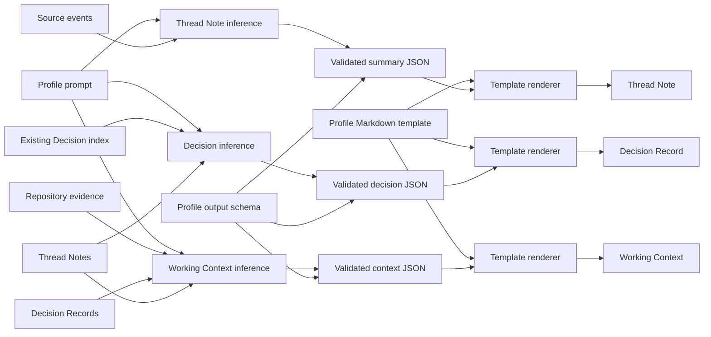

# Tkn Codex Context Pipeline

Codexのchat logから、会話の要約・決定事項・Projectの現状をまとめたMarkdownを
生成する、独立したローカルデータパイプラインです。
Codex appのProject登録情報とchatの所属情報を参照し、chat logを加工せず原本として
保存します。そのlogから会話ごとのThread Noteを作成し、そこから再利用できる判断を
まとめたDecision Recordと、Projectの現状をまとめたWorking Contextを生成します。
入力元は設定で変更でき、既定では`~/.codex`配下のProject情報と`sessions`配下のlogを
読み取ります。
Project folderにはmarker・設定・contextを一切書きません。

## 用語

本Projectでは、ユーザーから見た会話、その技術的な識別単位、そこから生成する
artifactを区別します。Codex chatとthreadは異なるレイヤーから見た同じsourceを
表しますが、それ以外の用語は同義語として扱いません。

| 用語 | 本Projectでの定義 |
| --- | --- |
| Codex chat | Codex appに表示される、ユーザー向けの1つの会話。ユーザー向け文書では`chat`を使用する。 |
| thread | Codex chatの永続的な技術識別単位。`threadId`を持ち、複数のturnを含む。コード、state、report、帰属判定では`thread`を使用する。 |
| turn | thread内の1回のCodex処理サイクル。通常はuser inputで始まり、完了または中断で終わり、messageやtool itemを含み得る。 |
| user message | ユーザーが送信した1つのmessage。ユーザーが送信したtextやmultimodal contentを表す標準のデータ用語。 |
| user instruction | user messageに含まれる依頼または指示。1つのuser messageに複数のinstructionを含められる。 |
| assistant message | assistant roleを持つCodex生成message。 |
| final answer | turnを完了する最後のassistant message。中間報告とは区別する。 |
| item | message、tool call、tool output、reasoning itemなど、turn内の下位要素。 |
| prompt | model生成を導くinputまたはinstruction。`user message`の固定的な同義語にはしない。 |
| session | runtimeやlifecycle上の期間、またはCodex session tree。chatやthreadの同義語にはしない。 |
| rollout file | Codexがthreadごとに保存する内部JSONL log。source evidenceであり、公開互換形式でも会話の同義語でもない。 |
| Thread Note | 本applicationが1つのsource threadから生成する、source-nearで事実中心の永続Markdown artifact。 |
| Decision Record | 1つ以上のThread Noteから合成する、再利用可能で永続的な判断。 |
| Working Context | 1つのProjectで現在真であることを示す、source-backedな短いorientation dashboard。 |

両レイヤーを示す必要がある文章では、初出を**Codex chat（source thread）**とします。
製品利用者向けの説明では`chat`、技術識別には`thread`または`threadId`を使用します。
raw Codex inputの保存先`~/.codex/sessions`は維持しますが、そのdirectory名によって
source objectの標準名がsessionになるわけではありません。

## 必要なもの

- Python 3.11以上
- [uv](https://docs.astral.sh/uv/)
- localのCodex app Project状態と`~/.codex/sessions`配下のchat log
- Thread Note、Decision Record、Working Context生成に使用する、次のいずれかの推論backend
  - `generation.active_provider: codex`では`PATH`から実行できる`codex`
    - Windowsでは`powershell -ExecutionPolicy Bypass -c "irm https://chatgpt.com/codex/install.ps1 | iex"`でインストールします。
  - `generation.active_provider: claude-code`では`PATH`から実行できる`claude`、または明示した`executable`
  - `generation.active_provider: github-copilot`では`PATH`から実行できる`copilot`、または明示した`executable`
  - `generation.active_provider: ollama`ではlocalのOllama service

## インストール

次のコマンドでインストールします。例示している`C:\path\to\tkn_codex_context_pipeline`は、このリポジトリの実際のフォルダパスに置き換えてください。

```console
cd "C:\path\to\tkn_codex_context_pipeline"
uv tool install .
tkn-codex-context --help
```

最後のコマンドは、インストール後に`tkn-codex-context`を実行できることを確認します。この方式では、インストール時点のコードが使用され、その後のリポジトリの変更は自動的に反映されません。

`git pull`などでリポジトリを更新するたびに、更新後のコードと依存モジュールをインストール済みのコマンドへ反映するため、次のコマンドで再インストールしてください。

```console
uv tool install "C:\path\to\tkn_codex_context_pipeline" --reinstall
tkn-codex-context --help
```

リポジトリ更新後は`--reinstall`を使用し、tool環境内のすべてのpackageを再インストールして、cacheされたpackage dataも更新します。`--force`は既存tool環境の再作成や競合するentry pointの置き換えに使用するoptionであり、通常のリポジトリ更新には使用しません。

### 開発用のeditable installation

開発時には、代わりにeditable installationを使用できます。

```console
uv tool install -e "C:\path\to\tkn_codex_context_pipeline" --reinstall
```

`-e`（`--editable`）を指定すると、インストールされたコマンドはリポジトリ内のソースコードを直接参照するため、ソースコードだけの変更は再インストールせずに反映されます。`pyproject.toml`または`uv.lock`の依存関係を変更した場合、package metadataやentry pointを変更した場合、リポジトリfolderを移動・renameした場合、またはeditable installationが古い場所を参照している可能性がある場合は、同じeditable installationのコマンドを`--reinstall`付きで再実行してください。

## 設定

最初にユーザー設定を作成して解決結果を確認し、Codex app Projectと保存先を
dry-runで確認してからpipeline storageを初期化します。

```console
tkn-codex-context config init
tkn-codex-context config show
tkn-codex-context init --dry-run
tkn-codex-context init
```

`config init`はapplication-ownedなexampleを
`~/.tkn/codex_context_pipeline/config.yaml`へcopyし、絶対pathを表示します。再実行時に
同一内容なら`unchanged`です。編集済み設定は暗黙に上書きせず、`config init --force`を
指定した場合だけtimestamp付きbackupを作成してから置換します。package resourceとして
同梱するため、通常のwheelまたは`uv tool` installation後も利用できます。

`config show`は解決後の設定をJSONで出力し、有効な設定schema version、利用可能な
各layerのsource/effective schema version、in-memory migrationの有無、各設定値の採用元も
表示します。

### 推論provider

Source providerはCodexのままです。Project metadataとchat evidenceはCodex appと
`~/.codex/sessions`だけから読みます。`generation.active_provider`は、そのevidenceから
Thread Note、Decision Record、Working Contextを生成する推論backendだけを切り替えます。

| provider ID | 呼び出し方法 | 構造化出力contract |
| --- | --- | --- |
| `codex` | `codex exec` | native JSON Schema output |
| `claude-code` | `claude -p` | `--json-schema`と`structured_output` |
| `github-copilot` | `copilot -s`へのpipe input | JSON-only promptとapplication validation |
| `ollama` | localの`POST /api/chat` | `format`のJSON Schemaとapplication validation |

Claude CodeとGitHub Copilotは、file、shell、URL、MCP系toolを無効にした非対話
modeで実行します。Ollama endpointはloopback host（`localhost`、`127.0.0.1`、
`::1`）だけを許可します。どのproviderでも、application-owned prompt、schema、
renderer、validation、retry、atomic writeは共通です。

生成設定は`active_provider + providers`構造です。`active_provider`には使用するstable
provider IDを1つ指定し、`providers`にはbackendごとのmodelと接続設定を保持します。
YAMLの設定keyは`snake_case`、`claude-code`や`github-copilot`などのprovider IDは
`kebab-case`の値です。実行ファイルが`PATH`にない場合は、`executable`を絶対pathに
変更できます。Windowsでは、`WindowsApps`配下のCodex App実行ファイルはautomation用の
standalone CLIではないため拒否します。standalone Codex CLIをinstallし、その実行ファイルを
指定してください。

```yaml
schema_version: "2.1.0"
raw_root: ~/.tkn/codex_context_pipeline/raw
generation:
  active_provider: codex
  providers:
    codex:
      model: gpt-5.6-sol
      reasoning_effort: high
      executable: codex
```

他のproviderを使用する場合は、そのprovider blockを追加し、同じIDを
`active_provider`に指定します。CLI providerの各blockには`model`と`executable`が
必要です。Ollamaには代わりに`model`と`base_url`が必要です。`reasoning_effort`を
省略した場合は`high`になります。

```yaml
# Claude Code
generation:
  active_provider: claude-code
  providers:
    claude-code:
      model: sonnet
      reasoning_effort: high
      executable: claude
```

```yaml
# GitHub Copilot CLI
generation:
  active_provider: github-copilot
  providers:
    github-copilot:
      model: <model-supported-by-copilot>
      reasoning_effort: high
      executable: copilot
```

```yaml
# Ollama
generation:
  active_provider: ollama
  providers:
    ollama:
      model: qwen3.5:9b
      reasoning_effort: high
      base_url: http://127.0.0.1:11434
```

applicationが管理する各config fileには、引用符付き3要素SemVer形式の
`schema_version`が必要です。現在のeffective versionは`"2.1.0"`です。このversionは
各設定sourceのmetadataであり、通常の設定優先順位による上書き対象にはしません。
同じMajorの互換性がある古いversionと、対応中のMajor/Minorに属する新しいPatchは
読み込めます。新しいMinor/Major、migration経路のない古いMajor、version欠落、不正な
形式は、必要なactionを示して停止します。`config show`でsource/effective versionと
in-memory migrationの有無を確認できます。

v0.3.0が出力した整数の`schema_version: 2`はlegacy表現として認識し、fileを書き換えず
memory上で`"2.1.0"`へ変換します。現在の形式を永続化するには、先頭行を
`schema_version: "2.1.0"`へ置き換えてください。

設定schema Major v2では、以前のflatな`provider`、`model`、`reasoning_effort`、
`*_executable`、`ollama_base_url`を廃止しました。移行途中の設定で誤ったbackendが
暗黙に選ばれないよう、schema v1は移行方法を示して拒否します。各値を対応する
provider blockへ移し、`schema_version: "2.1.0"`を指定してください。

同じ値は、commandより前に置くglobal CLI optionでも上書きできます。

```console
tkn-codex-context --provider ollama --model qwen3.5:9b thread-notes pull
```

`config show`で、解決後の値、設定schemaの互換性、採用された設定layerを確認できます。
dry-runはproviderを解決してsource evidenceを選択しますが、推論providerは呼びません。

Codex、Claude Code、GitHub Copilotを選ぶと、選択・redact済みの生成inputは、各CLIが
使用するaccountとserviceを通ります。認証、subscription entitlement、利用上限、
発生し得る料金は、このapplicationではなく各CLIまたはserviceが管理します。Ollamaは
設定したloopback serviceだけへinputを送り、このapplicationからcloud APIのリクエスト
単位料金は発生しません。ただしlocal computeと電力は使用します。

生成artifact、state、reportにはstable provider IDと表示名を記録します。provider ID、
model、reasoning effortは生成fingerprintに含まれるため、providerを変更すると、以前の
生成artifactは再生成対象になります。

`init`は作成済み設定を読み、Project registryとCodex app左ペインのProjectごとに
空の`thread-notes/`と`decisions/`を用意します。また、設定されたdata、state、cache、rawの
各rootへ`.tkn-codex-context-root.json`所有権markerを書き込みます。Thread Noteや
Decision Record、Working Contextは生成しません。実行日時は`installed_at`として
保存され、通常実行が自動処理するのは、この日時以後に作成または更新されたchatだけ
です。それ以前のchatは、明示的な`pull --backfill`または`rebuild`で処理します。

既存のpipelineを完全に作り直す場合は、まず削除対象を確認してからforce初期化
します。modelや保存先などの設定は維持され、`installed_at`だけが更新されます。
`--force`が置換できるのは、存在しないroot、空のdirectory、またはこのapplicationと
root種別に一致する有効な所有権markerを持つdirectoryだけです。非空でmarkerがない
directory、別applicationのmarker、不正なmarkerは、保存先を退避する前に拒否します。
force dry-runが成功した場合は各rootの所有権statusを表示し、拒否した場合は安全でない
すべてのrootと理由をerrorに示します。

```console
tkn-codex-context init --force --dry-run
tkn-codex-context init --force
```

以前のversionが作成したstorageには所有権markerがありません。設定されたpathと内容を
確認し、force再構築の前に既存directoryを明示的に採用します。

```console
tkn-codex-context init --adopt-existing --dry-run
tkn-codex-context init --adopt-existing
tkn-codex-context init --force --dry-run
tkn-codex-context init --force
```

採用dry-runは各rootの所有権statusと理由を表示します。採用はoperatorによる独立した
所有権表明です。適用時も所有権markerだけを書き、storageの再構築、configの書き換え、
`installed_at`の更新は行いません。別applicationのmarkerや不正なmarkerを上書きせず
拒否します。

Project名や現在のrootから内部IDを確認する場合は、登録済みProjectを一覧表示します。

```powershell
tkn-codex-context projects list
tkn-codex-context projects list --json
```

標準出力は、状態、Project名、内部Project ID、現在のrootを含む人向けの表です。
`--json`では、script利用や詳細確認のために登録済みroot metadataも出力します。

アプリ自身のファイルは、用途別に次の場所へ保存します。

```text
~/.tkn/codex_context_pipeline/
├── config.yaml
├── raw/
│   ├── .tkn-codex-context-root.json
│   └── <sourceId>/
│       ├── manifest.jsonl
│       └── sha256/<prefix>/<sha256>.jsonl
├── data/
│   ├── .tkn-codex-context-root.json
│   ├── project-registry.jsonl
│   └── projects/
│       └── <projectId>/
│           ├── working-context.md
│           ├── thread-notes/
│           └── decisions/
└── state/
    ├── .tkn-codex-context-root.json
    ├── projects/
    │   └── <projectId>/
    │       ├── chat-refresh-state.json
    │       ├── decision-build-state.json
    │       └── working-context-build-state.json
    └── reports/

~/.cache/codex_context_pipeline/
├── .tkn-codex-context-root.json
└── 中断した処理を再開するためのcache
```

`raw/`はsource JSONLの不変かつcontent-addressedなcopyとappend-only manifestを保持します。
`data/`はProject registry、Thread Note、Decision Record、Working Contextなどの永続データ、`state/`はrefresh
checkpointやrun reportなどの再作成可能な状態・履歴に使用します。
cacheは既定で`~/.cache`へ分離し、`XDG_CACHE_HOME`が設定されている環境では
その場所を使用します。実行中だけ必要なmodel入出力などは、Pythonの標準一時
directoryを使うため、Windowsでは通常`%TMP%`、Linuxでは通常`/tmp`に置かれます。

設定の優先順位は次のとおりです。

1. built-in defaults
2. `~/.tkn/codex_context_pipeline/config.yaml`
3. `./.tkn/config.yaml`
4. `--config`
5. CLI option

exampleのsource of truthはpackage resource
`src/tkn_codex_context/resources/config.example.yaml`です。実設定をcommitしないで
ください。YAML中の相対pathは、そのYAML fileがあるfolderを基準に解決します。
Thread Note、Decision Record、Working Contextの生成profileはapplication-ownedで、ユーザー向け
設定keyはありません。旧設定の
`summary_prompt: null`は読み飛ばします。値を設定した`summary_prompt`が残っている
場合は、現在のCLIを実行する前にそのkeyを削除してください。

## 通常実行

### Raw chatをBronze landing zoneへ取り込む

`thread-notes pull`と`thread-notes rebuild`は、scanの前に同じBronze ingestを実行します。
書き込みrunでは、新しく観測したbyte列を
`raw_root/<sourceId>/sha256/<prefix>/<sha256>.jsonl`へcopyします。
`codex_home/sessions`のsource fileは移動・書き換え・削除しません。その後のThread処理は
application所有のcaptureを読みます。append-only manifestには`sourceRef`、capture hash、
byte数、capture時刻、thread ID、最後のevent時刻を記録します。

capture済みと処理済みは別の状態です。captureの成功はraw byteが利用可能という意味で、
Thread Note生成済みという意味ではありません。Projectごとのrefresh stateとrun reportに
`sourceCaptureRef`と`sourceCaptureSha256`を保存し、どのcaptureを処理したかを識別します。
global watermarkは使わず、各`sourceRef`の最新captureを独立に選びます。後からsource側で
削除されたfileも`bronze-only`として利用できます。

Thread Noteを生成せず、Bronze ingestだけを実行できます。

```powershell
tkn-codex-context raw ingest --dry-run
tkn-codex-context raw ingest
```

dry-runはcopy予定を検証・表示しますが、raw blob、manifest、所有権marker、run reportを
作りません。非emptyかつ未所有の`raw_root`、不正な所有権marker、source/raw rootの重複、
登録済みcaptureの破損はfail closedで停止します。

### Artifactへ安定IDを付与する

新しいThread Note、Decision Record、Working Contextは、Frontmatterの`id`にcanonicalな
小文字UUIDv4を持ちます。再生成時はfilenameが変わっても同じ値を維持します。既存artifactは
次の明示commandで移行できます。

```powershell
tkn-codex-context artifacts migrate-ids --all --dry-run
tkn-codex-context artifacts migrate-ids --all
tkn-codex-context artifacts migrate-ids --project-id <projectIdOrNameOrRoot> --dry-run
```

これはmetadata-only migrationです。`id`だけを追加または検証し、Markdown本文、BOM、
改行形式、既存date・IDを維持し、legacyの`schemaVersion`も変更しません。書き込みrunは
結果を検証し、1件でも失敗すれば全original byteを復元します。重複IDとUUIDv4でないIDは
拒否します。dry-runではIDを生成せず、run reportも書きません。

このrepositoryの責務はMarkdown identityまでです。RDF projectionや
`https://id.tuckn.net/{noteId}` IRIの生成は行いません。Markdownの`id`値からそのIRIへの
mappingは、downstreamのRDF componentに委ねます。

### Project metadataを取得する

初期化後にCodex app Projectが追加・変更された場合は、Codex appからProject
metadataを取得します。これはCodex appからlocal registryへの一方向の更新です。
dry-runではregistryやProject directoryを変更しません。

```powershell
tkn-codex-context projects fetch --dry-run
```

確認後に反映します。

```powershell
tkn-codex-context projects fetch
```

### Project fetch結果の読み方

`projects fetch`および`thread-notes pull`の`projectFetch.projects`には、
現在Codex appに存在するProjectごとに次の情報が出力されます。

| field | 意味 |
| --- | --- |
| `sourceProjectId` | Codex appから読み取った内部Project ID |
| `projectId` | registryと保存先folderで使用するProject ID。現在の仕様では`sourceProjectId`と常に同じ |
| `name` | Codex appに表示されている現在のProject名 |
| `status` | 今回のfetchでCodex app Projectとregistry recordを対応付けられたか |
| `method` | どの方法でregistry recordを決定したか |
| `roots` | Codex appに現在登録されている有効なroot。先頭がPrimary、以降がSecondary |

`projectFetch.projects[*].status`が現在取り得る値は次のとおりです。

- `bound`: Codex appの内部IDとregistryの`projectId`を対応付けられた状態。
  既存recordを再利用した場合と、新規recordを作成した場合の両方で使用します。

Codex appから消えたProjectは`projectFetch.projects`には含まれません。保存済み
Projectも含めた状態は`projects list`で確認します。こちらの`status`は次の意味です。

- `active`: 直近のfetch時点で、同じ内部IDのProjectがCodex appに存在する。
- `inactive`: Codex appからProjectが消えている。registry、Thread Note、stateは
  削除されず、同じIDが戻れば次回fetchで`active`へ戻る。
- `unknown`: registry recordにstatusがない非標準状態。通常の`init`または
  `projects fetch`が作成したrecordでは発生しない。

`method`が取り得る値は次のとおりです。

- `project-id`: 同じ内部Project IDの既存registry recordを見つけ、そのrecordの
  名前とroot metadataを更新した。
- `new`: 同じ内部Project IDのrecordがなく、新しいregistry recordを作成した。
  `--dry-run`の場合は作成予定であり、まだ書き込んでいない。

`projects list --json`の`roots[*].status`では、現在のrootを`active`、以前のrootを
帰属判定用に保持したaliasを`historical`と表示します。

### Thread Noteを生成する

`thread-notes pull`は、通常処理の対象となるCodex chatを取り込み、Thread Noteを
作成または更新します。実行前にProject metadataのfetchも自動的に行うため、
既定のJSON出力は簡潔です。`projectFetchSummary`と`reportSummary`に真偽値と件数を
表示し、`reportPath`で保存済みの完全なrun reportを示します。Project・thread単位の
詳細をstdoutにも表示したい場合だけ`--full-output`を使います。
生成ノートのFrontmatterは`type: threadNote`です。`thread-notes/`へ保存し、
`thread-notes` commandで管理します。

最初にdry-runで対象を確認します。dry-runは生成AIを呼び出さず、registry、
Thread Note、refresh state、cache、run reportのいずれも変更しません。

```powershell
tkn-codex-context thread-notes pull --dry-run
```

既定の簡潔な出力に含まれる主なfieldは次の意味です。

| field | 意味 |
| --- | --- |
| `ok` | threadの失敗および未解決のProject bindingなしで完了したか |
| `reportPath` | 保存したrun report。dry-runでは保存しないため`null` |
| `projectFetchSummary.projectCount` | Codex appから取得したProject数 |
| `projectFetchSummary.boundCount` | 使用可能なlocal rootを紐付け済みのProject数 |
| `projectFetchSummary.newCount` | 新しく検出したProject数 |
| `projectFetchSummary.pendingCount` | rootの紐付けが必要なProject数 |
| `reportSummary.mode` | 通常pullは`daily`、過去分は`backfill`、再構築は`rebuild` |
| `reportSummary.selectedCount` | `--limit`適用後、作成・更新予定のThread Note件数 |
| `reportSummary.processedCount` | 作成・更新に成功したThread Note件数 |
| `reportSummary.failedCount` | 失敗したthread数 |
| `reportSummary.deferredCount` | runtime上限により次回へ延期したthread数 |
| `reportSummary.warningCount` | run warningの件数 |
| `reportSummary.excludedCount` | 詳細な`excluded`配列に記録された識別可能なchat数 |
| `reportSummary.rawIngest.*` | Bronzeの発見、capture予定/実績、unchanged、利用可能、Bronze-only件数 |
| `reportSummary.scan.*` | file数、候補数、変更なし、対象外などの数値counter |

既定出力では、大きくなりやすい`projects`、`selected`、`excluded`、`processed`、error詳細の
配列を省略します。通常実行の詳細は`reportPath`のfileを確認してください。
dry-runはreportを保存しないため、選択または除外されたProject、thread、sourceの詳細を
確認するときは`--full-output`を使います。

```powershell
tkn-codex-context thread-notes pull --dry-run --full-output
```

完全なreportの`excluded`配列には、chat種別、継続的なsource/content条件、またはProject
帰属判定によって除外したchatを記録します。各項目は`threadId`、sessions rootからの相対参照
である`sourceRef`、`reason`、`candidateProjectIds`を持ちます。reason codeは次のとおりです。

| reason | 意味 |
| --- | --- |
| `without-event-time` | JSONLで最後に有効だったrecordに利用可能なsource event timestampがない |
| `approval-or-internal` | approval reviewまたは既知のCodex内部chat |
| `without-user-message` | chat内に利用可能なuser messageがない |
| `projectless` | Codex app stateでthreadが明示的にprojectlessとされている |
| `assigned-to-other-project` | 選択したProject集合の外側へthreadが明示的に割り当てられている |
| `ambiguous-project` | cwd evidenceが複数の候補Projectに一致する |
| `unmatched-project` | 明示的割当とcwd evidenceのどちらでもProjectを特定できない |
| `without-project-user-message` | Projectには一致したが、そのProjectに属するuser messageがない |

日時範囲、idle、明示的なthread filter、変更なしの判定は`excluded`へ追加せず、scan counterに
残します。そのため`reportSummary.excludedCount`と`reportSummary.scan.ignoredFiles`は一致しない
場合があります。

dry-runで`reportSummary.selectedCount: 0`なら、今回作成・更新するThread Noteは
ありません。`reportPath: null`と`reportSummary.processedCount: 0`はdry-runの
通常動作です。

`reportSummary.scan.ignoredFiles`は対象外fileの合計であり、後続の個別counterは完全な
内訳ではありません。日時範囲またはidle条件で早期に除外されたfileは、
`ignoredFiles`だけが増えます。有効なevent timestampがないsourceは、
`excludedWithoutEventTime`も増えます。そのため`ignoredFiles`が個別counterの合計より
大きくてもエラーではありません。

確認後に生成します。

```powershell
tkn-codex-context thread-notes pull
```

通常のpullは30分以上idleのchatだけを処理します。`installed_at`による期間分割とidle
判定には、JSONLで最後に有効だったrecordのtop-level `timestamp`をsource event time
として使用します。filesystemの更新時刻では代用しないため、session logのcopy、restore、
同期によって通常処理とbackfillの間を移動しません。1回のscanまたは再検証につきJSONLを
1回だけdecodeし、metadata、events、source event timeを一緒に取得します。dry-runの
完全出力では、選択した各threadの`lastEventAt`も確認できます。過去分は明示的に実行します。

#### 既存Thread Noteの更新判定

既存Thread Noteについてsource fingerprint、artifact schema、model、
reasoning effort、要約prompt、出力schema、Markdown template、generator prompt
envelope、renderer versionが現在の条件とすべて一致する場合は
`scan.unchanged`としてスキップします。生成AIは呼び出さず、Thread Noteとstateも
変更しません。

sourceが更新された場合、現在より古いschemaの場合、またはmodelなどの生成条件が
異なる場合は、自動的に作成・更新候補になります。現在より新しい未対応schemaは、
誤って上書きせずエラーで停止します。

条件が同じThread Noteも再生成する場合は`--force`を指定します。

```powershell
tkn-codex-context thread-notes pull --force --dry-run
tkn-codex-context thread-notes pull --force
```

通常の`pull --force`が対象にするのは`installed_at`以後のchatです。全履歴を
強制再生成する場合は、過去分と通常分をそれぞれ実行します。

```powershell
tkn-codex-context thread-notes pull --backfill --all --force --dry-run
tkn-codex-context thread-notes pull --backfill --all --force
tkn-codex-context thread-notes pull --force
```

#### 過去chatをbackfillする

`pull --backfill`は、最後のsource eventが`installed_at`より前のchatを取り込みます。通常のpullと
同じfingerprint・schema・model判定を使用するため、変更のない最新ノートは
スキップします。dry-runでは生成AIも書き込みも発生しません。

```powershell
tkn-codex-context thread-notes pull --backfill --project-id <projectIdOrNameOrRoot> --dry-run
tkn-codex-context thread-notes pull --backfill --all --dry-run
tkn-codex-context thread-notes pull --backfill --all
```

`--backfill`には、誤って全履歴を処理しないよう`--project-id`または`--all`が
必要です。`--project-id`と`--all`は`--backfill`なしでは使用できません。
`--project-id`には内部Project IDのほか、現在のProject NameまたはCURRENT ROOTを
指定できます。解決順は内部IDの完全一致、現在のNameの完全一致、CURRENT ROOTの
順です。root比較ではWindows pathの大文字小文字、`/`と`\`、末尾separatorの違いを
正規化します。NameまたはCURRENT ROOTで一致する有効なProjectが複数ある場合は、
誤選択せず一致したProject IDを表示してエラーで停止します。

#### 1つのProjectをrebuildする

`rebuild`は、1つのProjectに帰属する全chatを`installed_at`やidle時間に関係なく
再評価し、Thread Note directoryとrefresh stateを整合した状態へ再構築します。
生成と検証がすべて成功してから新しい構成へ切り替えるため、途中失敗時は既存の
Thread Noteとstateを維持します。

現在より古いすべての数値schema versionは再生成対象です。最新schemaかつsourceと
生成条件が同じノートは再利用します。現在より新しいschemaは未対応形式として
停止します。`--force`を付けると、最新のノートも含めて全対象を再生成します。

```powershell
tkn-codex-context thread-notes rebuild --project-id <projectIdOrNameOrRoot> --dry-run
tkn-codex-context thread-notes rebuild --project-id <projectIdOrNameOrRoot>
tkn-codex-context thread-notes rebuild --project-id <projectIdOrNameOrRoot> --force
```

#### Thread Noteをvalidateする

`validate`は、指定した1つのThread Noteについて、現在のschema、必須Frontmatter、
source thread/ref、source fingerprint、必須見出し、本文とFrontmatterのstatus一致を
検証します。ファイルを変更せず、生成AIも呼び出しません。

```powershell
tkn-codex-context validate <thread-note.md>
```

### Decision Recordを生成する

`decisions build`は、1つのProjectに保存された対応済みThread Note v3-v4を一次入力として
durableなdecisionを抽出します。通常経路では元のCodex chatを読み直しません。
`Explicit Decision`を持つ複数のThread Noteをbounded synthesis batchとしてモデルへ
まとめて渡します。生成単位はThread Noteではなくcentral decisionです。複数のNoteが
同じ判断の成立・修正・検証を示す場合は、`sourceThreadNoteRefs`に根拠をまとめた1つの
Decision Recordを生成します。既存Decision Recordのindexも渡し、同じdecisionなら
既存IDを参照します。

対象を事前確認する場合は、`--dry-run`を明示します。dry-runは生成AIを呼び出さず、
registry、Thread Note、Decision Record、state、cache、run reportを変更しません。

```powershell
tkn-codex-context decisions build --project-id <projectIdOrNameOrRoot> --dry-run
tkn-codex-context decisions build --project-id <projectIdOrNameOrRoot> --dry-run --full-output
```

`reportSummary.selectedCount`は生成対象のThread Note数、`synthesisBatchCount`はmodelへ
渡すbatch数、`createdCount`は新規record数、`updatedCount`は未review recordの
再構成数、`referencedExistingCount`は既存recordへ紐付けた件数です。dry-runでは生成AIを
省略するため、最終的な作成・更新・既存参照件数は通常実行時に確定します。選択した個別の
Thread Noteと予定するsynthesis batchを確認する場合は`--full-output`を使用します。

推論用indexへ含める既存Decision Recordは新しい順に200件までです。indexが上限へ到達すると
reportの`warningCount`を増やし、`existingDecisionIndexLimit`と
`existingDecisionIndexOmittedCount`を表示します。これはrunの失敗ではなく、古いrecordが
model contextから外れ始める境界を明示する品質warningです。

`--dry-run`を付けない場合は生成AIを呼び出し、Decision Record、state、run reportを
生成・保存します。

```powershell
tkn-codex-context decisions build --project-id <projectIdOrNameOrRoot>
```

version 0.2.0で、このcommandは既定dry-runから通常の書き込み実行へ変更しました。旧
`--write`はscript互換性のため一時的に受理しますが、deprecation warningを出すため削除して
ください。

新規recordは`data/projects/<projectId>/decisions/DR-NNNN-<slug>.md`に保存します。
新規生成するDecision Record v5は`Decision`だけを常設し、それ以外のsectionは
source-backedな内容がある場合だけ表示します。空のsectionや`None.` placeholderは出力しません。
明示的なuser acceptanceまたは成立済みのoperational practiceが確認できる場合だけ
`Accepted`とし、それ以外は`Proposed`にします。statusと実装・検証状態は別fieldで
管理します。検証できなかった事項は`Verification`の`Limitations`に残し、format検証の
成功と事実確認を区別します。

#### Decision Recordの読み方

Decision Recordは議事録ではなく、後続作業を導く1つの判断を保存する記録です。
最初に`Decision`を読み、表示されている任意sectionだけを必要に応じて確認します。

| section | 読み取る内容 |
| --- | --- |
| `Decision` | 後続の作業を導く中心的な判断 |
| `Why` | 判断が必要になった背景と、その判断を選んだ理由 |
| `Consequences` | benefitと、同時に受け入れたcost・risk |
| `Alternatives` | 検討したが採用しなかった選択肢 |
| `Scope` | 適用条件、適用外、再利用できる原則、Project固有の詳細 |
| `Verification` | 確認済みの根拠、未確認事項・制約、確認日 |
| `Related Evidence` | 判断の根拠となったThread Note、file、specなど |
| `Follow-up` | 判断後に残っている具体的な作業 |
| `Supersession` | 置き換えた判断、またはこの判断を置き換えた新しい判断 |

先頭のFrontmatterは主に検索、状態管理、再現性確認のためのmetadataです。通常は
`description`、`status`、`implementationStatus`、`reviewStatus`だけ確認すれば十分です。
`status`は判断自体が`Proposed`、`Accepted`などのどの状態か、
`implementationStatus`は未着手、途中、実装済み、検証済みのどこまで進んだかを示します。
`reviewStatus`は人が内容をreviewしたか、`automatedValidation`は必須fieldや構造の自動検証に
通ったかを示します。`automatedValidation: passed`は、記載された事実や実環境を人が確認した
という意味ではありません。`sourceThreadNoteRefs`は根拠となったThread Note、
`promotionStatus`と`promotedTo`は再利用可能な原則やglobal contextなど、Project内の
Decision Recordより広い範囲への昇格状態です。model、prompt、schema、hash、生成日時などの
fieldは生成条件の追跡用なので、通常の初読では読み飛ばせます。working context、repository
文書、global context、Skillへの反映先もFrontmatterの`*Targets` fieldで管理し、本文には
表示しません。

既存のDecision Record v1-v4はそのまま読み取り、自動上書きしません。
Codex生成かつ`reviewStatus: unreviewed`のv2-v4は、通常の`decisions build`実行時に、
decision ID、既存のartifact `id`、初回dateを保ってv5へ再構成できます。
`--dry-run`では変更しません。

Decision生成は入力Thread Noteを変更しません。生成依存はDecision Record側の
`sourceThreadNoteRefs`に保持し、Thread Noteごとの処理済み状態と逆引き`decisionIds`は
`decision-build-state.json`へ記録します。run reportの`decisionRefs`でも今回の対応を
確認できます。生成結果がno-actionの場合もstateだけに記録するため、同じThread Noteを
working contextなど別の下流処理で利用できます。

source hashとdecision生成profileが同じThread Noteは次回`unchanged`としてスキップします。
再評価する場合は`--force`を指定します。model呼出や書き込みなしで選択を確認する場合は
`--force --dry-run`を使用します。同一decisionは既存IDへ
紐付けます。`reviewStatus: unreviewed`のCodex生成recordは、複数Noteから得た訂正や重要な
追加根拠がある場合、IDと初回dateを保って再構成できます。review済みrecordのcentral
judgmentは自動更新せず、新しい`sourceThreadNoteRefs`と`Related Evidence`だけを追記します。

```powershell
tkn-codex-context decisions build --project-id <projectIdOrNameOrRoot> --force
```

生成したDecision Record v5と既存のv2-v4は単独でvalidateできます。

```powershell
tkn-codex-context decisions validate <decision-record.md>
```

### Working Contextを生成する

`working-context build`は、現在のProjectにある検証済みThread Note v3-v4、Decision Record、
選択したroot文書、read-onlyなGit snapshotをまとめ、短い`working-context.md`を生成します。
時系列の履歴ではなくcurrent truthを扱い、古い記述は置換し、Accepted decisionをdashboardへ
反映します。Proposed decisionをcurrent truthへ昇格しません。

sourceと変更計画を確認する場合は、`--dry-run`を明示します。dry-runではCodexを呼び出さず、
registry、artifact、state、cache、run reportを変更しません。

```powershell
tkn-codex-context working-context build --project-id <projectIdOrNameOrRoot> --dry-run
tkn-codex-context working-context build --project-id <projectIdOrNameOrRoot> --dry-run --full-output
```

`--dry-run`を付けない場合は生成AIを呼び出し、生成artifact、state、run reportを保存します。

```powershell
tkn-codex-context working-context build --project-id <projectIdOrNameOrRoot>
```

version 0.2.0で、このcommandは既定dry-runから通常の書き込み実行へ変更しました。旧
`--write`はscript互換性のため一時的に受理しますが、deprecation warningを出すため削除して
ください。

生成結果は`data/projects/<projectId>/working-context.md`に保存します。Working Context v4は
`Project Overview`と`Current Truth`を常設し、それ以外はsource-backedな内容がある場合だけ
表示します。`Semantic Context`には、Project固有の小さな`Semantic Glossary`、`Taxonomy`、
明示的な関係を含められます。生成する事実、用語、分類、関係には、既存の`project:/`または
`repo:/` logical source referenceを必ず付けます。

入力と生成profileのfingerprintが同じ場合はno-opです。`--force`で同じ入力を再評価でき、
`--force --dry-run`でその選択だけをpreviewできます。また、生成artifactのhashをstateへ
保存します。生成後に
`working-context.md`が手編集され、さらに入力が変化した場合は、自動上書きせず停止します。
編集内容を確認して生成結果へ明示的に置き換える場合だけ`--allow-edited`を使用します。
先に`--dry-run`と組み合わせ、手編集保護だけを解除する計画であることを確認できます。

```powershell
tkn-codex-context working-context build --project-id <projectIdOrNameOrRoot> --dry-run --allow-edited
tkn-codex-context working-context build --project-id <projectIdOrNameOrRoot> --allow-edited
```

生成したWorking Context v4は単独でvalidateできます。

```powershell
tkn-codex-context working-context validate <working-context.md>
```

### dry-run契約

application所有のraw、data、state、cache、reportを通常変更するすべてのpipeline commandが
`--dry-run`を提供します。このoptionを
付けない`init`、`projects fetch`、`raw ingest`、`artifacts migrate-ids`、
`thread-notes pull/rebuild`、`decisions build`、`working-context build`は、
command名が表す処理を実行します。
`config init`は明示的でidempotentな設定作成境界です。同一内容なら`unchanged`とし、異なる
内容は`--force`で先にbackupを作成しない限り保護します。

dry-runは、正確な計画に必要な同じ設定を解決し、localのCodex app state、chat log、既存の
pipeline state、Project file、local Git snapshotを読み取り、検証します。生成AIの呼出、
network access、download、外部systemの変更は行わず、application所有のdata、config、state、
cache、reportを作成・更新・削除しません。一時fileも残しません。選択・skipする処理と、生成
なしで確定できる場合は作成・更新予定件数とpathを表示します。通常実行では入力を再読込し、
保護条件を再確認するため、dry-runはpreviewであり、後の実行結果との完全一致を保証しません。

`projects list`の既定出力を除き、各コマンドはJSON結果を出力します。
機械可読な一覧には`projects list --json`を使います。Thread Note、Decision Record、Working Contextの
commandは既定で簡潔な要約を出力し、通常実行の完全なreportは`reportPath`へ保存します。
完全なreport JSONもstdoutへ出す場合は`--full-output`を追加します。

進捗ログは既定でstderrへ、最終JSONはstdoutへ出力します。そのため、対話実行では
`[INFO] Starting thread 1/7: ...`や`[SUCCESS] Completed thread 1/7: ...`の
ような進捗を確認でき、scriptではstdoutだけを
安全にpipeまたはcaptureできます。実装にはPython標準の`logging` moduleだけを使い、
logging専用の外部dependencyは追加していません。

ANSI対応のinteractive terminalでは`[SUCCESS]`を緑、`[ERROR]`と`[CRITICAL]`を
赤で表示します。redirect、`NO_COLOR`、`TERM=dumb`では色を付けません。Windowsでは
consoleが対応している場合にvirtual-terminal processingを有効化します。

- `-q` / `--quiet`: 進捗を省略し、errorだけを表示
- `-v` / `--verbose`: `[DEBUG]`の詳細な診断情報と元の進捗eventを追加表示

```powershell
tkn-codex-context thread-notes rebuild --project-id <projectIdOrNameOrRoot>
tkn-codex-context -q thread-notes rebuild --project-id <projectIdOrNameOrRoot> --dry-run
tkn-codex-context -v thread-notes pull
```

## 対象範囲

現在はThread Note、Decision Record、Project Working Contextの生成を扱います。
Project横断またはglobal contextはまだ対象外です。

Codex app ProjectのPrimary rootとSecondary rootは、どちらも現在有効なrootとして
扱います。Secondaryをhistorical rootとはみなしません。複数rootが異なるGit
repositoryでも問題ありません。

## Projectとthreadの同定

保存先とreportの`projectId`には、Codex appの`local-projects`に保存された内部
Project IDをそのまま使用します。`--project-id`でNameまたはCURRENT ROOTを
指定した場合も、それらはCLI入力時の検索にだけ使われ、保存時には解決後の内部IDを
使用します。Project名とrootは変更可能なmetadataであり、Projectの
同一性判定には使用しません。同じrootでも左ペイン上で別Projectなら別Project、
同じ内部IDなら名前やrootが変わっても同じProjectとして扱います。

threadは、Codex appの明示assignment、全active rootに対する一意なcwd一致、
保存済みhistorical aliasの順で同定します。cwdの解決済みvariantはcacheし、rootの
variantはscan中にProjectごとに1回計算します。projectlessまたはambiguousなthreadは
除外してreportへ残します。

## Codex内部形式への依存

`.codex-global-state.json`と`~/.codex/sessions`配下のJSONL thread logは
Codex appのprivateな内部形式であり、
公開された互換contractではありません。adapterは必要な構造を厳密に検証し、
破損・欠落・互換性のない変更を検出した場合は推測せずfail closedします。
元JSONLは常にread-onlyです。

生成には、設定した推論providerとstructured-output contract、application validationを
使います。Codexはephemeral processとread-only sandbox、Claude CodeとGitHub Copilotは
file、shell、URL、MCP系toolなしで実行し、Ollamaはloopback endpointだけに接続します。
source/generator fingerprintが同じthreadはモデルを呼ばずno-opにします。noteとrefresh
stateは検証後にatomic反映し、通常のpullとrebuildの中断済み生成物は再開に利用します。

## 開発

### Application-ownedな生成profile

Thread Note、Decision Record、Working Contextの生成resourceはapplication-ownedな開発者向けassetです。ユーザーはprompt、
schema、template、profileの選択・上書きを行えません。現在は1つのprofileをbundle
として読み込み、将来、開発者が別の要約patternを追加するときは同階層へprofile
directoryを追加します。

```text
src/tkn_codex_context/profiles/
├── summary/
│   └── default/
│       ├── prompt.md
│       ├── output.schema.json
│       └── template.md
├── decision/
│   └── default/
│       ├── prompt.md
│       ├── output.schema.json
│       └── template.md
└── working_context/
    └── default/
        ├── prompt.md
        ├── output.schema.json
        └── template.md
```

| resource | 役割 |
| --- | --- |
| `prompt.md` | version付きの編集方針、各fieldの意味、development label、source・merge・repair modeの指示 |
| `output.schema.json` | inference providerのstructured outputとPython検証が共用する、生成JSONのfield・型・enum・上限 |
| `template.md` | version付きの決定的なMarkdown見出し順序とsection配置 |

3つは次の生成pipelineとして連携します。



output schemaは完成したMarkdownではなく、生成AIが返す中間JSONの契約です。
最終Frontmatter、必須見出し、event IDの整合性、`schemaVersion`はPythonが検証する
application contractです。bundle loaderはstrict schemaとtemplate placeholderを
検証しますが、fieldの意味を変える場合は開発者が関連箇所をそろえて変更します。

| 変更内容 | 通常変更するもの |
| --- | --- |
| fieldを変えない編集方針の変更 | promptとその`version` |
| 既存fieldの上限やenum変更 | schema、説明している場合はprompt、test |
| 生成fieldの追加・削除・改名 | schema、prompt、Pythonの検証・renderer、test。配置も変わる場合はtemplate |
| Markdown sectionの順序・見出し変更 | templateとその`version`。必須見出し・placeholder変更時はPython検証・testも変更 |
| Frontmatterや互換性のないThread Note形式の変更 | Python renderer・検証・test。通常は`THREAD_NOTE_SCHEMA_VERSION`も更新 |

schemaはSHA-256で識別し、promptとtemplateは明示的なversionも持ちます。3つのhashは
生成fingerprintへ含め、provenanceは`config show`と生成ノートmetadataで確認できます。

開発用dependencyを同期して、test・静的検査・buildを実行します。

```powershell
uv sync
uv run pytest
uv run ruff check .
uv run mypy
uv build
```
