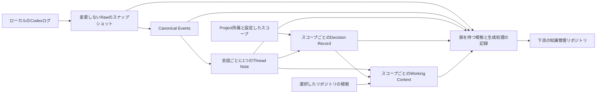

# Tkn Codex Context Pipeline

Codexの会話を保存し、Thread Note、Decision Record、現在のWorking Contextへ
変換するローカルデータパイプラインです。設定後に `clone` で取得可能な過去の
会話を一括処理し、その後は `pull` を定期実行します。

English: [README.md](README.md)

## 目的と現在の対応範囲

バージョン0.5では、根拠となるデータを会話単位で管理します。Codex Projectを
移動したり、複数の作業に関係したりしても、1つの会話に対するThread Noteは1つです。
Projectへの所属は観測したメタデータとして保持します。DecisionとWorking Contextは、
Codex Project、設定で指定した関連作業、未所属の会話の集合という「スコープ」ごとに生成します。



通常のコマンドで全段階を連続実行します。個別buildは保守用です。
取り込みや要約の前にProjectを登録したり、Projectごとにbackfillしたりする必要はありません。
生成物は指定したアプリケーション用の保存先に置き、元のリポジトリやCodexの保存領域には書き込みません。

| 入力 | 対応範囲 |
| --- | --- |
| `codex_home/sessions/**/*.jsonl` | 取得可能なローカルのCodex会話ログ |
| `codex_home/archived_sessions/**/*.jsonl` | 既定で対象に含める |
| `.codex-global-state.json` | 任意のProject所属情報。存在しない場合や未対応形式でも会話を除外しない |
| Project未所属、所属不明、候補が複数の会話 | Projectを推測で確定せず、保存・要約する |
| クラウドのChatGPTチャット／Work | クラウド履歴の取得機能はない。実際にローカルに存在する対応JSONLのみ対象 |
| クラウドからローカルへの引き継ぎ | ローカルで取得できるログ部分。クラウド側の元会話や全履歴の取得は保証しない |
| 内部処理・承認タスク、通常のユーザー発言がないログ | Raw保存と正規化まで行い、Thread Note生成から除外する |

ローカルの内部形式を読む機能です。アプリに表示されるすべての会話について、
対応するローカルログの存在を保証するものではありません。解析できないログや
競合する版も保存し、問題を報告します。未知のレコード型はRawに残し、対応範囲の警告として報告します。

## 必要なものとインストール

Python 3.11以上、uv、アクセス可能なローカルログを使用します。
生成には推論バックエンドの設定も必要です。既定はCodex CLIで、Claude Code、
GitHub Copilot CLI、ローカルOllamaにも対応します。アプリのProject情報は必須ではありません。

```console
cd "C:\path\to\tkn_codex_context_pipeline"
uv tool install .
tkn-codex-context --help
```

インストール時点のコードを使用します。リポジトリの更新後は再インストールします。

```console
uv tool install . --reinstall
```

Codexを使う場合は、独立した `codex` CLIが利用可能で、認証が済んでいる必要があります。
`WindowsApps` 配下のCodexデスクトップ実行ファイルは、独立したCLIの代わりにはなりません。

## 設定、clone、日常のpull

```console
tkn-codex-context config init
```

表示された `~/.tkn/codex_context_pipeline/config.yaml` を編集し、入力元、保存先、
生成に使うプロバイダーとモデルを選びます。実効設定を確認し、必要なら初回実行を事前確認します。

```console
tkn-codex-context config show
tkn-codex-context clone --dry-run
tkn-codex-context clone
```

`clone` は既存データをリセットせずに不足する保存領域を準備し、取得可能な全履歴を保存します。
対象となるThread Noteを生成した後、影響する全スコープのDecisionとWorking Contextまで処理します。
繰り返し実行しても途中から再開できます。初回はモデル呼び出しが多くなる可能性があります。
`--dry-run` は推論せず、フォルダーやレポートを作成しません。モデルの生成結果は予測せず、
新しいノートを待つ下流段階は `awaiting-upstream` と表示します。

日常の更新は次の操作です。

```console
tkn-codex-context pull
tkn-codex-context status
tkn-codex-context scopes list
```

`pull` は初期化済みの保存領域を使い、追加・変更されたログと未完了の処理を確認します。
後から追加された古い会話も対象で、インストール日時による足切りはありません。
成功済みで入力に変化のない段階はモデルを呼びません。既定では最後のイベントから30分経過した会話を
要約し、会話中のものは保留します。Raw保存はその前に行います。`--limit` で1回に生成を試みる
ノート数を制限でき、残りは次回の `pull` で続けます。

`status` は最終実行時点の記録と日時を表示し、入力元を再走査しません。
対象会話と有効なスコープがすべて最新になった場合のみ完了と扱います。
失敗、保留、保護された古いノートが残っていれば完了にはしません。
入力が揃っていないスコープでは最新と称するコンテキストを合成せず、独立したスコープは処理を続けられます。

## 設定

同梱の[設定例](src/tkn_codex_context/resources/config.example.yaml)に既定値があります。

```yaml
schema_version: "2.2.0"
codex_home: ~/.codex
raw_root: ~/.tkn/codex_context_pipeline/raw
data_root: ~/.tkn/codex_context_pipeline/data
state_root: ~/.tkn/codex_context_pipeline/state
cache_root: ~/.cache/codex_context_pipeline
source_id: windows
include_archived: true
generation:
  active_provider: codex
  providers:
    codex:
      model: gpt-5.6-sol
      reasoning_effort: high
      executable: codex
idle_minutes: 30
runtime_minutes: 230
model_timeout_seconds: 1800
scopes: {}
```

優先順位は、組み込み既定値 → ユーザー設定 → 作業ディレクトリの `.tkn/config.yaml`
→ 明示した `--config` → コマンドライン指定です。相対パスは記述元の設定ファイルを基準に解決します。
`config show` で各値の採用元、スキーマの読み替え、生成プロファイルのハッシュを確認できます。
`config init` は既存設定を保持し、`config init --force` は先にバックアップします。
互換性のある古い設定形式はメモリー上で読み替えます。以前の `installed_at` が残っていても、
新しいワークフローの対象選択には影響しません。

共通オプションはコマンドの前に指定します。

```console
tkn-codex-context --config "C:\path\to\config.yaml" clone
tkn-codex-context --idle-minutes 0 --runtime-minutes 60 pull --limit 20
```

保存先には、このアプリケーション専用で相互に重ならず、入力ログや設定ファイルとも
重ならない領域を指定します。無関係な既存ディレクトリは拒否します。
1つの保存領域は1つの `source_id` に対応します。別の入力元には別の保存領域を使用します。
`include_archived: false` はアーカイブの新たな走査を止めますが、保存済みの根拠は引き続き利用できます。

### 推論プロバイダー

入力元はCodexのままで、`generation.active_provider` は推論バックエンドだけを変更します。
選択するプロバイダーのモデルと接続先を指定してください。モデルの利用可否と認証は各サービス側で管理します。

| プロバイダーID | 接続設定 | 実行方法 |
| --- | --- | --- |
| `codex` | `executable: codex` | 独立した `codex exec` |
| `claude-code` | `executable: claude` | 非対話のClaude Code |
| `github-copilot` | `executable: copilot` | 非対話のCopilot CLI |
| `ollama` | `base_url: http://127.0.0.1:11434` | ローカルのchatエンドポイント。ループバックのみ |

利用可能なローカルモデルを使う場合は、例えばgenerationブロックを次のように置き換えます。

```yaml
generation:
  active_provider: ollama
  providers:
    ollama:
      model: <installed-local-model>
      reasoning_effort: high
      base_url: http://127.0.0.1:11434
```

CLI型のプロバイダーでは、選択した生成入力をそのCLIの設定先サービスへ送信します。
Rawと来歴のスナップショットには元の内容がローカルに残るため、会話データに適した保存先を選びます。
生成プロファイル、出力検証、再試行上限はアプリケーションが管理します。
モデル、プロバイダー、推論設定、生成プロファイルを変更すると、関連する段階が再生成対象になります。

### Projectをまたぐ作業

`scopes list` と会話カタログから元の正確なIDを確認し、関連付けを設定します。
Project指定と会話指定の和集合が対象です。

```yaml
scopes:
  context-pipeline:
    title: Context pipeline work
    project_ids: [project-a, project-b]
    thread_ids: [a-projectless-thread-id]
    repository_roots: ["C:/path/to/repository-a", "C:/path/to/repository-b"]
```

この設定は `work:context-pipeline` を作成します。自動作成するローカルProjectスコープは
`project:<source-project-id>` です。それ以外の会話は `unassigned` にまとめますが、
独立した活動の集合として扱い、共通の目的があるとは仮定しません。
スコープの重複は可能で、Thread Noteを複製せずに共有参照します。
未知のIDは推論前にエラーにします。所属が変わるとスコープの入力を更新し、会話のノートIDは維持します。

Working Contextは、共有Thread Note、有効なDecision Record、選択したリポジトリの文書やGit状態を使います。
Projectスコープでは観測したルート、任意の作業スコープでは `repository_roots` を参照します。
リポジトリの入力量には上限があり、読み取れないファイルや秘密情報らしき内容を含むファイルは省きます。
リポジトリの根拠がないことを、実装済みの証拠としては扱いません。
現在の入力による裏付けがないDecisionは古いものとして保持し、最新コンテキストの入力から除外します。
Decisionが0件でもWorking Contextは正常に生成できます。

## コマンドと運用

| コマンド | 用途 |
| --- | --- |
| `config init`、`config show` | 設定ファイルの作成・確認 |
| `clone` | 保存領域を準備し、取得可能な全履歴を全段階で処理 |
| `pull` | 変更分を保存し、関連する段階と未完了分を更新 |
| `status` | 入力を走査せず、最終実行の記録を確認 |
| `scopes list` | 最後に公開したスコープと正確なIDを確認 |
| `raw ingest` | バイト列の保存のみ。正規化・推論は行わず、保存領域の初期化も可能 |
| `thread-notes build [--thread-id ID]` | 全会話または1会話のノートを再評価 |
| `decisions build [--scope ID]` | 全スコープまたは1スコープのDecisionを再評価 |
| `working-context build [--scope ID]` | 上流が最新であることを確認してWorking Contextを再評価 |
| `thread-notes validate FILE` | Thread Noteの検証 |
| `decisions validate FILE` | Decision Recordの検証 |
| `working-context validate FILE` | Working Contextの検証 |
| `provenance validate` | 索引の生成物、保存した根拠のハッシュ、生成処理の参照関係を検証 |

パイプラインの書き込みコマンドは通常実行で保存し、`--dry-run` に対応します。
生成コマンドは `--force` と `--allow-edited` にも対応します。
`--force` は指定段階の変更がない入力も再評価しますが、編集保護は解除しません。
`--allow-edited` は編集済みで未レビューの出力の置換を明示的に許可します。
レビュー済みのノート・コンテキストは再生成から保護します。
レビュー済みDecisionは参照できますが、書き換えません。入力が変わったときは、
保護された生成物と根拠の関係を手動で確認・整理する必要があります。

```console
tkn-codex-context thread-notes build --thread-id "thread-id" --force
tkn-codex-context decisions build --scope "work:context-pipeline" --force
tkn-codex-context working-context build --scope "work:context-pipeline" --force
```

個別buildも、対象段階を選ぶ前にローカルの根拠を保存・正規化します。
上流の生成は行わず、パイプライン全体の完了とも扱いません。全段階を揃える場合は `pull` を使います。

進捗と診断はstderr、stdoutはUTF-8のJSONです。
詳細レポートは `state_root/reports/` に保存し、`--full-output` で会話・スコープごとの詳細も
stdoutに含めます。共通の `--quiet` は進捗を抑制し、`--verbose` は診断を詳しくします。

| 終了コード | 意味 |
| --- | --- |
| `0` | 指定段階の成功、またはdry-runの計画検証成功 |
| `1` | 設定・入力・保存領域・検証・生成の失敗 |
| `2` | パイプラインの未完了・保留、または不正なコマンド構文 |

失敗しても、成功したノート、確定済みDecisionバッチ、Rawは残ります。
`pull` で再開すると、成功済みで変更のない推論処理は繰り返しません。
OSのロックで同時書き込みを拒否し、プロセス終了時にロックを解除します。
実行時間の上限に達すると新たな処理を始めず、実行中の推論には有限の猶予時間を認めます。
結果の公開前に中断した場合、最終実行の記録は実行中・未完了のまま残ります。

定期運用では、外部スケジューラーから明示した設定ファイルと一定の作業ディレクトリで `pull` を実行し、
終了コードとstderrを記録します。このCLIはスケジューラーや常駐プロセスを登録しません。
取得を推論と独立して続ける場合は `raw ingest` を短い間隔で実行し、後から `pull` で生成物を更新できます。

## 保存構造と下流へのデータ契約

| ルート／パス | 内容 |
| --- | --- |
| `raw_root/<sourceId>/sha256/<prefix>/<hash>.jsonl` | 元のバイト列を変更しないスナップショット |
| `raw_root/<sourceId>/manifest.jsonl` | 追記式の取得・発見記録 |
| `raw_root/<sourceId>/metadata/<hash>.json` | アプリの所属メタデータのスナップショット |
| `data_root/source-aligned/<threadKey>/<hash>.json` | 変更しない正規化イベント、Rawの行参照、解析診断 |
| `data_root/threads/<threadKey>/thread-notes/*.md` | 会話ごとに1つの、安定したIDを持つThread Note |
| `data_root/scopes/<scopeKey>/decisions/DR-*.md` | スコープのDecision Record |
| `data_root/scopes/<scopeKey>/working-context.md` | スコープの現在のコンテキスト |
| `data_root/catalog/threads.json`、`scopes.json` | 観測した所属と履歴、参照、処理状態 |
| `data_root/provenance/` | 変更しないエンティティの版、入出力のスナップショット、生成処理の記録と下流向け索引 |
| `state_root/` | 保存領域の識別情報、処理チェックポイント、段階別状態、レポート、最終実行状態 |
| `cache_root/` | 再開可能な生成処理の作業データと保留出力 |

データ契約では、論理的なUUIDと内容の版（`sha256:`）を分け、生成プロバイダー・モデル・
プロファイルのハッシュを記録し、出力から正確な入力の版を辿れるようにしています。
Working Contextは `scopeId` と `scopeStatus` を使用するスキーマ5です。
Thread Noteはスキーマ4、Decisionはスキーマ5です。既存生成物のIDと作成日は再生成時に維持し、
同じ会話のノートが重複している場合は曖昧なまま選択せずエラーにします。

[データ契約](reference/data-contract.md)に、参照方式、スキーマ、完了状態、来歴の利用方法を記載しています。
RDF出力、グローバルIRIの方針、OWL語彙、意味に基づくエンティティ同定、PROV-Oへの対応付けは
下流リポジトリの責務です。本リポジトリはそのための根拠を出力し、オントロジーやグラフストアは実装しません。

バージョン0.5は保存形式2を使います。旧Project単位の保存構造を自動移行・リセットしません。
新しいdata/state/cacheの保存先（Rawも新しい保存先を推奨）を設定し、旧データを残して `clone` します。
以前のProjectごとのbackfillやリセットを前提としたコマンドは公開しません。

## 開発

```console
uv sync
uv run pytest
uv run ruff check src tests
uv run mypy
uv build
```

テストでは合成ログ、疑似推論プロバイダー、テストフレームワークの一時領域を使います。
実アカウントや個人の会話データは不要です。生成プロンプト、スキーマ、テンプレートは
`src/tkn_codex_context/profiles/` に置き、パッケージに同梱します。
生成の契約を変更する場合はバージョンとハッシュも確認してください。

[開発引き継ぎ](reference/project-handoff.md)に実装の責務と開発を再開する手順を記載しています。
