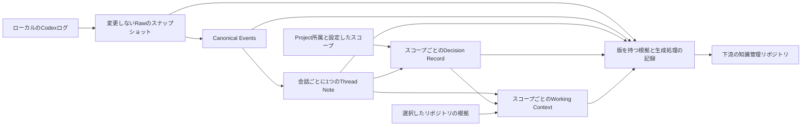
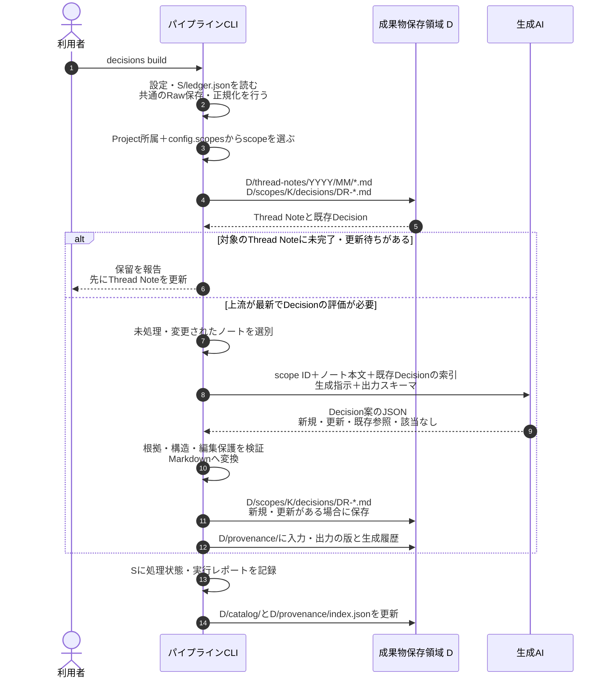
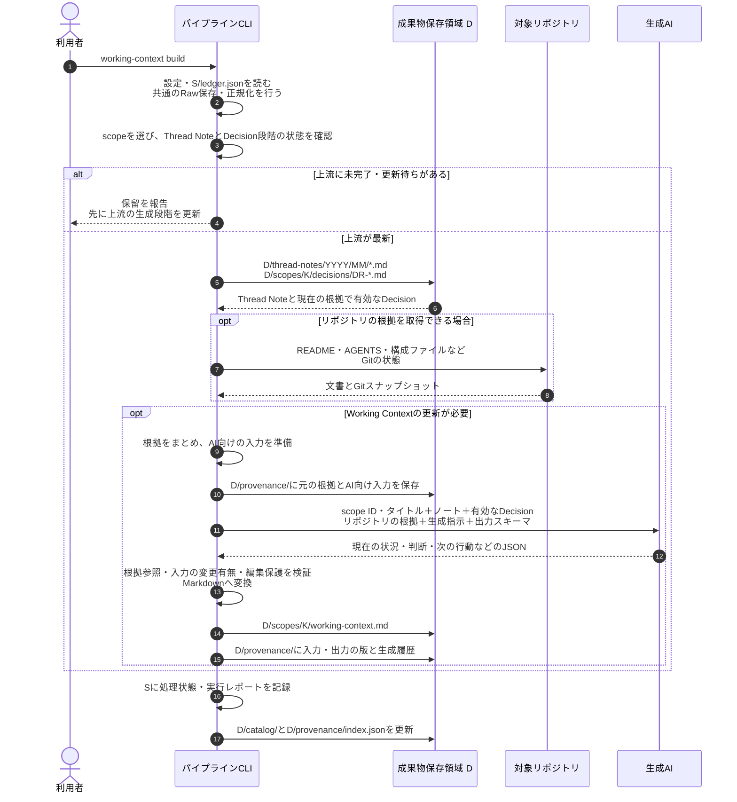
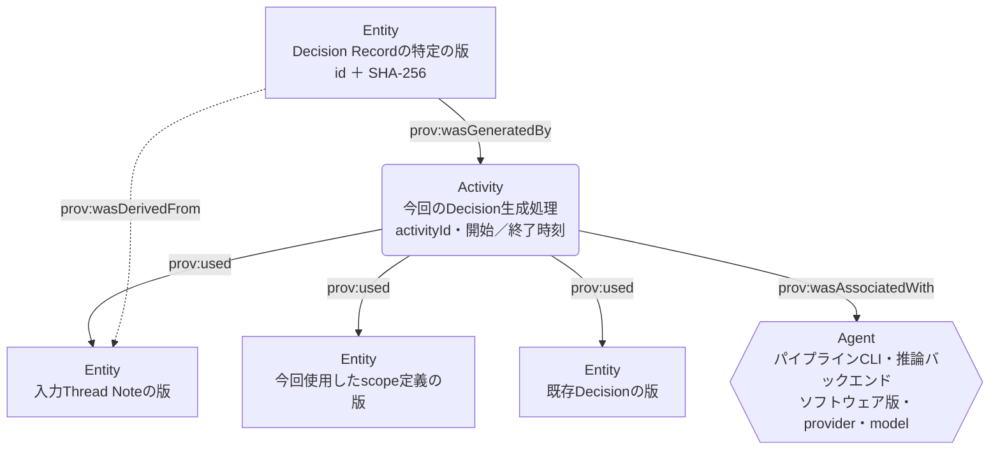

# Tkn Codex Context Pipeline

English: [README.md](README.md)

Codexの会話をまずRawデータとして保存し、それを元に要約したノート（以後、Thread Note）を
Markdownで作成するローカルデータパイプラインです。Thread Noteを元にDecision Recordを作成し、
さらにThread Note、Decision Record、リポジトリの情報から、現在の状況と次の行動をまとめた
Working Contextを作成します。Thread Noteには概要に加えて、時系列の記録と最後に確認できた状態も残します。
`config.yaml` による設定後に、`clone` で取得可能な過去の会話を一括処理し、その後は `pull` を定期実行します。

## 目的と現在の対応範囲

根拠となるデータを会話単位で管理します。Codex Projectを
移動したり、複数の作業に関係したりしても、1つの会話に対するThread Noteは1つです。
Projectへの所属は観測したメタデータとして保持します。DecisionとWorking Contextは、
Codex Project、設定で指定した関連作業、未所属の会話の集合という「スコープ」ごとに生成します。



`clone` コマンドは、Raw保存からWorking Context生成までの全段階を連続実行します。
その後の更新には `pull` を使い、特定の生成段階だけを実行する場合は個別のbuildコマンドを使います。
生成物は、`config.yaml` で指定したアプリケーション用の保存先に置き、元のリポジトリやCodexの保存領域には書き込みません。
CLI引数の `--config` で設定ファイルを選べますが、保存先のパスを直接指定する引数はありません。

各段階のActor、ファイルパス、AIへの入力、生成物は、
[処理のシーケンスと来歴](#processing-flow)で確認できます。

| 入力 | 対応範囲 |
| --- | --- |
| `codex_home/sessions/**/*.jsonl` | 取得可能なローカルのCodex会話ログ |
| `codex_home/archived_sessions/**/*.jsonl` | 既定で対象に含める |
| `.codex-global-state.json` | 任意のProject所属情報。存在しない場合や未対応形式でも会話を除外しない |
| Project未所属、所属不明、候補が複数の会話 | Projectを推測で確定せず、保存・要約する |
| クラウドのChatGPTチャット／Work | クラウド履歴の取得機能はない。実際にローカルに存在する対応JSONLのみ対象 |
| クラウドからローカルへの引き継ぎ | ローカルで取得できるログ部分。クラウド側の元会話や全履歴の取得は保証しない |
| 内部処理・承認タスク、通常のユーザー発言がないログ | Raw保存と正規化まで行い、Thread Note生成から除外する |

ローカルの内部形式を読む機能です。アプリに表示されるすべての会話について、
対応するローカルログの存在を保証するものではありません。解析できないログや
競合する版も保存し、問題を報告します。未知のレコード型はRawに残し、対応範囲の警告として報告します。

## 必要なものとインストール

Python 3.11以上、uv、アクセス可能なローカルログを使用します。
生成には推論バックエンドの設定も必要です。既定はCodex CLIで、Claude Code、
GitHub Copilot CLI、ローカルOllamaにも対応します。アプリのProject情報は必須ではありません。

```console
cd "C:\path\to\tkn_codex_context_pipeline"
uv tool install .
tkn-codex-context --help
```

インストール時点のコードを使用します。リポジトリ更新後は、次のコマンドで再インストールして変更を反映します。

```console
uv tool install . --reinstall
```

Codexを推論に使う場合は、コマンドプロンプトやターミナルで `codex` コマンドが実行でき、
`codex --version` で `codex-cli <バージョン番号>` と表示されることを確認してください。
認証も必要です。次のコマンドでバージョンとログイン状態を確認します。

```console
codex --version
codex login status
```

未ログインの場合は `codex login` で認証します。
GUIのCodex Appは、独立したCLIの代わりにはなりません。Appがインストールされていても、
ターミナルから上記のコマンドを実行できることを確認してください。
詳細は[Codex CLIの公式コマンドリファレンス](https://learn.chatgpt.com/docs/developer-commands?surface=cli)を参照してください。

## 設定、clone、日常のpull

### config：設定ファイルの作成と確認

以下のコマンドにより、設定ファイルを作成します。

```console
tkn-codex-context config init
```

表示された `~/.tkn/codex_context_pipeline/config.yaml` を編集し、入力元、保存先、
生成に使うプロバイダーとモデルを選びます。編集後は、次のコマンドで実際に適用される設定値を確認します。

```console
tkn-codex-context config show
```

### clone：過去の会話を一括処理

`clone` は既存データをリセットせずに不足する保存領域を準備し、取得可能な全履歴を保存します。
対象となるThread Noteを生成した後、影響する全スコープのDecisionとWorking Contextまで処理します。
会話が多い場合は、多くのAIトークンを消費し、時間がかかる可能性があります。
まずは次のdry-runで、対象となる会話や処理予定を確認してください。

```console
tkn-codex-context clone --dry-run
```

`--dry-run` はAIを呼び出さず、フォルダーやレポートも作成しません。
実際のトークン消費量や料金を見積もる機能ではなく、モデルの生成結果も予測しません。
新しいThread Noteの生成を待つ段階は `awaiting-upstream` と表示します。
設定と処理対象を確認したら、次のコマンドで保存・生成を実行します。

```console
tkn-codex-context clone
```

中断や保留があっても、再実行すると保存済みのデータと処理記録を使って続きから進められます。

### pull：追加・変更された会話を反映

初回の `clone` の後は、次のコマンドを定期的に実行します。

```console
tkn-codex-context pull
```

`pull` は、前回までに保存したログと処理記録を確認し、新しい会話や更新された会話を取り込みます。
変更に応じてThread Note、Decision、Working Contextを更新し、前回終わらなかった処理も再開します。
CLIのインストール前に行った会話でも、対応するログが後から入力元に追加されれば取り込みます。
成功済みで入力に変化のない段階はモデルを呼びません。既定では最後のイベントから30分経過した会話を
要約し、会話中のものは保留します。Raw保存はその前に行います。`--limit` で1回に生成を試みる
ノート数を制限でき、残りは次回の `pull` で続けます。

実行結果と、生成対象のスコープは次のコマンドで確認できます。

```console
tkn-codex-context status
tkn-codex-context scopes list
```

`status` は最終実行時点の記録と日時を表示し、入力元を再走査しません。
対象会話と有効なスコープがすべて最新になった場合のみ完了と扱います。
失敗、保留、保護された古いノートが残っていれば完了にはしません。
入力が揃っていないスコープでは最新と称するコンテキストを合成せず、独立したスコープは処理を続けられます。

## 設定

同梱の[設定例](src/tkn_codex_context/resources/config.example.yaml)に既定値があります。

```yaml
schema_version: "2.2.0"
codex_home: ~/.codex
raw_root: ~/.tkn/codex_context_pipeline/raw
data_root: ~/.tkn/codex_context_pipeline/data
state_root: ~/.tkn/codex_context_pipeline/state
cache_root: ~/.cache/codex_context_pipeline
source_id: windows
include_archived: true
generation:
  active_provider: codex
  providers:
    codex:
      model: gpt-5.6-sol
      reasoning_effort: high
      executable: codex
idle_minutes: 30
runtime_minutes: 230
model_timeout_seconds: 1800
scopes: {}
```

設定値の優先順位は、組み込み既定値 → ユーザー設定 → 作業ディレクトリの `.tkn/config.yaml`
→ 明示した `--config` → コマンドライン指定です。相対パスは記述元の設定ファイルを基準に解決します。
`config show` で各値の採用元、スキーマの読み替え、生成プロファイルのハッシュを確認できます。
`config init` は既存設定を保持し、`config init --force` は先にバックアップします。
互換性のある古い設定形式はメモリー上で読み替えます。以前の `installed_at` が残っていても、
新しいワークフローの対象選択には影響しません。

共通オプションはコマンドの前に指定します。

```console
tkn-codex-context --config "C:\path\to\config.yaml" clone
tkn-codex-context --idle-minutes 0 --runtime-minutes 60 pull --limit 20
```

保存先には、このアプリケーション専用で相互に重ならず、入力ログや設定ファイルとも
重ならない領域を指定します。無関係な既存ディレクトリは拒否します。
1つの保存領域は1つの `source_id` に対応します。別の入力元には別の保存領域を使用します。
`include_archived: false` はアーカイブの新たな走査を止めますが、保存済みの根拠は引き続き利用できます。

### 推論プロバイダー

現時点では、対応しているチャットソースは、ローカルに保存されたCodexの会話ログです。
推論に使用する生成AIモデルは、`generation.active_provider` と各プロバイダーの `model` で変更できます。
選択するプロバイダーのモデルと接続先を指定してください。モデルの利用可否と認証は各サービス側で管理します。

| プロバイダーID | 接続設定 | 実行方法 |
| --- | --- | --- |
| `codex` | `executable: codex` | 独立した `codex exec` |
| `claude-code` | `executable: claude` | 非対話のClaude Code |
| `github-copilot` | `executable: copilot` | 非対話のCopilot CLI |
| `ollama` | `base_url: http://127.0.0.1:11434` | ローカルのchatエンドポイント。ループバックのみ |

利用可能なローカルモデルを使う場合は、例えばgenerationブロックを次のように置き換えます。

```yaml
generation:
  active_provider: ollama
  providers:
    ollama:
      model: <installed-local-model>
      reasoning_effort: high
      base_url: http://127.0.0.1:11434
```

CLI型のプロバイダーでは、選択した生成入力をそのCLIの設定先サービスへ送信します。
Rawと来歴のスナップショットには元の内容がローカルに残るため、会話データに適した保存先を選びます。
生成プロファイル、出力検証、再試行上限はアプリケーションが管理します。
モデル、プロバイダー、推論設定、生成プロファイルを変更すると、関連する段階が再生成対象になります。

### scopeは誰が作成するか

scopeは、DecisionとWorking Contextを作る際に「どの会話を一緒に扱うか」を決める範囲です。
すべてのProjectについて、自分で作成する必要はありません。

| scope | 誰が定義するか | 対象の会話 |
| --- | --- | --- |
| `project:<source-project-id>` | CLIが観測したローカルProject所属から自動作成 | そのローカルProjectに割り当てられた会話 |
| `unassigned` | 必要な場合にCLIが自動作成 | ローカルProjectへの所属を確定できない会話 |
| `work:<configuration-key>` | 利用者が `config.yaml` でまとめ方を指定し、CLIが作成 | 指定したProjectと会話の和集合 |

最初は `scopes: {}` のままで始められます。この設定でも自動scopeは機能し、
対象となる会話がないscopeは作成しません。複数Projectや特定の会話について、
判断と次の行動をまとめて確認したくなったときに、任意の作業scopeを追加します。
現在のCLIには、AIが内容を読んでテーマ別のscopeを自動で考える機能はありません。

利用者が指定するのはscopeの名前と対象です。要約、Decision、Working Contextの本文を
手書きする必要はありません。`data_root/catalog/scopes.json` は生成結果のカタログであり、
設定のために編集するファイルではありません。

### Projectをまたぐ作業

`scopes list` と会話カタログから元の正確なIDを確認し、関連付けを設定します。
Project指定と会話指定の和集合が対象です。

```yaml
scopes:
  context-pipeline:
    title: Context pipeline work
    project_ids: [project-a, project-b]
    thread_ids: [a-projectless-thread-id]
    repository_roots: ["C:/path/to/repository-a", "C:/path/to/repository-b"]
```

この設定は、自動scopeに加えて `work:context-pipeline` を作成します。
`title` は表示名です。`project_ids` には `project:` を付けずに元のProject IDを指定し、
`thread_ids` には元の会話IDを指定します。任意の `repository_roots` はWorking Contextで
参照するリポジトリの根拠を追加する設定で、会話を選択する条件ではありません。
設定キーはscopeの識別子です。キーを変えると別scopeになり、タイトルだけの変更なら同じscopeを維持します。

設定の編集後に `pull` を実行すると、影響するscopeを更新します。
scopeの重複は可能で、Thread Noteを複製せずに共有参照します。
未知のIDは推論前にエラーにし、所属変更でも会話のノートIDは維持します。
`unassigned` は独立した活動の集合として扱い、共通の目的があるとは仮定しません。

Working Contextは、共有Thread Note、有効なDecision Record、選択したリポジトリの文書やGit状態を使います。
Projectスコープでは観測したルート、任意の作業スコープでは `repository_roots` を参照します。
リポジトリの入力量には上限があり、読み取れないファイルや秘密情報らしき内容を含むファイルは省きます。
リポジトリの根拠がないことを、実装済みの証拠としては扱いません。
現在の入力による裏付けがないDecisionは古いものとして保持し、最新コンテキストの入力から除外します。
Decisionが0件でもWorking Contextは正常に生成できます。

## コマンドと運用

| コマンド | 用途 |
| --- | --- |
| `config init`、`config show` | 設定ファイルの作成・確認 |
| `clone` | 保存領域を準備し、取得可能な全履歴を全段階で処理 |
| `pull` | 変更分を保存し、関連する段階と未完了分を更新 |
| `status` | 入力を走査せず、最終実行の記録を確認 |
| `scopes list` | 最後に公開したスコープと正確なIDを確認 |
| `raw ingest` | バイト列の保存のみ。正規化・推論は行わず、保存領域の初期化も可能 |
| `thread-notes build [--thread-id ID]` | 全会話または1会話のノートを再評価 |
| `decisions build [--scope ID]` | 全スコープまたは1スコープのDecisionを再評価 |
| `working-context build [--scope ID]` | 上流が最新であることを確認してWorking Contextを再評価 |
| `thread-notes validate FILE` | Thread Noteの検証 |
| `decisions validate FILE` | Decision Recordの検証 |
| `working-context validate FILE` | Working Contextの検証 |
| `provenance validate` | 索引の生成物、保存した根拠のハッシュ、生成処理の参照関係を検証 |

パイプラインの書き込みコマンドは通常実行で保存し、`--dry-run` に対応します。
生成コマンドは `--force` と `--allow-edited` にも対応します。
`--force` は指定段階の変更がない入力も再評価しますが、編集保護は解除しません。
`--allow-edited` は編集済みで未レビューの出力の置換を明示的に許可します。
レビュー済みのノート・コンテキストは再生成から保護します。
レビュー済みDecisionは参照できますが、書き換えません。入力が変わったときは、
保護された生成物と根拠の関係を手動で確認・整理する必要があります。

```console
tkn-codex-context thread-notes build --thread-id "thread-id" --force
tkn-codex-context decisions build --scope "work:context-pipeline" --force
tkn-codex-context working-context build --scope "work:context-pipeline" --force
```

個別buildも、対象段階を選ぶ前にローカルの根拠を保存・正規化します。
上流の生成は行わず、パイプライン全体の完了とも扱いません。全段階を揃える場合は `pull` を使います。

進捗と診断はstderr、stdoutはUTF-8のJSONです。
詳細レポートは `state_root/reports/` に保存し、`--full-output` で会話・スコープごとの詳細も
stdoutに含めます。共通の `--quiet` は進捗を抑制し、`--verbose` は診断を詳しくします。

| 終了コード | 意味 |
| --- | --- |
| `0` | 指定段階の成功、またはdry-runの計画検証成功 |
| `1` | 設定・入力・保存領域・検証・生成の失敗 |
| `2` | パイプラインの未完了・保留、または不正なコマンド構文 |

失敗しても、成功したノート、確定済みDecisionバッチ、Rawは残ります。
`pull` で再開すると、成功済みで変更のない推論処理は繰り返しません。
OSのロックで同時書き込みを拒否し、プロセス終了時にロックを解除します。
実行時間の上限に達すると新たな処理を始めず、実行中の推論には有限の猶予時間を認めます。
結果の公開前に中断した場合、最終実行の記録は実行中・未完了のまま残ります。

定期運用では、外部スケジューラーから明示した設定ファイルと一定の作業ディレクトリで `pull` を実行し、
終了コードとstderrを記録します。このCLIはスケジューラーや常駐プロセスを登録しません。
取得を推論と独立して続ける場合は `raw ingest` を短い間隔で実行し、後から `pull` で生成物を更新できます。

<a id="processing-flow"></a>

## 保存構造について

元チャットをRawとして取り込み、正規化した会話イベントからThread Noteを生成します。
Rawは元ログのフォルダ構造を保ち、Thread Noteは会話開始日時の年月で整理します。

以下は既定の保存先です。`~` はユーザーホーム、`<sourceId>` は取得元の識別子
（既定値は `windows`）です。各ルートは設定で変更できます。

```text
~/.tkn/codex_context_pipeline/
├─ raw/                                  # raw_root
│  └─ <sourceId>/
│     ├─ sessions/                       # 元のsessions/以下を再現
│     │  └─ 2026/09/10/
│     │     └─ rollout-....jsonl
│     ├─ archived_sessions/              # 元の相対構造・ファイル名を再現
│     │  └─ ...
│     ├─ manifest.jsonl                  # 元ファイルごとの最新の取得記録
│     └─ metadata/<hash>.json             # アプリの所属情報
├─ data/                                 # data_root
│  ├─ source-aligned/<threadKey>/
│  │  └─ <hash>.json                     # 正規化した会話イベント
│  ├─ thread-notes/
│  │  ├─ 2025/
│  │  │  └─ 12/
│  │  │     └─ <開始日時>-<slug>.md
│  │  └─ 2026/
│  │     ├─ 08/
│  │     │  └─ <開始日時>-<slug>.md
│  │     └─ 09/
│  │        └─ 20260910T081831+0900-storage-layout.md
│  ├─ scopes/<scopeKey>/
│  │  ├─ decisions/DR-*.md               # スコープのDecision Record
│  │  └─ working-context.md              # スコープの現在のコンテキスト
│  ├─ catalog/                           # 会話・所属・生成物の対応
│  └─ provenance/                        # 生成根拠と生成履歴
└─ state/                                # state_root：処理状態・レポート

~/.cache/codex_context_pipeline/          # cache_root：再開用の作業データ
```

### Raw：元のフォルダ構造で最新のチャットを保存

`raw_root/<sourceId>/` 以下に、Codexの `sessions/` と `archived_sessions/` の
相対フォルダ構造とファイル名を再現します。ツリー内の日付階層は元ログの配置例です。
変更されたログは同じ保存先の最新コピーを置き換え、元ログがなくなっても保存済みコピーは削除しません。
バックアップ世代の管理はFreeFileSyncやTask Schedulerなどの外部ツールの責務です。

### Thread Note：会話開始日時の年月で整理

正規化した会話イベントから、会話ごとに1つのThread Noteを
`data_root/thread-notes/YYYY/MM/<開始日時>-<slug>.md` に生成します。
フォルダとファイル名には、会話開始日時をシステムのタイムゾーンへ変換した値を使います。
日本時間なら `20260910T081831+0900` のようになり、日単位のフォルダは作りません。
会話が月をまたいでも開始月に保存し、会話の安定したIDはFrontmatterに保持します。

Decision RecordとWorking Contextは、Thread Noteを入力としてスコープごとに生成します。
`data_root/provenance/` の生成根拠スナップショットは、Rawの最新コピーとは別に維持します。

## 処理のシーケンスと来歴

CLIが入力を選び、生成AIが構造化JSONを返し、CLIが検証してMarkdownに変換・保存します。
`clone` と `pull` は、以下の3つの生成段階を順番に実行します。個別のbuildコマンドでは、
共通のRaw保存・正規化を行った後、指定した生成段階だけを実行します。
初回は `clone`（Raw保存だけなら `raw ingest`）で保存領域を準備してください。

図は通常実行で生成が必要な場合を示します。変更のない成功済みの処理は省略し、
`--dry-run` では生成AIの呼び出しとファイル保存を行いません。Raw保存・正規化にも生成AIは使いません。

### thread-notes build：RawからThread Noteを生成

会話ログをRawとして保存・正規化し、対象会話のThread NoteをMarkdownで生成します。
`--thread-id` で1会話を選べます。DecisionとWorking Contextは、このコマンドでは生成しません。
AIにはイベント内容・ID、生成指示、出力スキーマを渡します。

以下は `tkn-codex-context thread-notes build` の処理です。表の略記は直後の図で使います。

| 図中の表記 | 設定項目 | 既定の保存先 |
| --- | --- | --- |
| `C` | `codex_home` | `~/.codex` |
| `R` | `raw_root` | `~/.tkn/codex_context_pipeline/raw` |
| `D` | `data_root` | `~/.tkn/codex_context_pipeline/data` |
| `S` | `state_root` | `~/.tkn/codex_context_pipeline/state` |

`T` は会話の `threadKey`、`H` は内容のハッシュです。
図のパスでは、それぞれの実際の値を表すプレースホルダーとして使います。


保存するCanonical Eventsと要約処理が使うイベントは、同じ解析結果に基づきます。
現在の実装は、保存した正規化JSONを再読込せず、メモリー上のイベントを要約処理へ渡します。
この段階の要約単位は会話であり、作業scopeによる統合とは独立しています。

### decisions build：Thread NoteからDecisionを生成

scopeを使って対象のThread Noteと既存Decisionを選び、未処理・変更されたノートをAIへ渡します。
scopeは対象を決める設定データです。設定JSON全体をAIに渡すのではなく、scope IDと選別した根拠を渡します。
対象scopeのThread Noteが最新でなければ処理を保留します。このコマンドはThread NoteやWorking Contextを生成しません。

以下は `tkn-codex-context decisions build` の処理です。`--scope` で対象を限定できます。

| 図中の表記 | 設定項目・意味 | 既定の保存先 |
| --- | --- | --- |
| `D` | `data_root`：ノート・Decision・来歴 | `~/.tkn/codex_context_pipeline/data` |
| `S` | `state_root`：処理記録 | `~/.tkn/codex_context_pipeline/state` |
| `T` / `K` | 会話の `threadKey` / scopeの保存用キー | パス内のプレースホルダー |



新しいDecisionが0件でも正常に完了できます。モデルが返した既存Decisionの参照も処理記録に残します。

### working-context build：現在の状況と次の行動を生成

scopeのThread Note、有効なDecision、対象リポジトリの文書やGit状態からWorking Contextを作ります。
AIには、scope ID・タイトルと、選別した根拠、生成指示、出力スキーマを渡します。
元の根拠と、文字数を制限したAI向け入力は、それぞれ別のスナップショットとして保存します。

以下は `tkn-codex-context working-context build` の処理です。`--scope` で対象を限定できます。
Thread NoteとDecision段階が最新である必要があり、このコマンドからそれらを生成し直すことはありません。
Decision段階が正常に完了していれば、Decision Recordが0件でも生成できます。

| 図中の表記 | 設定項目・意味 | 既定の保存先 |
| --- | --- | --- |
| `D` | `data_root`：ノート・Decision・Working Context・来歴 | `~/.tkn/codex_context_pipeline/data` |
| `S` | `state_root`：処理記録 | `~/.tkn/codex_context_pipeline/state` |
| `T` / `K` | 会話の `threadKey` / scopeの保存用キー | パス内のプレースホルダー |
| 対象リポジトリ | Projectの観測ルート、またはscopeの `repository_roots` | scopeによる |



### Decisionの来歴をPROV-Oの見方で捉える

[PROV-O](https://www.w3.org/TR/prov-o/#description-starting-point)では、ファイルの特定の版などのデータを
Entity、今回実行した処理をActivity、責任を持つ実行主体をAgentとして整理できます。
矢印は、出力から生成処理・根拠へ辿る向きです。



これは現在のJSON記録をPROV-Oの概念へ対応付けた説明図で、RDF出力は下流の責務です。
来歴の `used` は生成段階の依存関係を表すため、入力選別に使ったscopeも含みます。
モデルに直接渡した文章だけの記録ではなく、すべてのモデル呼び出しを保存した完全な通信ログでもありません。

以下の表では `D` は `data_root`、`S` は `state_root`、`H` は内容のハッシュです。

| 保存場所 | 分かること |
| --- | --- |
| `D/provenance/entities/*.json` | データの論理ID、版、ハッシュ、保存先 |
| `D/provenance/blobs/{prefix}/H` | その版の正確な内容 |
| `D/provenance/activities/{activityId}.json` | どの処理が、どの版を使い、何を生成したか |
| `D/provenance/index.json` | 公開した成果物の版・状態と来歴への入口 |
| `S/ledger.json` | どこまで処理済みで、何を再開するか |
| `S/reports/{runId}.json` | 1回の実行の成功・失敗・保留 |
| `S/last-run.json` | 最終実行の状態 |

## Thread Note（スレッド記録）の内容

生成物の正式名は **Thread Note**、日本語では **スレッド記録** です。
「chat summary」は処理の通称として扱い、ノート全体を短い要約に限定しません。
既存の `thread-notes` コマンド、`type: threadNote`、保存先、
`profiles/summary/default` のリソースパスは維持します。

- **Summary**：会話の目的と結果を短く把握する概要。
- **Timeline**：日時・主体・内容・根拠IDを持つ時系列の本文。質問、着想、未採用案、
  失敗、再試行、訂正、実行、検証、決定を残します。定型的な読み取りは目的ごとにまとめます。
- **Last Known State**：最後に確認できた状態、最新のユーザー指示、未解決・未検証事項、再開地点。
- **Evidence / Source Notes**：必要な検証値や、入力省略・未確認事項。内容がある場合だけ表示します。

日時・主体はAIに生成させず、引用された開始・終了イベントから決定的に取得します。
日付ごとに区切り、日本時間（`Asia/Tokyo`）で秒まで表示します。元の時刻と行参照は
Raw・正規化イベントに保持し、同時刻や時計の逆行時も元ログの順序を優先します。
タイムゾーン不明・無効な時刻は推定せず「時刻不明」と表示します。
ログの記録時刻は作業時間の計測値ではありません。

Timelineは時刻を親項目とし、固定のフィールド名を持つ子項目へ分けます。
主体は `Actor: User` / `AI` / `Tool`、分類は `Type`、本文は `Text` です。
`EventRange` は時刻・主体を決める開始と終了のイベントID（単一なら同じID）、
`Sources` は本文全体を支えるイベントIDです。根拠IDの並びから開始・終了を推測しません。
時刻範囲は ` - `、イベント範囲は ` -> `、フィールドは `: ` と半角記号で区切ります。
不明な時刻は `Unknown`、不明な日付は `Unknown date` と表示し、本文の日本語は維持します。

```markdown
### 2026-05-17

- **11:27:35 - 11:27:47**
  - Actor: AI
  - Type: Action
  - Text: 公開範囲と一覧取得の可否を調べた。
  - EventRange: L000010 -> L000020
  - Sources: L000010, L000012, L000020
```

AIの発言とツール呼び出しはいずれも主体をAIとし、ツール結果の主体はToolとします。
本文の継続行は `Text` の下へ字下げし、フィールド行との混同を避けます。
SummaryとEvidenceも `Text` と子項目の `Sources` に分け、本文と参照IDを同じ行に混在させません。
Last Known Stateは `Work State`、`Detail`、`Latest User Direction`、`Unresolved`、`Unverified`、
`Continuation Point`、`Sources` を固定順で表示します。Sourcesはこの状態記録全体の根拠で、
項目ごとの根拠IDは推測して割り振りません。未解決・未確認事項は親項目の下へ `Text` として列挙します。
空の配列は `[]`、空のテキストは表示上 `null` とし、記録がないことを「すべて確認済み」や
「追加指示なし」と解釈しません。元のJSONでは空テキストは引き続き空文字です。
Source Notesは各注意事項を `Text` として分離し、元データにない分類や根拠IDを補いません。
EvidenceとSource Notesは記録項目がない場合に省略します。省略は記録がないことを表し、
独立した検証によって問題なしと確認したことを意味しません。旧形式も後続処理で読み取れます。
このMarkdownはRDF/PROV-Oそのものではありません。将来の変換では表示から役割を推測せず、
元イベントの構造化データと明示したID参照を使います。JSONの時系列スキーマは変更しません。

章の見出し・順序・任意章の表示条件とLast Known Stateの項目名・順序は、
`src/tkn_codex_context/profiles/summary/default/template.md` で管理します。
`{{?evidence}}` / `{{/evidence}}`、`{{?source_notes}}` / `{{/source_notes}}` は、
対応する本文がある場合だけ中の見出しと本文を表示する条件ブロックです。
条件マーカーは単独行に置き、入れ子にはしません。閉じ忘れ・未知の名前・重複などはエラーになります。
Python側は本文の繰り返し項目、改行・字下げ、時刻・主体・根拠IDの導出と検証を担当します。
生成文に `{{evidence}}` などが含まれていても再展開せず、そのまま本文として扱います。
出力JSONや既存Markdownの読み取り形式は変えず、依存ライブラリも追加しません。

長い会話は分割して記録します。**時系列本文は各部分の記録をそのまま結合**し、
概要・終了状態だけをAIで統合します。作業ごとの6項目上限や全体9,000文字の制限はありません。
1項目は900文字以内とし、ユーザー発言の取りこぼし、存在しない根拠、異なる日・主体・turnを
またぐ不適切な範囲を検証します。この検証は形式と参照の検査であり、意味内容の正しさは別途確認します。
イベント本文を8,000文字で切り取る処理は廃止しました。認証情報らしい文字列のマスキング後、
残る本文を順番にすべて渡します。通常のイベントは全文を維持し、既定120,000文字の入力枠を
超えるイベントだけを連続した部分に分割します。元ID・日時・部分番号と総数・本文内の位置を
保持し、修正依頼時も同じ部分を渡します。この入力枠はJSON化したイベント配列の文字数で、
プロンプト・スキーマなどの追加分は含まず、トークン数の上限でもありません。
各部分の時系列記録は統合時にも保持します。これは入力の欠落を防ぐもので、生成文に全詳細が
残る保証ではありません。Source Notesには、元ログに既に存在するツール出力の省略などを記載し、
欠落のない入力分割自体は資料の制約として扱いません。

記録は会話に基づく事実に限定します。複数の記録から新しい案、反復作業、自動化候補、日記を
作る分析は後段の用途です。観測できるツール操作・結果を含めますが、記録されていない内部思考は補いません。
DecisionとWorking Contextは新旧Thread Noteを読み取れます。長いThread Noteは1件180,000文字まで
読み込み、それを超える場合は黙って切り捨てず入力エラーとして報告します。

既存ノートとの実生成比較には、開発用の次のコマンドを使えます。
新しい出力フォルダに比較元・元ログのスナップショット・生成結果・検証レポートを保存し、
本番ノートや処理チェックポイントは更新しません。設定済みの生成AIを使用します。

```console
uv run python scripts/review_thread_note.py --source-log <rollout.jsonl> --baseline-note <thread-note.md> --output-dir <new-review-directory>
```

`--reuse-dir <previous-review-directory>` を指定すると、入力・プロファイル・生成AI設定が
同一の推論結果を再利用できます。現行の検証は毎回実行し、修正や未取得部分は生成AIを使います。

## 下流へのデータ契約

| ルート／パス | 内容 |
| --- | --- |
| `raw_root/<sourceId>/sessions/<original-relative-path>.jsonl` | 元のバイト列の最新コピー（`archived_sessions/` も同様） |
| `raw_root/<sourceId>/manifest.jsonl` | 元ファイルごとの最新の取得・発見記録 |
| `raw_root/<sourceId>/metadata/<hash>.json` | アプリの所属メタデータのスナップショット |
| `data_root/source-aligned/<threadKey>/<hash>.json` | 変更しない正規化イベント、Rawの行参照、解析診断 |
| `data_root/thread-notes/YYYY/MM/*.md` | 会話ごとに1つの、安定したIDを持つThread Note |
| `data_root/scopes/<scopeKey>/decisions/DR-*.md` | スコープのDecision Record |
| `data_root/scopes/<scopeKey>/working-context.md` | スコープの現在のコンテキスト |
| `data_root/catalog/threads.json`、`scopes.json` | 観測した所属と履歴、参照、処理状態 |
| `data_root/provenance/` | 変更しないエンティティの版、入出力のスナップショット、生成処理の記録と下流向け索引 |
| `state_root/` | 保存領域の識別情報、処理チェックポイント、段階別状態、レポート、最終実行状態 |
| `cache_root/` | 再開可能な生成処理の作業データと保留出力 |

データ契約では、論理的なUUIDと内容の版（`sha256:`）を分け、生成プロバイダー・モデル・
プロファイルのハッシュを記録し、出力から正確な入力の版を辿れるようにしています。
Working Contextは `scopeId` と `scopeStatus` を使用するスキーマ5です。
Thread Noteはスキーマ5、Decisionはスキーマ5です。旧Thread Noteのスキーマ3・4も読み取れます。既存生成物のIDと作成日は再生成時に維持し、
同じ会話のノートが重複している場合は曖昧なまま選択せずエラーにします。

[データ契約](reference/data-contract.md)に、参照方式、スキーマ、完了状態、来歴の利用方法を記載しています。
RDF出力、グローバルIRIの方針、OWL語彙、意味に基づくエンティティ同定、PROV-Oへの対応付けは
下流リポジトリの責務です。本リポジトリはそのための根拠を出力し、オントロジーやグラフストアは実装しません。

## 開発

```console
uv sync
uv run pytest
uv run ruff check src tests
uv run mypy
uv build
```

テストでは合成ログ、疑似推論プロバイダー、テストフレームワークの一時領域を使います。
実アカウントや個人の会話データは不要です。生成プロンプト、スキーマ、テンプレートは
`src/tkn_codex_context/profiles/` に置き、パッケージに同梱します。
生成の契約を変更する場合はバージョンとハッシュも確認してください。

[開発引き継ぎ](reference/project-handoff.md)に実装の責務と開発を再開する手順を記載しています。
