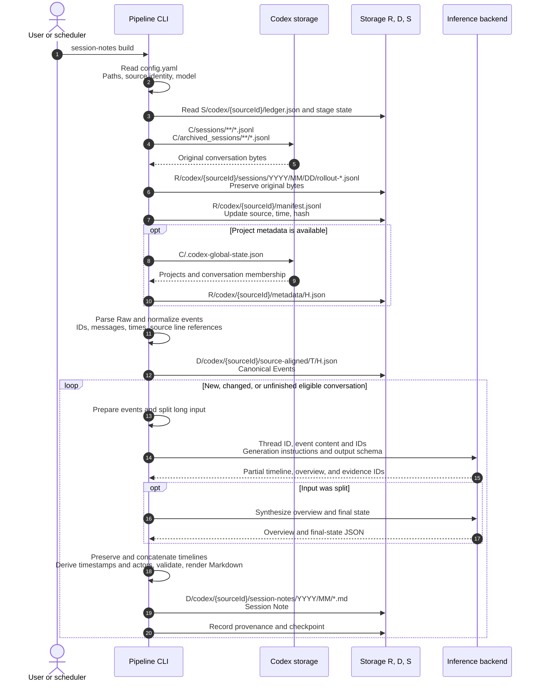

### session-notes build: generate Session Notes from Raw

Capture and normalize conversation logs, then generate Markdown Session Notes for
eligible conversations. Use `--thread-id` to select one conversation. This command
does not generate Decisions or Working Context. The model receives event content
and IDs, generation instructions, and the output schema.

The following shows `tkn-genai-chat-note session-notes build`. The legend applies
to the diagram immediately below it.

| Diagram notation | Configuration key | Default location |
| --- | --- | --- |
| `C` | `chat.providers.codex.home` | `~/.codex` |
| `R` | `raw_root` | `~/.tkn/genai_chat_note_pipeline/raw` |
| `D` | `data_root` | `~/.tkn/genai_chat_note_pipeline/data` |
| `S` | `state_root` | `~/.tkn/genai_chat_note_pipeline/state` |

`T` is a conversation's `threadKey` and `H` is a content hash.
They are placeholders in the diagram.

The saved Canonical Events and the summarizer's input originate from the same
parse. The current implementation passes in-memory events to the summarizer;
it does not re-read the saved canonical JSON for that step. Summarization is
per conversation, independent of work-scope grouping.
