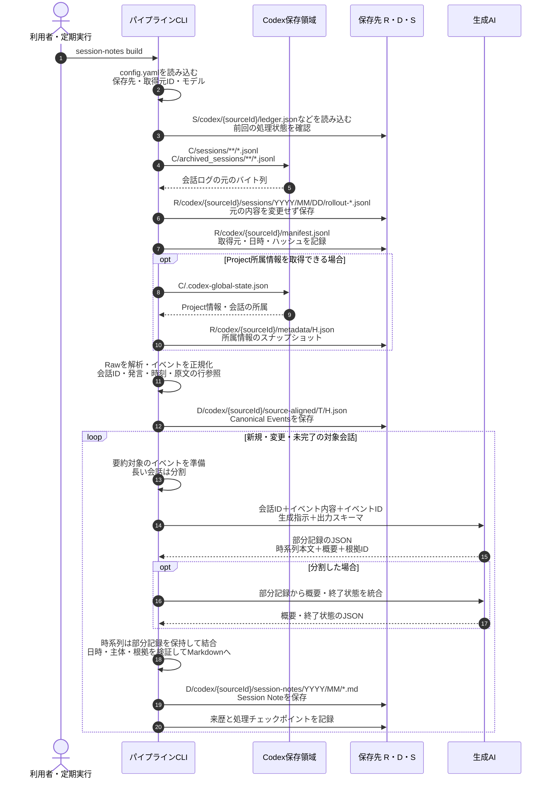

### session-notes build：RawからSession Noteを生成

会話ログをRawとして保存・正規化し、対象会話のSession NoteをMarkdownで生成します。
`--thread-id` で1会話を選べます。DecisionとWorking Contextは、このコマンドでは生成しません。
AIにはイベント内容・ID、生成指示、出力スキーマを渡します。

以下は `tkn-genai-chat-note session-notes build` の処理です。表の略記は直後の図で使います。

| 図中の表記 | 設定項目 | 既定の保存先 |
| --- | --- | --- |
| `C` | `chat.providers.codex.home` | `~/.codex` |
| `R` | `raw_root` | `~/.tkn/genai_chat_note_pipeline/raw` |
| `D` | `data_root` | `~/.tkn/genai_chat_note_pipeline/data` |
| `S` | `state_root` | `~/.tkn/genai_chat_note_pipeline/state` |

`T` は会話の `threadKey`、`H` は内容のハッシュです。
図のパスでは、それぞれの実際の値を表すプレースホルダーとして使います。

保存するCanonical Eventsと要約処理が使うイベントは、同じ解析結果に基づきます。
現在の実装は、保存した正規化JSONを再読込せず、メモリー上のイベントを要約処理へ渡します。
この段階の要約単位は会話であり、作業scopeによる統合とは独立しています。
